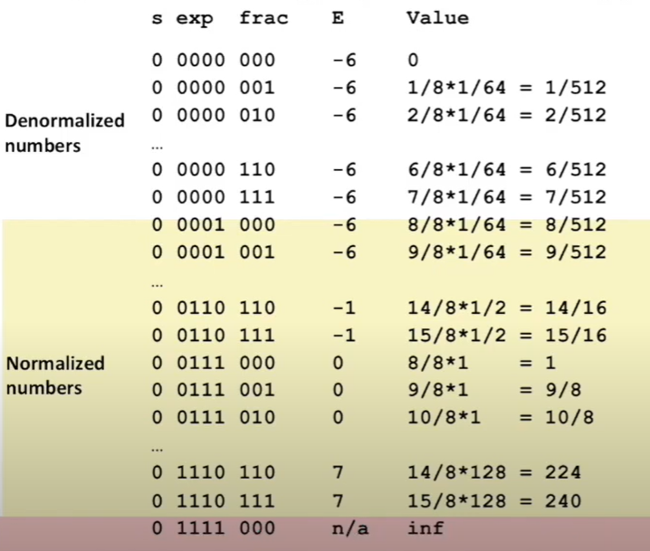

# Lecture 04 - Floating Point

### Fractional Binary Numbers
- Limitation #1
    - Can only represent numbers of the form x/ 2^k^
- Limitation #2
    - Just one setting of binary point within w bits 
        - If we move the binary point to the left, we cannot represent as many large numbers
        - If we move the binary point to the right, we cannot represent as many fractional numbers

### Floating Point Representation
- Numerical Form
    - (-1)^s^ M 2^E^
        - Sign bit **s** determines whether number is negative or positive
        - Significant **M** normally a fractional value in range [1.0, 2.0]
        - Exponent **E** weights value by a power of two
- Encoding
    - Most significant bit is sign bit **s**
    - exp field encodes **E** (but is not equal to E)
    - frac field encodes **M** (but is not equal to M)
    - Bit order: | s | exp | frac
- Precision options
    - Single precision: 32 bits
        ```
        | s |   exp   |        frac        |
          1   8-bits         23-bits
        ```
    - Double precision: 64 bits
        ```
        | s |   exp   |        frac        |
          1   11-bits        52-bits
        ```
- "Normalized" Values
    - When: exp != 000...0 && exp != 111...1
    - Exponent coded as a biased value: E = Exp - Bias (-127 <= E <= 128)
        - Exp: unsigned value of exp field (0 <= Exp <= 255)
        - Bias = 2^k-1^ - 1, where k is number of exponent bits. Acts like a shift to shift the range of exp to be >= 0 to allow unsigned bit representation (see range of E vs Exp)
            - Single precision: 2^7^ - 1 = 127 (Exp: 1...254, E: -126...127)
            - Double precision: 2^10^ - 1 = 1023 (Exp: 1...2046, E: -1022...1023)
    - Significant coded with implied leading 1: M = 1. xxx...x
        - xxx.x: bits of frac field
        - Minimum where frac = 000...0 (M = 1.0)
        - Maximum where frac = 111...1 (M = 2.0 - ε)
        - Get extra leading bit for "free" => only encode the fractional bits because the digit bit is always implied as 1
    - Example
        - Value: float F = 15213.0
            - 15213 (base 10) = 11101101101101 (base 2) = 1.1101101101101 * 2^13^
        - Significand
            - M = 1.__1101101101101__ (base 2)
            - frac = 11011011011010000000000 (23-bits)
        - Exponent
            - E = 13
            - Bias = 127
            - Exp = 140 (E = Exp - Bias) = 10001100 (base 2)
        - Result
        ```
        0 | 10001100 | 11011011011010000000000
        s |    exp   |          frac
        ```
- Denormalized Values
    - Condition: exp = 000...0
    - Exponent value: E = 1 - Bias (instead of E = 0 - Bias to allow smooth transition from denormalized numbers to normalized in the range of float representation)
    - Significant coded with implied leading 0: M = 0.xxx...x (base 2)
        - xxx...x: bits of frac
    - Cases:
        - exp = 000...0, frac = 000..0
            - Represents zero value
            - Note distinct values: +0 and -0
        - exp = 000...0, frac != 000...0
            - Numbers closest to 0.0
            - Equispaced (numbers with same exp fields are equally spaced apart, in this case, exp is always 000...0)
    - Special Values
        - Condition: exp = 111...1, frac = 000...0
            - Represent value ∞
            - Operation that overflows; unlike in two's complement where overflow brings the number back to the set range in a modular way, float numbers overflow into infinity
            - E.g. 1.0/0.0
        - Condition: exp = 111...1, frac != 000...0
            - Not-a-Number(NaN)
            - Represents case when no numeric value can be determined
            - E.g. sqrt(-1)

- Special properties of the IEEE Encoding
    - Floating Point 0 same as Integer 0
        - All bits = 0
    - Can (almost) use unsigned integer comparison
        - Problematic cases: -0 = 0, NaNs

### Floating Point Operations
```
x + y = Round(x + y)
x * y = Round(x * y)
```
- Round-To-Even
    - Round up or down to closer integer, if float number is in middle of 2 integers, then round to the nearest even number.
    - Is the default rounding mode as all other rounding methods (e.g. Round-To-Zero, Round-Towards-Negative-Infinity) are all statistically biased
    - Can apply to other decimal places / bit positions (e.g. round to nearest hundredth, 7.8950000 -> 7.90 because 0 is even and 9 is odd)
- Rounding Binary Numbers
    - Binary Fractional Numbers
        - Is "even" when least significant bit is 0
        - Is "half-way" when bits to right of rounding position = 100... (base 2)
    - Examples
    ```
    // Round to nearest 1/4 (2-bits right)
    Value   Binary    Rounded  Rounded Value
    2 3/2   10.00011  10.00    2
    2 3/16  10.00110  10.01    2 1/4
    2 7/8   10.11100  11.00    3
    // Cannot round to 10.11 because last bit 1 is "odd", so round up to 11.00
    2 5/8   10.10100  10.10    2 1/2
    ```
- Floating Point Multiplication
    - Exact (Unfixed) Result: (-1)^s^ M 2^E^
        - Sign s: s1 ^ s2
        - Significand M: M1 x M2
        - Exponent E: E1 + E2
    - Fixing
        - If M >= 2, shift M right, increment E
        - If E out of range, overflow to infinity
        - Round M to fit frac precision
    - Commutative but NOT Associative (due to overflow and inexactness of rounding)
        - e.g. (1e20 * 1e20) * 1e-20 = inf
        1e20*(1e20 * 1e-20) = 1e20
- Floating Point Addition:
    - Exact (Unfixed) Result: (-1)^s^ M 2^E^
        - Sign s, Significand M
            - Result of signed align & add
        - Exponent E: E1 (E1 > E2)
    - Fixing
        - If M >= 2, shift M right, increment E
        - M < 1, shift M left k positions, decrement E by k
        - If E out of range, overflow to infinity
        - Round M to fit frac precision
    - Commutative but NOT Associative (due to overflow and inexactness of rounding)
        - e.g. (3.14+1e10)-1e10 = 0, 3.14+(1e10-1e10) = 3.14
    - Monotonicity (Almost)
        - a >= b => a+c >= b+c
        - Except for infinitys and NaNs

### Floating Point in C
- Two Levels
    - float: single precision
    - double: double precision
- Casting between int, float, and double changes bit representation
- double/float -> int
    - truncate fractional part
    - Not defined when out of range or NaN: Generally sets to TMin
- int -> double
    - Exact conversion as long as int has <= 53-bit word size
- int -> float
    - Will round according to rounding mode (more bits in int than float)
- Puzzles
```
int x;
float f;
double d;

x == (int)(float) x      -> False
x == (int)(double) x     -> True
f == (float)(double) f   -> True
d == (double)(float) d   -> False
f == - (-f)              -> True   (Only toggling bit)
2/3 == 2/3.0             -> False  (Int & float cast to float)
d < 0.0 => ((d*2) < 0.0) -> True   (Even overflow will be -INF)
d > f   => -f > -d       -> True
d * d >= 0.0             -> True
(d+f) - d == f           -> False
```