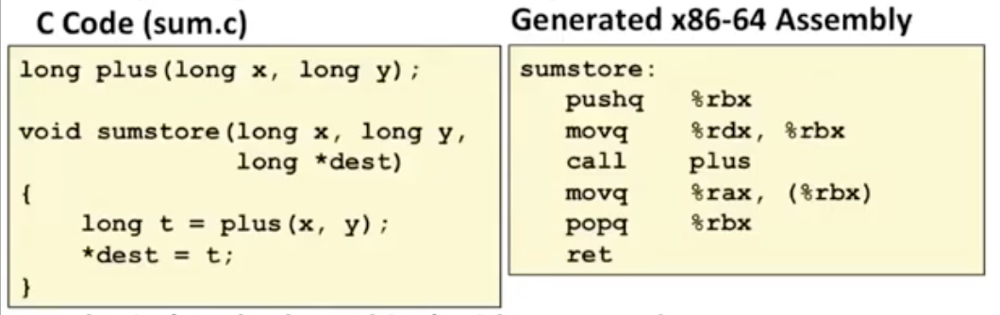
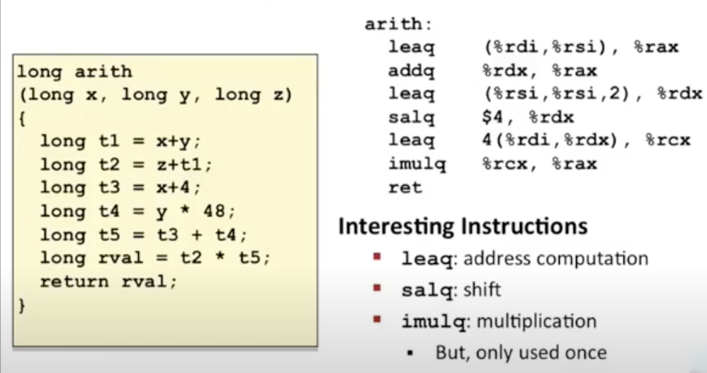

# Lecture 05 - Machine-Level Programming I: Basics

### Definitions
- **Architecture** (also ISA: instruction set architecture): The parts of a processor design that one needs to understand or write assembly/machine code
- **Microarchitecture**: Implementation of the architecture; execute instructions described by ISA
    - E.g. cache sizes and core frequency
- **Code Forms**: 
    - Machine Code: The byte-level programs that a processor executes
    - Assembly Code: A text representation of machine code
- **Example ISAs**:
    - Intel: x86, IA32, Itanium, x86-64
    - ARM: Used in almost all mobile phones 

### Assembly/Machine Code View

- PC: Program counter
    - Address of next instruction
    - Called "RIP" (x86-64)
- Register file
    - Contains all the general purpose registers
    - Registers are temporary storage locations inside the CPU that hold data and addresses (program data)
- Condition codes
    - Store status information about most recent arithmetic or logical operation
    - Used for conditional branching
- Memory
    - Byte addressable array
    - Code and user data
    - Stack to support procedures

### Compiling C into Assembly


### Assembly Characteristics
- Data Types
    - Code: Byte sequences encoding series of instructions
    - Makes no distinction between signed, unsigned integers or even pointers
    - No aggregate types such as arrays or structures
        - Don't exist at machine level; constructed artificially by the compiler
- Operations
    - Perform arithmetic function on register or memory data
    - Transfer data between memory and register
    - Transfer control
        - Transfer the flow of execution of the program to a new address specified in the instruction
        - Conditionals such as for loops, while loops, switch statements are built on these lower level features in the instructions
- *movq* Operand Combinations

| Src, Dest | C Analog | Description |
| ----------- | ---------- | ----------- |
| movq $0x4, %rax     | temp = 0x4       | Take a constant value and copy to register; temporary data  |
| movq $-147, (%rax)   | *p = -147 | Store constant value in memory  |
| movq %rax, %rdx   | temp1 = temp2  | Copy temporary data from one register to another  |
| movq %rax, (%rdx)   | *p = temp | Copy data from register to memory; storing to an address (deferenced pointer *p)  |
| movq (%rax), %rdx   | temp = *p  | Copy data from memory to register; storing to a temporary storage location  |

When you put name of register in parenthesis => means to use the data in that register as an address and use that address to reference some memory location
### Memory Addressing Modes
- Normal (R) Mem[Reg[R]]
    - Register R specific memory address
    - Pointer dereferencing in C
    `movq (%rcx), %rax`
- Displacement D(R) Mem[Reg[R]+D]
    - Register R specifies start of memory region
    - Constant displacement D specificies offset
    - Specify to not use the exact address that's in the register but rather to use the address offset by a certain value D
    `movq 8 (%rdp), %rdx`
- Example: Understanding Swap()

    - Register %rdi holds the pointer to the value 123 in memory and Register %rsi holds the pointer to the value 456 in memory

    Step 1: movq (%rdi), %rax ; t0 = *xp

    - Use the dereferenced pointer (the address referencing the data stored in memory) from %rsi and storing it in the register %rax
    
    Step 2: movq (%rsi), %rdx ; t1 = *yp

    - Similar step as Step 1

    Step 3: movq %rdx, (%rdi) ; *xp = t1

    - Use the value stored in register %rdx and writing back to memory by using the address stored in %rdi (dereferenced pointer)

    Step 4: movq %rax, (%rsi) ; *yp = t0

    - Similar step as Step 3

### Complete Memory Addressing Modes   
- Most General Form D(Rb,Ri,S) Mem[Reg[Rb]+S*Reg[Ri]+D]
    - D: Constant 'displacement' 1, 2 or 4 bytes
    - Rb: Base register. Any of 16 registers
    - Ri: Index register: Any, except for %rsp
    - S: Scale (1, 2, 4 or 8)
    - Useful for array indexing (More in upcoming lectures)

```
%rdx 0xf000
%rcx 0x0100

0x8 (%rds)      ->  0xf000 + 0x8     ->  0xf008
(%rdx, %rcx)    ->  0xf000 + 0x100   ->  0xf100
(%rdx, %rcx, 4) ->  0xf000 + 4*0x100 ->  0xf400
0x80 (, %rdx, 2) ->  2*0xf000 + 0x80  ->  0x1e080 //Scale byte in %rdx by 2 then add it to byte 0x80
```

### Address Computation Instruction
- Moving Data: `movq Src, Dst`
    - Immediate: $0x400, Register: %rax, Memory: (%rax). Memory-memory transfer is not allowed.
- Load Effective Address: `leaq Src, Dst`
    - It can compute an address (memory reference pointer) and write to the register
        - Dst but be a register and Src will be a memory reference
        - E.g. translation of `p = &x[i]`
    - It can compute arithmetic expressions of the form `x + k * y`.
```
x * 12 = ?

leaq (%rdi, %rdi, 2), %rax #  3 * x
salq $2, %rax              # (3 * x) << 2
//Left shift by two bits => same as multiply by 4
```
- Arithmetic Operations

| Format | Computation                  |
| ------ | ---------------------------- |
| addq   | Dest = Dest + Src            |
| subq   | Dest = Dest - Src            |
| imulq  | Dest = Dest * Src            |
| salq   | Dest = Dest << Src           |
| sarq   | Dest = Dest >> Src           |
| shrq   | Dest = Dest >> Src (Logical) |
| xorq   | Dest = Dest ^ Src            |
| andq   | Dest = Dest & Src            |
| orq    | Dest = Dest \| Src           |
- One Operand Instructions

| Format | Computation     |
| ------ | --------------- |
| incq   | Dest = Dest + 1 |
| decq   | Dest = Dest - 1 |
| negq   | Dest = - Dest   |
| notq   | Dest = ~Dest    |
- Arithmetic Expression Example

- Understanding Arithmetic Expression Example
