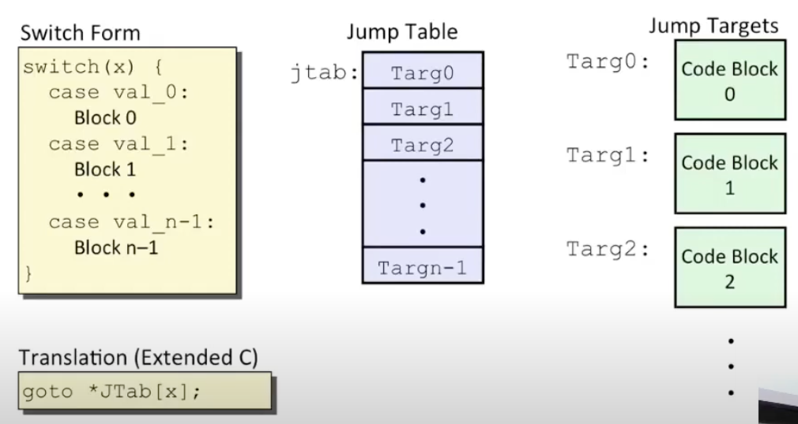

# Lecture 06 - Machine-Level Programming II: Control

### Condition Codes (Implicitly set)
- Single bit registers
    - CF: Carry Flag (for unsigned)
    - SF: Sign Flag (for signed)
    - ZF: Zero Flag
    - OF: Overflow Flag (for signed)
- Side Effect of arithmetic operations
    - E.g. addq Src Dst <-> t = a + b
        - **CF set** if carry out from most significant bit (unsigned overflow)
        - **ZF set** if t == 0
        - **SF set** if t < 0 (as signed)
        - **OF set** if two's-complement (signed) overflow
- Not set by leaq instruction

### Condition Codes (Explicit Setting: compare)
- Explicit Setting by Compare Instruction
    ```
    cmpq Src2, Src1
    //cmpq b, a like computing a-b without setting destination
    ```
- **CF set** if carry out from most significant bit (used for unsigned comparisons)
- **ZF set** if a == b
- **SF set** if (a-b) < 0 (as signed)
- **OF set** if two's complement (signed) overflow

### Condition Codes (Explicit Setting: test)
- Explicit Setting by Test Instruction
    ```
    testq Src2, Src1
    //testq b, a like computing a-b without setting destination
    ```
- Sets condition codes based on value of Src1 & Src2
- Useful to have one of the operands be a mask
- **ZF set** if a & b == 0
- **SF set** if a & b < 0

### Reading Condition Codes
- SetX Instructions
    - Set low-order byte of destination to 0 or 1 based on combinations of condition codes
    - Does not alter remaining 7 bytes

| Format | Computation      | Description               |
| ------ | ---------------- | ------------------------- |
| sete   | ZF               | Equal / Zero              |
| setne  | ~ZF              | Not equal / Not Zero      | 
| sets   | SF               | Negative                  |
| setns  | ~SF              | Nonnegative               |
| setg   | ~(SF ^ OF) & ~ZF | Greater (Signed)          |
| setge  | ~(SF ^ OF)       | Greater or equal (Signed) |
| setl   | (SF ^ OF)        | Less                      |
| setle  | (SF ^ OF) \| ZF  | Less or equal (Signed)    |
| seta   | ~CF & ~ZF        | Above (Unsigned)          |
| setb   | CF               | Below (Unsigned)          |

```
int gt (long x, long y) {
	return x > y;
}

# rdi -> x
# rsi -> y
# rax -> return val

gt:
	cmpq    %rsi, %rdi   # Compare x:y
	setg    %al          # Set when > (Can only one byte)
	movzbl  %al, %eax    # Zero other bytes
	ret

# When result is 32-bit result, zeros are added for the other 32-bits so that total bits is 64
```

### Jumping
- jX instructions
    - Jump to different part of code depending on condition codes

| Format | Computation      | Description               |
| ------ | ---------------- | ------------------------- |
| jmp    | 1                | Unconditional             |
| je     | ZF               | Equal / Zero              |
| jne    | ~ZF              | Not equal / Not Zero      |
| js     | SF               | Negative                  |
| jns    | ~SF              | Nonnegative               |
| jg     | ~(SF ^ OF) & ~ZF | Greater (Signed)          |
| jge    | ~(SF ^ OF)       | Greater or equal (Signed) |
| jl     | (SF ^ OF)        | Less                      |
| jle    | (SF ^ OF) \| ZF  | Less or equal (Signed)    |
| ja     | ~CF & ~ZF        | Above (Unsigned)          |
| jb     | CF               | Below (Unsigned)          |
- Conditional Branch Example
```
int absdiff (long x, long y) {
	long result;
	if (x > y)
		result = x - y;
	else
		result = y - x;
	return result
}

absdiff:
	cmpq   %rsi, %rdi   # Compare x:y
	jle    .L4          # Jump when <=
	movq   %rdi, %rax
	subq   %rsi, %rax
	ret
.L4:            # x <= y
	movq   %rsi, %rax
	subq   %rdi, %rax
	ret
```
- Same example expressed with Goto (feature of C) Code
```
long absdiff_j (long x, long y) {
    long result;
    int ntest = x <= y;
    if (ntest) goto Else;
    result = x - y;
    goto Done;
Else:
    result = y - x;
Done:
    return result;
}
```
- Conditional Moves
    - Compute both if and else statements first
    - Only after that then the compiler decides which of the results to move into the register
    - GCC tries to use them but only when the computation is known to be safe
    - Why: Branchers are very disruptive to instruction flow through pipelines
    - Why: Conditional moves do not require control transfer
    - Why not: Expensive computations, Risky computations, Computations with side effects
```
val = Test ? Then_Exp : Else_Exp;

# Conditional Move Logic
result = Then_Exp;
eval = Else_Exp;
nt = !Test;

if (nt) result = eval;
return result;

# Assembly code of Conditional Moves using absdiff example
movq   %rdi, %rax   # x
subq   %rsi, %rax   # result = x - y
movq   %rsi, %rdx
subq   %rdi, %rdx   # eval = y - x
cmpq   %rsi, %rdi   # Compare x:y
cmovle %rdx, %rax   # if <=, result = eval
ret
```

### Loops
- Do Loop
    - E.g. Count number of 1's in argument x ("popcount")
```
//C Code
long pcount_do (unsigned long x) {
    long result = 0;
    do {
        result += x & 0x1;
        x >>= 1;
    } while (x);
    return result;
}

//Goto Version
long pcount_goto (unsigned long x) {
    long result = 0;
  loop:
    result += x & 0x1;
    x >>= 1;
    if (x) goto loop;
    return result;
}

//Assembly Code
    movl   $0, %eax     # result = 0
.L2
    movq   %rdi, %rdx
    andl   $1, %edx     # t = x & 0x1
    addq   %rdx, %rax   # result += t
    shrq   %rdi         # x >>= 1
    jne    .L2          # if (x) goto loop
    rep;   ret
```
- While Loop

Example 1: Jump to Middle (using -0g flag when compiling)
```
while (Test)
	Body

# Goto version logic -Og flag
	goto Test;
loop:
	Body
test:
	if (Test)
		goto loop;
done:

# Example using popcouint
//C Code
long pcount_while (unsigned long x) {
    long result = 0;
    while (x) {
        result += x & 0x1;
        x >>= 1;
    }
    return result;
}

//Goto Version
long pcount_goto (unsigned long x) {
    long result = 0;
    goto test;
  loop:
    result += x & 0x1;
    x >>= 1;
  test:
    if (x) goto loop;
    return result;
}
```
Example 2: Guarded-do (using -01 flag when compiling)
```
if (!Test)
    goto done;
do 
    Body
    while (Test);
done:
    ...

# Goto version logic -O1
	if (!Test)
		goto done;
loop:
	Body
	if (Test)
		goto loop;
done:
```

- For loop
```
//General Form
for (Init; Test; Update)
    Body
    
//Example using popcount
#define WSIZE 8*sizeof(int)
long pcount_for (unsigned long x) {
    size_t i;
    long result = 0;
    for (i = 0; i < WSIZE; i++) {
        unsigned bit = (x >> i) & 0x1
        result += bit
    }
    return result;
}
```

- Switch Statements

The asterisk * means an indirect jump. Jump to the value at the address, and not the direct address.

```
long switch_eg(long x, long y, long z) {
	long w = 1;
	switch (x) {
		case 1:
		    w = y*z;
		    break;
		case 2:
			w = y/z;
			/* Fall Through */
		case 3:
			w += z;
			break;
		case 5:
		case 6:
			w -= x;
			break;
		default;
			w = 2;
	}
	return w;
}


switch_eg:
	movq   %rdx, %rcx
	cmpq   $6, %rdi      # Compare x to 6
	ja     .L8           # Jump default if x < 0 or x > 6
	jmp    *.L4(,%rdi,8) # goto *JTab[x]
	

# Jump Table

.section    .rodata
  .align 8           # Spaced by 8 bytes
.L4
  .quad     .L8      # Case Default
  .quad     .L3      # Case 1: x = 1
  .quad     .L5      # Case 2: x = 2
  .quad     .L9      # Case 3: x = 2
  .quad     .L8      # Case Default
  .quad     .L7      # Case 5: x = 5
  .quad     .L7      # Case 6: x = 6
  
# Code Blocks

.L3:
    movq   %rsi, %rax  # y
    imulq  %rdx, %rax  # y*z
    ret
.L5:                   # Case 2
	movq   %rsi, %rax
	cqto
	idivq  %rcx        # y/z
	jmp    .L6         # goto merge
.L9:                   # Case 3
	movl   $1, %eax    # w = 1
.L6:             
	addq   %rcx, %rax  # w += z
	ret
.L7:
    movl   $1, %eax    # w = 1
    subq   %rdx, %rax  # w -= z
    ret
.L8
    movl   $2, %eax    # x = 2
    ret
```