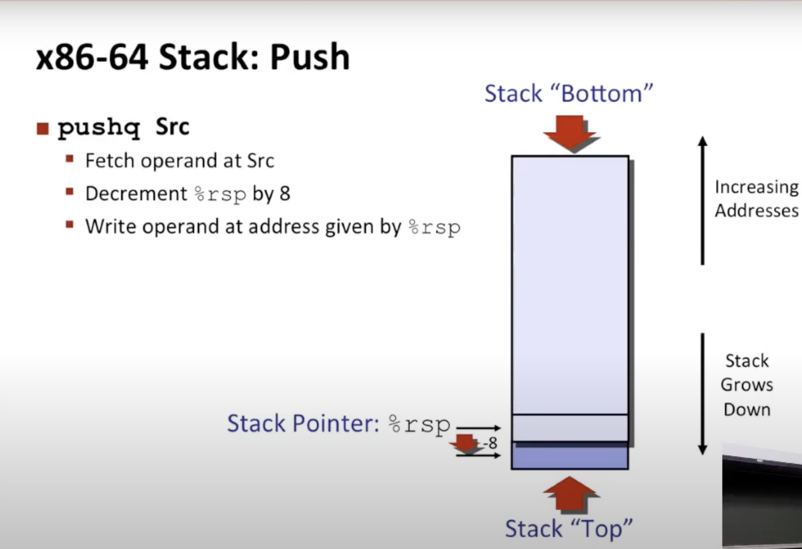
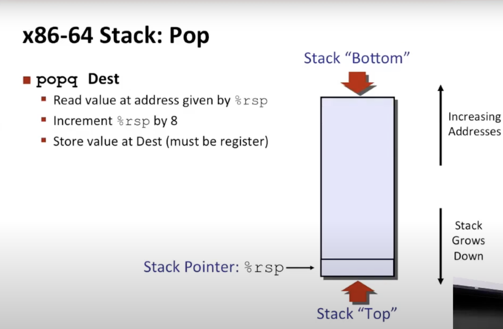
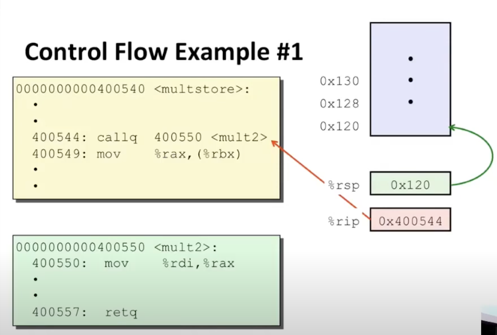
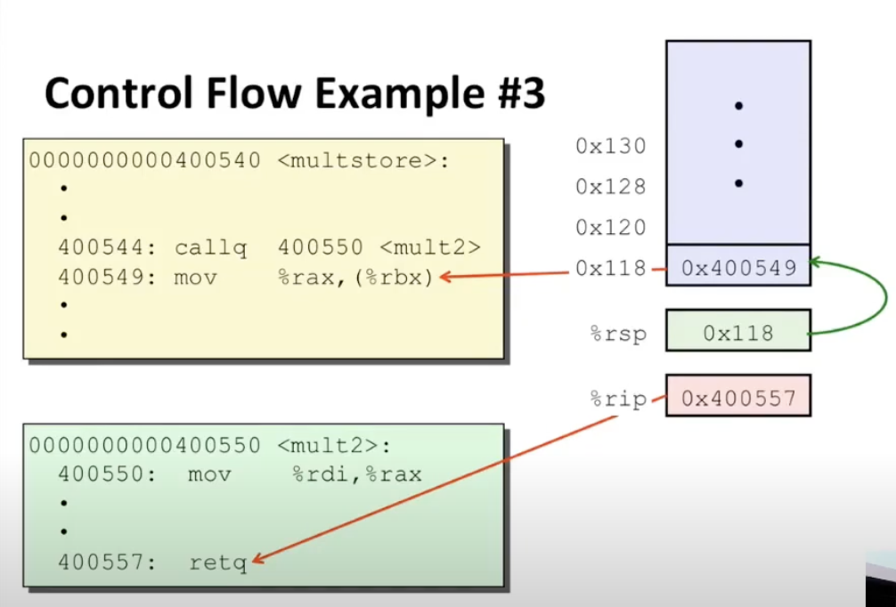
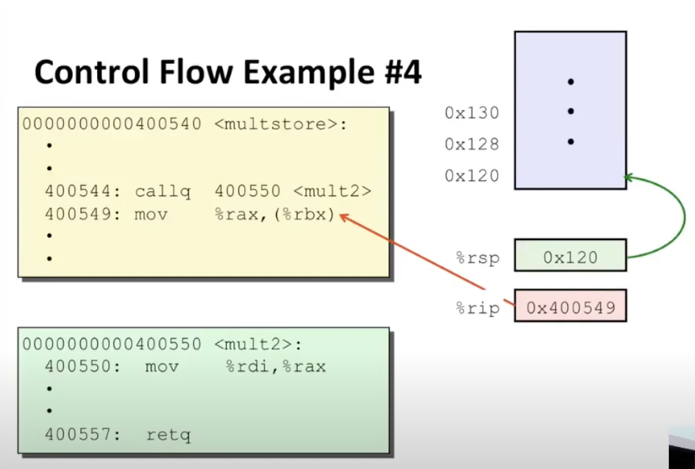

# Lecture 07 - Machine-Level Programming III: Procedures

### Mechanisms in Procedures
- Passing Control
    - Program counter must identify the current instruction with the help of jump instructions
- Passing Data
    - One or more procedure arguments and return values have to be passed between functions
- Memory Management
    - Allocate memory for storing local data for procedure execution
    - Deallocate memory of local data when function returns

### Stack Structure
- x86-54 Stack
    - Region of memory managed with stack discipline
    - Grows toward lower addresses
    - Register %rsp contains lowest stack address (address of "top" element)

### Passing Control
- Push onto stack: `pushq Src`

    - Fetch operand at src -> decrement %rsp by 8 -> write operand at address given by %rsp
- Pop from stack: `popq Dest`

    - Read value at address given by %rsp -> increment %rsp by 8 -> store the value at dest
- Call procedure: `callq <Label>`
    - Invokes procedure by pushing the return address onto the stack and setting %rip (the program counter) to the starting address of the procedure
    - Step 1: Top of stack is at address `0x120` and the program counter %rip is indicating that the current instruction is at `0x400544` which is the call instruction
    
    - Step 2: The `callq` instruction 
        - decrements the stack pointer (`0x120` to `0x118`)
        - writes the return address of the instruction which is the next instruction after the call to the top of the stack (`0x118` points to `0x400549` so that control can be passed back to the original procedure once the called function has returned)
        - sets the program counter %rip to the dest address encoded in the call function (`0x400550`) which is the target address of the function being called.
    
    - Step 3: The program counter reaches the `retq` return instruction in the called function. The `retq` instruction
        - will pop the address off the top of the stack (`0x400549`)
        - increment the stack pointer (`0x118` to `0x120`)
        - set the program counter to the address popped off the stack (`0x400549`). Control is passed by to the original procedure and the effect of the call is reversed
    
    

### Passing Data

There are 6 registers in the order of %rdi, %rsi, %rdx, %rcx, %r8, %r9.

The first 6 arguments get passed into these 6 registers and the return value is returned in register %rax. This is only for arguments involving integers and pointers, floating points are stored in a separate set of registers.

If there are more than 6 arguments, the calling procedure puts arguments 7 and above onto the top of the stack (store into memory). All data sizes are rounded up to be multiples of 8. Considering that the return address is at the top of the stack, the argument 7 is at 8(%rsp), argument 8 is at 16(%rsp) and so on.

### Stack Frames
Keep a stack frame for each function call that has not been returned (sort of a private storage)
- Space allocated in the stack when entering procedure, deallocated when return
- Stores saved registers & local variables
- Stores return pointer to the stack so that program counter knows where to point to in the procedure once the stack frame has been deallocated
- Indicated by the stack pointer %rsp and also the frame pointer %rbp (optional, usually used only when an array/memory buffer of variable size is used because compiler is unsure how much memory to allocate)

Register saving conventions prevent one function call from corrupting another's data
- Unless the C code explicitly does so (e.g. buffer overflow in Lecture 9)

Stack discipline follow call / return pattern
- When procedure P calls Q, then Q returns before P (Last in, First out). Q must preserve the register value

### Register Saving Conventions
Caller saved: Caller saves the temporary values before the call.

Callee saved: Callee saves the temporary values and restore them before returning.

Callee saved convention: %rbx, %rbp, %r12 - %r15 (callee saved registers). When procedure P calls Q, Q must preserve the register value.

Caller saved convention: All other registers except %rsp. They can be modified by any function. Procedure P must save the data if it wants to use again.

Callee-Saved Example
```
long call_incr2(long x) {
	long v1 = 15213;
	long v2 = incr(&v1, 3000);
	return x+v2;
}

call_incr2:
	pushq %rbx            # Store value x in register before altering in return statement
	subq  $16, %rsp       # Allocate 16 bytes on the stack
	movq  %rdi, %rbx
	movq  $15213, 8(%rsp)
	movl  $3000, %esi
	leaq  8(%rsp), %rdi
	call  incr
	addq  %rbx, %rax
	addq  $16, %rsp       # Move back the stack pointer to the address of %rbx
	popq  %rbx            # Retrieve back value x from the register for usage in return value
	ret
```

### Illustration of Recursion
```
long pcount_r(unsigned long x) {
	if (x == 0)
		return 0;
	else
		return (x & 1) + p_count_r(x >> 1);
}

pcount_r:
	movl   $0, %eax;
	testq  %rdi, %rdi;  # Check if equal zero
	je     .L6
	pushq  %rbx         # Going to use %rbx so save in stack first
	movq   %rdi, %rbx   # Copy x into %rbx
	andl   $1, %ebx     # %ebx is the bottom 32-bits of the %rbx register
	shrq   %rdi         # Shift right by 1
	call   pcount_r     # Begin recursion 
	addq   %rbx, %rax   # %rax holds the recursive result. Compiler knows that %rbx will be restored with the original argument which is the least significant bit of x (andl $1, %ebx)
	popq   %rbx	
.L6
	rep; ret            # Just means return
```