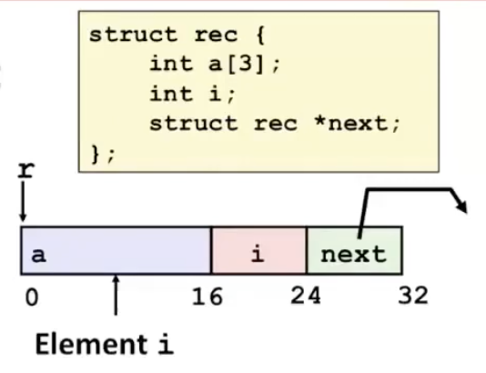
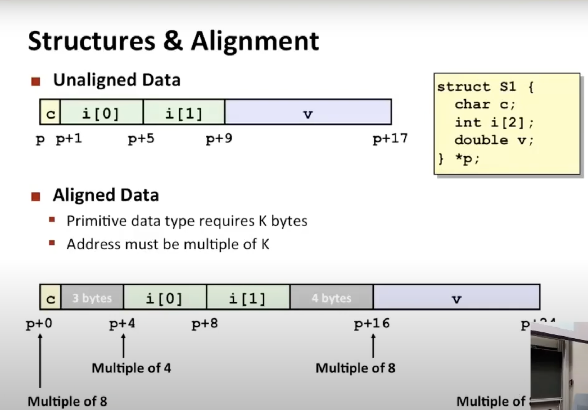
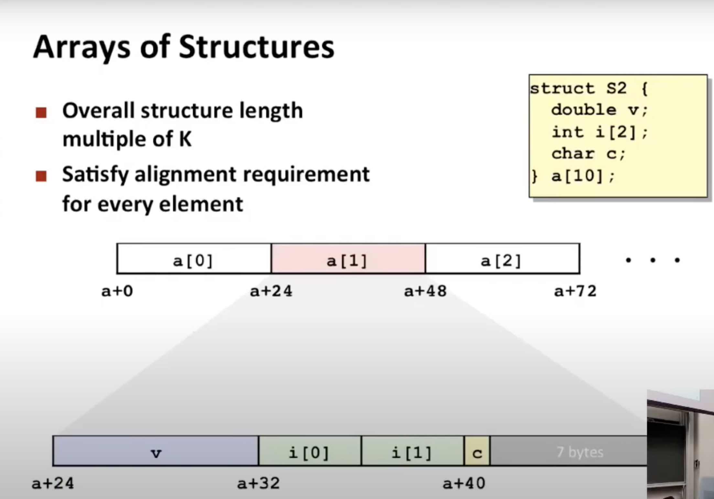
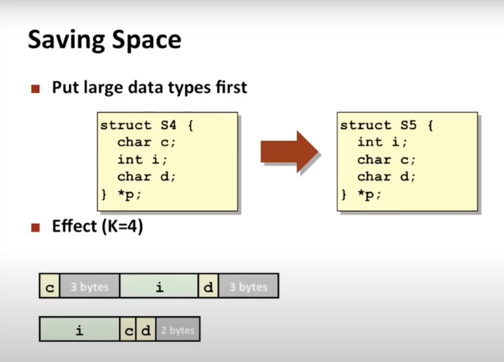

# Lecture 08 - Machine-Level Programming IV: Data

### Arrays
Continguously allocated region of L * sizeof(T) bytes in memory. Array references are pointers.

Declaring int val[5] will allocate this region in memory.
```
 |   1   |   5   |   2   |   1   |   3
 x      x+4     x+8     x+12    x+16
```
Reference | Type | Value
------ | ------- | ------- 
val[4] | int | 3
val | int * | x
val + 1 | int * | x + 4   //Increment by enough bytes (int has 4 bytes for IA32) to point to the address of the next value in the array
&val[2] | int * | x + 8
val[5]  | int   | ??
*(val + 1) | int | 5
val + i | int * | x + 4i

Array Accessing Example:
```
#define ZLEN 5
typedef int zip_dig[ZLEN];

int get_digit (zip_dig z, int digit) {
	return z[digit]
}

# %rdi = z   // register %rdi contains starting address of array
# %rsi = digit   // register %rsi contains index of desired value
movl (%rdi, %rsi, 4), %eax  # z[digit]   // desired digit at 4*%rsi + %rdi
```

Array Loop Example:
```
#define ZLEN 5
typedef int zip_dig[ZLEN];

void zincr(zip_dig z) {
	size_t i;
	for (i=0; i < 5; i++)
		z[i]++
}

zincr:
	movl  $0, %eax            # i = 0
	jmp   .L3                 # goto middle
.L4                           # loop:
	addl  $1, (%rdi, %rax, 4) # z[i]++
	addq  $1, %rax            # i++
.L3                           # middle:
	cmpq  $4, %rax            # i:4
	jbe   .L4                 # if <=, goto loop
	rep; ret
```

Multidimensional (Nested) Arrays: Array A has R rows and C columns. If A[i][j] is an element that requires K bytes, its address is at `A + K(i*C + j)`.

```
 | 1 5 2 0 6 | 1 5 2 1 3 | 1 5 2 1 7 |
 x        x+4*(5)     x+4*(2*5)   x+4*(3*5)
```

Multi-level Array: Each item in the top array (univ) is a pointer of 8 bytes (64-bit) which points to the address of the start of each row array (pgh[i]).
```
int pgh[3][5];

int *univ[3] = {<arr1>, <arr2>, <arr3>}

Access pgh[index][digit]:
	Mem[pgh + 20*index + 4*digit]
	
Access univ[index][digit]:
	Mem[Mem[univ + 8*index] + 4*digit]
	
salq   $2, %rsi              # 4*digit
addq   univ(,%rdi,8), %rsi   # p = univ[index] + 4*digit
movl   (%rsi), %eax          # return *p
ret
```

Variable Array: Array can be declared either as a local variable or an argument to a function.
```
int var_ele(long n, int A[n][n], long i, long j) {
	return A[i][j];
}

# n in %rdi, A in %rsi, i in %rdx, j in %rcx
imulq    %rdx, %rdi               # n*i
leaq     (%rsi, %rdi, 4), %rax    # a + 4*n*i
movl     (%rax, %rcx, 4), %rax    # a + 4*n*i + 4*j
ret
```

### Structs
- Structure represented as block of memory (big enough to hold all the fields)
- Fields ordered according to declaration (even if another ordering could yield more compact representation)
- Compiler determines overall size + positions of fields (machine-level program has no understanding of the structures in the source code)

Linked List Example

```
struct rec {
	int a[4]; // Embedded within the struct
	int i;
	struct rec *next;
}

void set_val(struct rec *r, int val) {
	while(r) {
		int i = r->i;
		r->a[i] = val;
		r = r->next;
	}
}


.L11                              # loop
	movsq  16(%rdi), %rax         # i = M[r+16]
	movl   %esi, (%rdi, %rax, 4)  # M[r + 4*i] = val
	movq   24(%rdi), %rdi         # r = M[r+24]
	testq  %rdi, %rdi             # Test r
	jne    .L11                   # if !=0 goto loop
```

Data Alignment: Primitive data types have K bytes. Addresses must be a multiple of K. For largest alignment requirement of K, the overall structure must be a multiple of K (required on some machines; advised on x86-64). Compiler inserts gaps of empty bytes in structure to ensure correct alignment of fields.


Data alignment in array of structs: Ensure each successive starting address of struct in the array is a multiple of 8 added to the starting address of array.


Save space: Rearrange the items in structures to save space. Place the biggest items in the beginning.


### Floating Points
All floating point numbers are passed in %xmm registers (%xmm0, %xmm1, ...). All registers are caller-saved. %xmm0 is for return. Different mov instructions to move between XMM registers, and between memory and XMM registers
```
double dincr (double *p, double v) {
    double x = *p;
    *p = x + v;
    return x;
}

# p in %rdi, v in %xmm0
movapd   %xmm0, %xmm1   # Copy v
movad    (%rdi), %xmm0  # x = *p
addsd    %xmm0, %xmm1   # t = x + v
movsd    %xmm1, (%rdi)  # *p = t
ret
```

