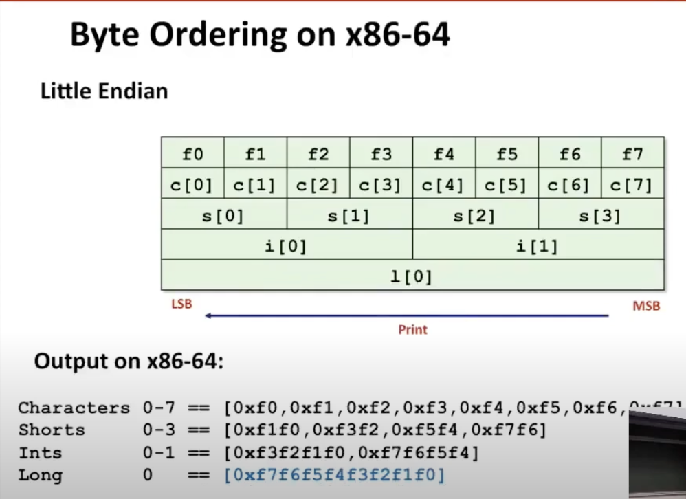

# Lecture 09 - Machine-Level Programming V: Advanced Topics

### Memory Layout
x86-64 Memory Layout
```
00007FFFFFFFFFFF -> (47-bit max)
Stack -> (Can go down max 8MB)
 |
 v

Shared Libraries

 ^
 |
Heap -> (Dynamically allocated as needed, malloc/ new)
Data -> (Statically allocated data, global/static/constants)
Text -> (Executable machine instructions)
```

### Buffer Overflow
When exceeding the memory size allocated for an array.
This is the #1 technical cause of security vulnerabilies
- If there is some way for an outsider to overflow a buffer (i.e. give an input *i* larger than the byte size of memory allocated for the array) => crash the program
- When writing code, have to consider if certain values can be trusted (i.e. whether the value is computer by program and within bounds or does it come from an external source)

Most common form
- Unchecked lengths on string inputs
    - e.g. Unix function gets() which does not specify the number of characters to read
- Particularly for bounded character arrays on the stack
    - stack smashing

E.g. Vulnerable Buffer Code
```
void echo() {
	char buf[4]; /* allocates 4 bytes */
	gets(buf);   /* reads a line from stdin and stores it */
	puts(buf);   /* writes to stdout up to (not including) the null char */
}

void call_echo() {
	echo();
}


# We are able to write 23 characters to 'echo'
# Writing 24 characters cause segmentation fault

echo:
	sub    $0x18, %rsp   # Allocates 24 bytes (20 extra)
	mov    $rsp, $rdi
	callq  <gets>
	mov    %rsp, %rdi
	callq  <puts>
	add    $0x18, %rsp
	retq
call_echo:
	sub    $0x8, %rsp
	mov    $0x0, %eax
	callq  <echo>
	add    $0x8, %rsp
	ret
```
Typing 23 characters (24 bytes) work fine because of unused space in stack. Typing 24 characters corrupts the return address.

Worm vs Virus
- Worm: A program that
    - Can run by itself
    - Can propagate a fully working version of itself to other computers
- Virus: Code that
    - Adds itself to other programs
    - Does not run independently

System-Level Protections
- Randomized stack offsets
    - At start of program, allocate random amount of space on stack
    - Shifts stack addreses for entire program
    - Makes it difficult for hacker to predict beginning of inserted code
    - E.g. 5 executions of memory allocation code
        - Stack repositioned each time program executes

- Nonexecutable code segments
    - In traditional x86, can mark region of memory as either "read-only" or "writeable"
        - Can execute anything readable
    - x86-64 added explicit "execute" permission
    - Stack marked as non-executable

- Stack canaries: Place a special value (canary) on stack just beyond buffer and check for corruption before exiting function. It is now the default for GCC.

```
# Canary

echo:
	sub    $0x18, %rsp
	mov    %fs:0x28, %rax  # Reading from read-only segment
	mov    %rax, 0x8(%rsp) # Place sth at 8-byte offset
	
	...
	
	mov    0x8(%rsp), %rax
	xor    %fs:0x28, %rax  # Check if corrupted
	je     <echo+0x39>
	callq  <__stack_chk_fail@plt> # Dump if corrupted
	...
	retq
```

Return-Oriented Programming Attacks
- Use existing code (instead of injecting binary code)
    - String together fragments to achieve overall desired outcome
    - Does not overcome stack canaries
- Construct program from *gadgets*
    - Sequence of instructions ending in **ret**
        - Encoded by single byte `0xc3`
        - Final **ret** in each gadget will start next one (pop address off stack and start executing next instruction where the next gadget starts)
        - Achieve a desired sequence of code
    - Code positions fixed from run to run
    - Code is executable

### Unions
- Allocate according to largest element
- Can only use one field at a time
- Allows a single object to be referenced according to multiple types. An enum can be added alongside to differentiate the types during runtime.
- Way to circumvent type system
- Different from casting => Unions do not alter the bit representation when changing between types => only numeric value changes (i.e. same bit represented in float vs int) => useful for getting how the same bit sequence is represented among different types

```
typedef union {
	float f;
	unsigned u;
} bit_float_t;

float bit2float(unsigned u) {
	bit_float_t arg;
	arg.u = u;
	return arg.f;
}
```

x86-64 Byte ordering
```
# Little Endian: Least significant byte has lowest address.

union {
	unsigned char c[8]; //1 byte
	unsigned short s[4]; //2 bytes
	unsigned int i[2];  //4 bytes
	unsigned long 1[1];  //8 bytes
} dw;

char 0-7 == [0xf0, 0xf1, 0xf2, 0xf3, 0xf4, 0xf5, 0xf6, 0xf7]
int  0-1 == [0xf3f2f1f0, 0xf7f6f5f4]
```
