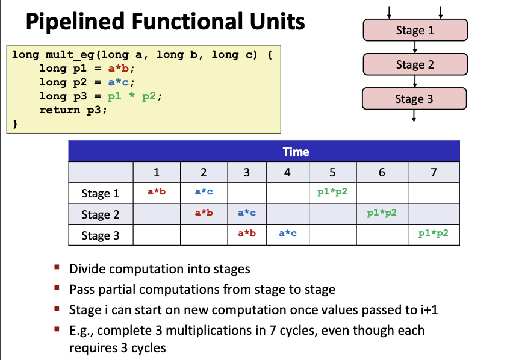

# Lecture 10 - Program Optimization

### Performance Realities
There's more to performance than asymptotic complexity

Constant factors matter too!
- Must optimize at multiple levels:
    - algorithm, data representations, procedures, and loops

Must understand system to optimize performance
- How programs are compiled and executed
- How modern processors + memory systems operate
- How to measure program performance and identify bottlenecks
- How to improve performance without destroying code modular generality

### Generally Useful Optimizations
**Code Motion**
- Reduce frequency with which computation performed (esp if it will always produce same result)

```
#INITIAL
void set_row(double *a, double *b, long i, long n) {
    long j;
    for (j = 0; j < n; j++)
        a[n*i + j] = b[j]
}

#AFTER OPTIMIZATION
void set_row(double *a, double *b, long i, long n) {
    long j;
    int ni = n*1
    for (j = 0; j < n; j++)
        a[ni + j] = b[j]
}
```

**Reduction in Strength**
- Replace costly operation with simpler one
    - e.g. shift, add instead of multiply or divide

```
#INITIAL
for (i=0; i<n; i++) {
	int ni = n*i;
	for (j=0; i<n; j++)
		a[ni+j] = b[j];
}

#AFTER OPTIMIZATION
int ni = 0;
for (i=0; i<n; i++) {
	for (j=0; i<n; j++)
		a[ni+j] = b[j];
	ni += n;
}
```

**Share Common Subexpressions**
- Reuse portions of expressions
- GCC will do this with -O1

```
#INITIAL
up    = val[(i-1)*n + j];
down  = val[(i+1)*n + j];
left  = val[i*n + j-1];
right = val[i*n + j+1];

#AFTER OPTIMIZATION
long inj = i*n + j;
up    = val[inj - n];
down  = val[inj + n];
left  = val[inj - 1];
right = val[inj + 1];
```

### Optimization Blockers
**Procedure Calls**
```
#INITIAL
void lower(char *s) {
	size_t i;
	for (i=0; i<strlen(s); i++) # Compiler will not optimize this
		if (s[i] >= 'A' && s[i] <= 'Z')
			s[i] -= ('A' - 'a');
}

#AFTER OPTIMIZATION
void lower(char *s) {
	size_t i;
	size_t len = strlen(s)
	for (i=0; i<len; i++)
		if (s[i] >= 'A' && s[i] <= 'Z')
			s[i] -= ('A' - 'a');
}
```
- `strlen `is an O(N) operation
- Move procedure call to `strlen` to outside the loop such that it will only need to be called once

Why couldn't the compiler optimize by moving strlen out of inner loop?
- Procedure may have side effects (i.e. it might alter global state each time called)
- Function may not return same value for given arguments
    - Procedure `lower` could interact with `strlen`
- Therefore, compiler treats procedure call as a black box and does not optimize heavily to avoid generating undesired side effects.

**Memory Aliasing**
Aliasing is when two different memory references specify single location.
This can occur easily in C as programmer is allowed to do address arithmetic and has direct access to storage structures.
To remove aliasing, introduce local variables instead of reading from and writing to memory multiple times. Then, the compiler won't have to check for aliasing.
```
#INITIAL
/*Sum rows is of n x n matric a and store in vector b */
void sum_rows(double *a, double *b, long n) {
    long i, j;
    for (i = 0; i < n; i++) {
        b[i] = 0;
        for (j = 0; j < n; j++)
            b[i] += a[i*n + j];
    }
}
//In the initial version, in every inner loop, compiler reads, adds, and then store back to memory every time. This is to account for possibility of memory aliasing which will affect program behavior. E.g. if b[i] is a reference to a[x], altering b[i] might affect the values in a[x] due to memory aliasing

#AFTER OPTIMIZATION
void sum_rows(double *a, double *b, long n) {
    long i, j;
    for (i = 0; i < n; i++) {
        double val = 0;
        for (j = 0; j < n; j++)
            val += a[i*n + j];
        b[i] = val
    }
}
//By introducing a local variable in register to accumulate the values from a, compiler only needs to read, add and write to memory once at the end of each outer loop.
```

### Exploiting Instruction-Level Parallelism
**Superscalar design**: A superscalar processor can issue multiple instructions in one cycle. One way is the **out-of-order execution** where independent instructions are executed in parallel.

**Pipelining**: Divides an instruction into distinct stages where each stage is executed in a different part of the processor. When one operation moves from one stage to the next, another operation can take its place and begin execution (ability to stream operations through a single processor in close succession to each other). The example shows completion of 3 multiplications in 7 cycles, even though each individually requires 3 cycles.
