# Lecture 11 - The Memory Hierarchy

### Storage Technologies and Trends
##### Random-Access Memory (RAM)
- RAM is traditionally packaged as a chip
- Basic storage unit is normally a cell (one bit per cell)
- Multiple RAM chips form a memory
- Comes in 2 varieties
    - Static RAM (SRAM)
    - Dynamic RAM (DRAM)

##### SRAM vs DRAM
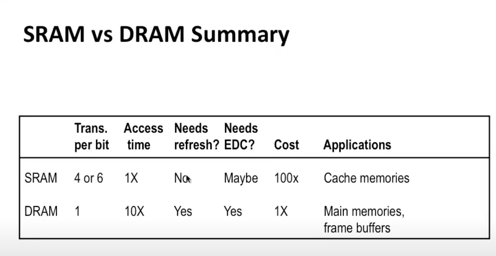
- SRAM require more transistors per bit (more expensive)
- SRAM needs less error detection and correction (EDC)

##### Nonvolatile Memories
DRAM and SRAM are volatile memories (i.e. they lose information once powered off)
Nonvolatile memories retain value even if powered off
- ROM: Read-only memory.
- PROM: Can be programmed exactly once.
- EPROM: Can be bulk cleared to zero and rewritten. Requires a separate device to write ones.
- EEPROM: Can be bulk cleared to zero and - rewritten in-place without a separate device.
- Flash memory: Based on EEPROMs. Partial erase - capability which wears out over time.

Firmware: Programs stored in ROMs such as BIOS, disk controllers.
BIOS (Basic input/output system): the program a computer's microprocessor uses to start the computer system after it is powered on. It also manages data flow between the computer's operating system (OS) and attached devices.

##### Bus Structure Connecting CPU and Memory
A **bus** is a collection of parallel wires that carry address, data and control signals
Buses are typically shared among multiple devices.
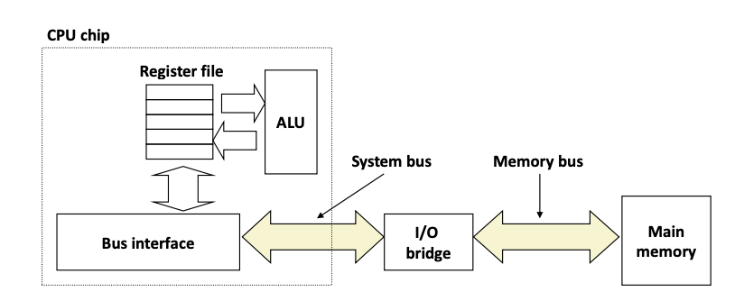

Memory Read Transaction:
- CPU places address A on the memory bus
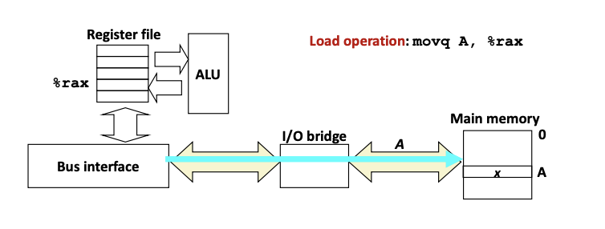
- Main memory reads A from the memory bus, retrieves word x, and places it on the bus
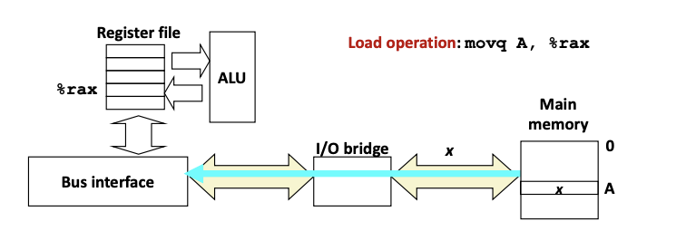
- CPU read word x from the bus and copies it into register %rax
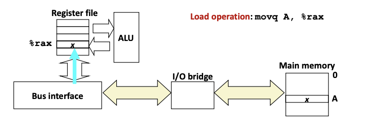

Memory Write Transaction:
- CPU places address A on bus. Main memory reads it and wait for the corresponding data word to arrive
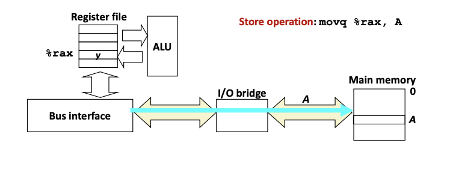
- CPU places data word y on the bus
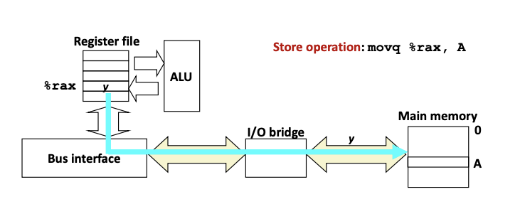
- Main memory reads data word y from the bus and store it at address A
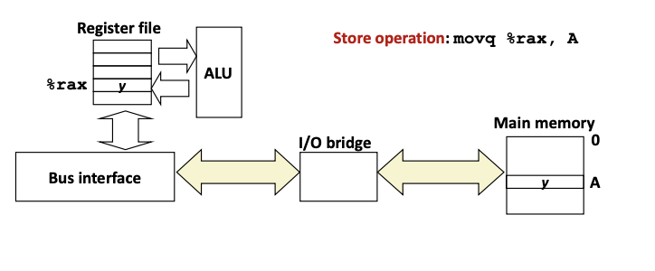

Bus is expensive: Memory reads and writes are about 50-100 ns while operations between registers are < 1 ns.

##### Disk Drive
Rotating disks: Consist of one or more platters, each with two surfaces. Each surface consists of concentric rings called tracks. Each track consists of sectors separated by gaps.
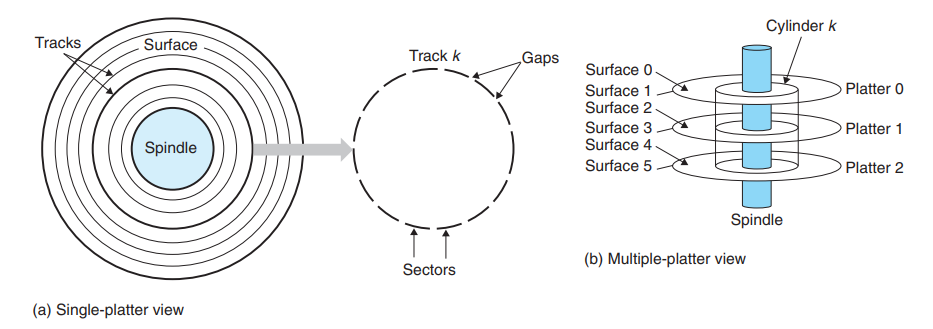

Disk Capacity:
- Capacity: maximum number of bits that can be stored
- Capacity is determined by these technological factors:
    - Recording density: number of bits that can be stored per inch segment of a track
    - Track density: number of tracks that can be squeezed per inch of radial segment
    - Areal density: product of recording and track density
```
Capacity = (bytes/sector) x (sectors/track) x (tracks/surface) x (surfaces/platter) x (platters/disk)
```

Disk Access: 
- Seek -> Rotational Latency -> Data Transfer

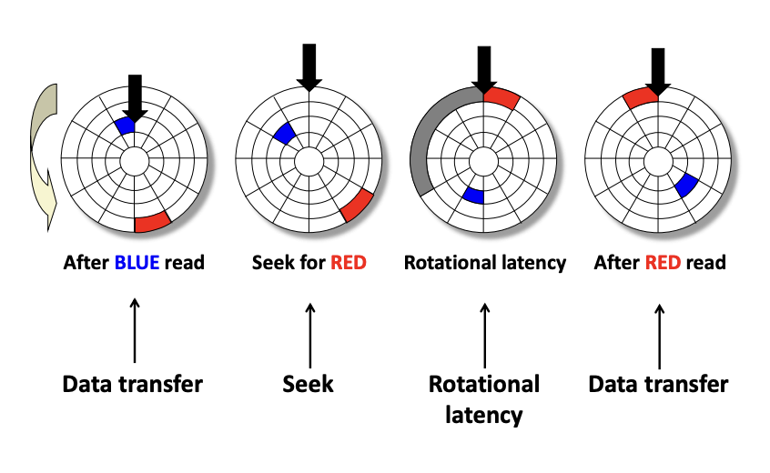
```
Taccess = Tavg seek + Tavg rotation + Tavg transfer
```
- Disk access time dominated by seek time and rotational latency
- First bit in a sector is the most expensive to access, the rest are essentially free
- Disk access is 40000 times slower than SRAM and 2500 times slower than DRAM

Read a disk sector:
1. CPU writes a command + logical block number + destination memory address to a port (address) associated with the disk controller.
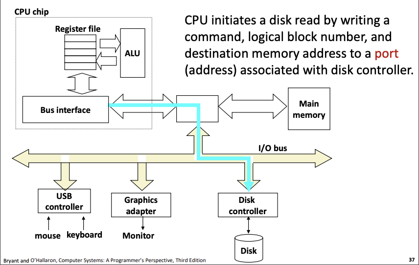
2. Firmware on the disk controller performs a fast table lookup.
3. Hardware on the disk controller reads the sector and performs a direct memory access (DMA) transfer into main memory.
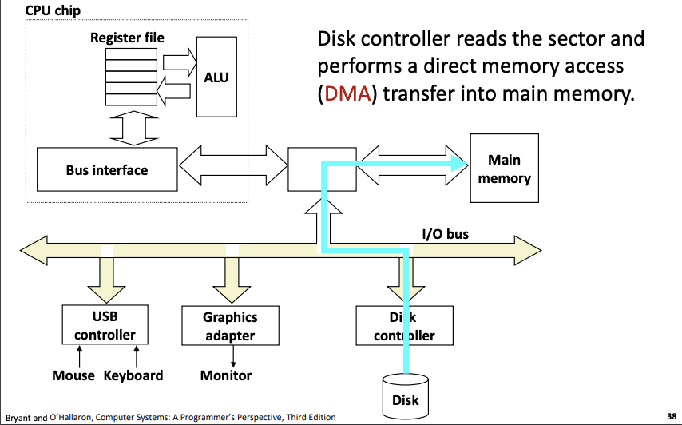
4. Once data transfer completes, the disk controller notifies the CPU with an interrupt.
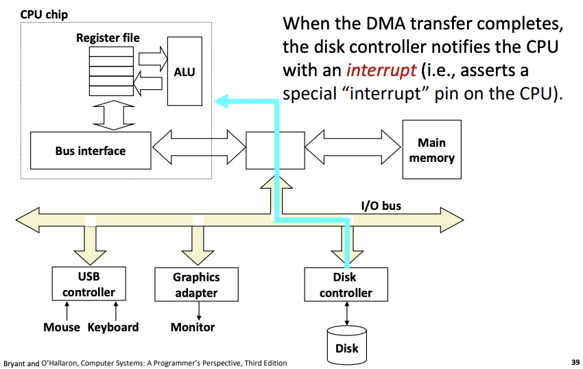

Solid State Disk (SSD): 
- Storage technology based on flash memory. Flash translation layer serves the same purpose as the disk controller.
- Data is written in units of pages but a page can be only written after its block has been erased. In other words, to modify a single page, other pages have to be copied onto a clean block. A block wears after about 100,000 erases. Consequently, reading is performed much faster than writing.

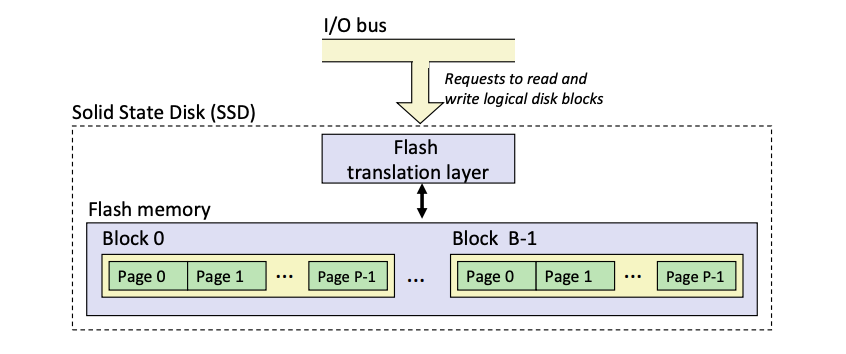

##### The CPU-Memory Gap
The gap widens between DRAM, disk and CPU speeds.

Locality:
- key to bridging this CPU-Memory gap
- Principle of Locality: Program tend to use data and instructions with addresses near or equal to those they have used recently
- Temporal Locality: Recently referenced items are likely to be referenced again in the near future
- Spatial Locality: Items with nearby addresses tend to be referenced close together in time
- Example:
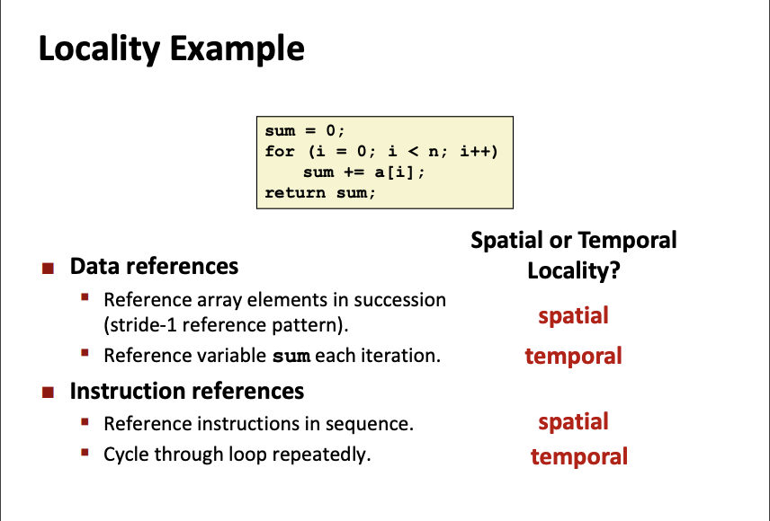
- Qualitative Estimates of Locality
```
#BAD LOCALITY
int sum_array_rows(int a[M][N]) {
    int i, j, sum = 0;
    for (i = 0; i < N; i++)
        for (j = 0; j < M; j++)
            sum += a[j][i]
    return sum
}
// stride-M reference pattern

#GOOD LOCALITY
int sum_array_rows(int a[M][N]) {
    int i, j, sum = 0;
    for (i = 0; i < M; i++)
        for (j = 0; j < N; j++)
            sum += a[i][j]
    return sum
}
// Data of arrays are laid out by rows in the memory. Make use of spatial locality by accessing all the data in each column within a row before moving to the next. (stride-1 reference pattern)
```

##### Memory Hierarchies
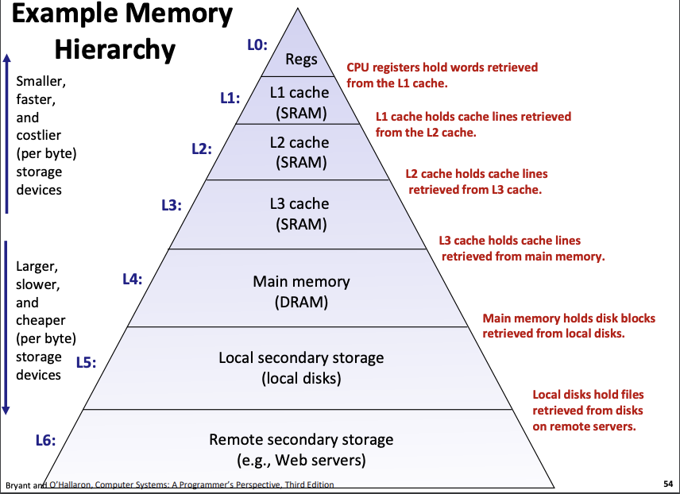
This hierarchical system and caching create a large pool of storage that can be accessed at the speed of the fastest storage device (registers) and at the cost of the cheapest storage device (local disks)

##### Caches
A smaller, faster storage device that acts as a staging area for a subset of the data in a larger, slower device.

Cache Hit: Data that is requested can be found in cache (i.e. this data has already been accessed before, therefore stored in cache)

Cache Miss: Data requested cannot be found in cache => needs to be fetched from memory => data is placed in cache (for future references) by replacing a block that is currently occupying space in the cache

Types of Cache Misses:
- Cold miss: Cache is initially empty.
- Capacity miss: Occurs when active cache blocks (working set; data that is constantly accessed) is larger than the cache.
- Conflict miss: Most caches limit blocks at level-(k+1) to a small subset of positions at level k. This is because randomly placed blocks are expensive to locate. However, this means that multiple data can map to the same level-k block and evicting one another.
e.g. if block i at level k+1 must be placed in block (i mod 4) at level k (cache) => referencing blocks 0, 8, 0, 8, 0, 8... would miss everytime as both blocks are constantly evicting one another