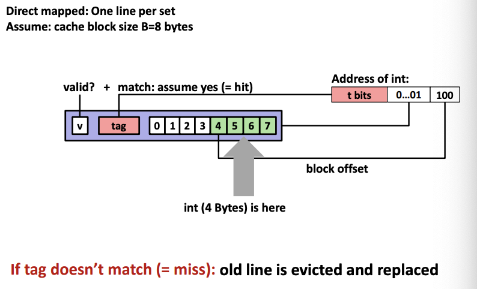

# Lecture 12 - Cache Memories

### General Cache Organization

**Cache size**: C = S x E x B data bytes

**Cache Read**: When CPU sends address to cache, cache divides the address into a number of regions (tag, set index, block offset).
- Set index: Locate the set in the cache
- Tag: Check if any line matches the tag
- Block offset: Byte location in a cache line

### Direct-Mapped Cache Simulation
Direct-mapped cache contains 1 line per set only.


### E-way Associative Cache
E-way associative cache: (E = 2) means 2-way associative; 2 lines per set. Searches for matching tag in all the lines within a set.

### Cache Write
Write-hit
- Write-through: Write immediately to memory on cache hit. Simple but causes bus traffic every write.
- Write-back (Common): Defer write to memory until the replacement of line in cache. Another bit is needed to indicate whether the cache block has been modified.

Write-miss
- Write-allocate (Common): Loads from the lower level into cache and updates the line.
- No-write-allocate: Writes the word directly to the next lower level.

### Cache Performance Metrics
Miss Rate
- Fraction of memory references not found in cache = 1 - hit rate

Hit Time
- Time to deliver a line in cache to the processor (including time to determine whether line is in the cache)

Miss Penalty
- Additional time required because of a miss

### The Memory Mountain
Read throughput (read bandwidth) - number of bytes read from memory per second (MB/s)

Memory mountain: Measured read throughput as a
function of spatial and temporal locality.
- Compact way to characterize memory system performance. 


### Rearranging loops to improve spatial locality
**Matrix Multiplication Example**
Multiple N x N matrix where each element is a double (8 bytes). Block size is 32 bytes (4 doubles) and cache is not big enough to hold multiple rows.
```
/* ijk */

for (i=0; i<n; i++) {
	for (j=0; j<n; j++) {
		sum = 0.0;
		for (k=0; k<n; k++)
			sum += a[i][k] * b[k][j]; /* Focus here */
		c[i][j] = sum
	}
}

// Row-wise access of A and Column-wise access of B
// Miss per inner loop iteration:
// A: 0.25, B: 1, C: 0

/* kij */ (BEST)

for (k=0; k<n; k++) {
	for (i=0; i<n; i++) {
		r = a[i][k];
		for (j=0; j<n; j++)
			c[i][j] += r * b[k][j]; /* Focus here */
	}
}

// Row-wise access of A and Row-wise access of B
// Miss per inner loop iteration:
// A: 0, B: 0.25, C: 0.25

/* jki */

for (j=0; j<n; j++) {
	for (k=0; k<n; k++) {
		r = b[k][j];
		for (i=0; i<n; i++)
			c[i][j] += a[i][k] * r; /* Focus here */
	}
}

// Column-wise access of A and Column-wise access of B
// Miss per inner loop iteration:
// A: 1, B: 0, C: 1
```

### Using blocking to improve temporal locality
Blocking is a well-known optimization technique that can help avoid memory bandwidth bottlenecks in a number of applications. The key idea behind blocking is to exploit the inherent data reuse available in the application by ensuring that data remains in cache across multiple uses.

**Blocking example (Before)**
```
for (body1 = 0; body1 < NBODIES; body1 ++) {
   for (body2=0; body2 < NBODIES; body2++) {
     OUT[body1] += compute(body1, body2);
   }
}
```
In this example, data (body2) is streamed from memory. Assuming NBODIES is large, we would have no reuse in cache. This application is memory bandwidth bound. The application will run at the speed of memory to CPU speeds, less than optimal.

**Blocking example (After)**
```
for (body2 = 0; body2 < NBODIES; body2 += BLOCK) {
   for (body1=0; body1 < NBODIES; body1 ++) {
      for (body22=0; body22 < BLOCK; body22 ++) {
         OUT[body1] += compute(body1, body2 + body22);
      }
   }
}
```
In this modified code, data (body22) is kept and reused in cache, resulting in better performance.

For instance, the code snippet above shows an example of blocking NBody code. There are two loops (body1 and body2) iterating over all bodies. The original code on the top streams through the entire set of bodies in the inner loop, and must load the body2 value from memory in each iteration. The blocked code at the bottom is obtained by splitting the body2 loop into an outer loop iterating over bodies in multiple of BLOCK, and an inner body22 loop iterating over elements within the block, and interleaving the body1 and body2 loops. This code reuses a set of BLOCK body2 values across multiple iterations of the body1 loop. If BLOCK is chosen such that this set of values fits in cache, memory traffic is brought down by a factor of BLOCK.