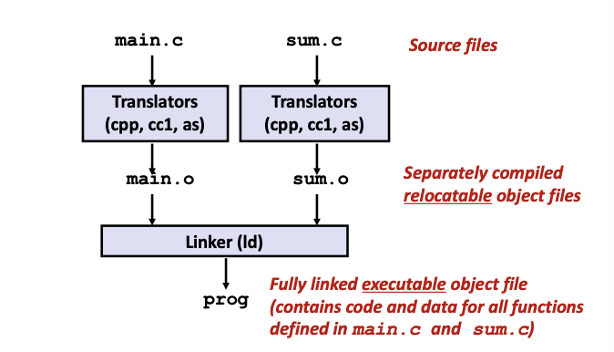
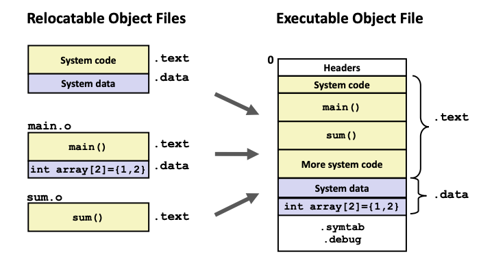
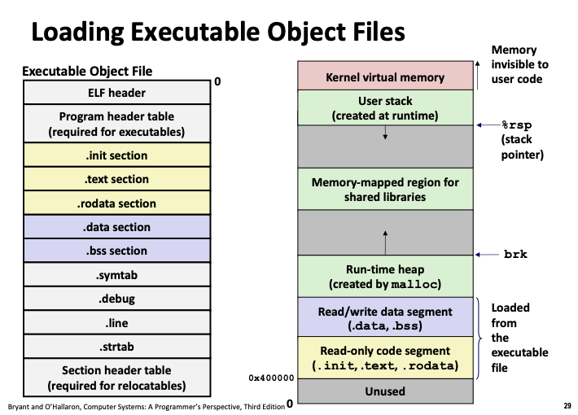
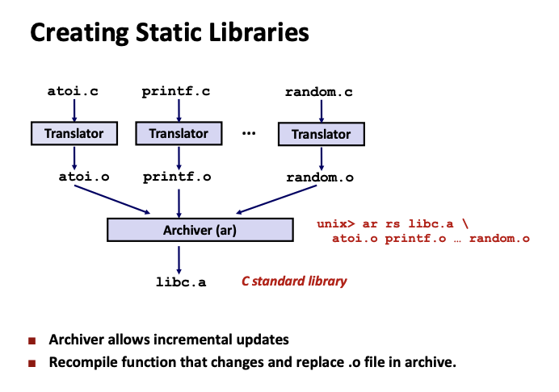
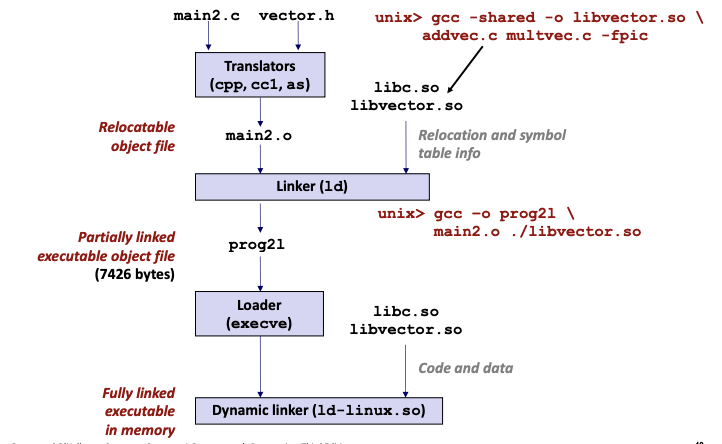

# Lecture 13 - Linking

### Linking
Programs are translated and linked using a compiler driver:
```
linux> gcc -Og -o prog main.c sum.c
linux> ./prog
```


##### Why Linkers?
Reason 1: Modularity
- Program can be written as a collection of smaller source files, rather than one monolithic mass
- Can build libraries of common functions (e.g. Math library, standard C library)

Reason 2: Efficiency
- Time: Seperate compilation
    - Change one source file, compile and then relink
    - No need to recompile other source files
- Space: Libraries
    - Common functions can be aggregated into a single file...
    - Yet executable files and running memory images contain only code for the functions they actually use

##### What do linkers do?
Step 1: Symbol resolution
- Programs define and reference symbols (global variables and functions):
```
void swap() {...} /* definition */
swap()            /* reference */
int *xp = &x;     /* definition & reference */
```
- Symbol definitions are stored in object file (by assembler) in symbol table
    - Symbol table is an array of structs
    - Each entry includes name, size, and location of symbol
- During symbol resolution step, the linker associates each symbol reference with exactly one symbol definition.

Step 2: Relocation
- Merges separate code and data sections into single sections
- Relocate symbols from their relative locations in the .o files to their absolute memory locations in the executable
- Updates all the symbol references to point to the correct address

##### Types of Object Files (Modules)
Relocatable object file (.o file)
- Contains compiled object code that is produced by the compiler. Can be combined with other relocatable object files and processed by the linker to produce the final executable
    - Each .o file is produced from exactly one source (.c) file

Executable object file (a.out file)
- Abbreviated form of "assembler output"
- Contains code and data in a form that can be copied directly into memory and then executed
- Default output file name for executables created by compilers and linkers when no output name is specified

Shared object file (.so file)
- Special type of relocatable object file that can be loaded into memory and linked dynamically, at either load time or run-time
- SO files are saved in a specific place in an user's file system and dynamically linked to programs, meaning they are loaded only when needed (i.e. when a program needs to perform a common function stored in an SO file)

##### Executable and Linkable Format (ELF)
Standard binary format for object files

ELF Object File Format:
```
ELF header - Word size, byte ordering, file type (o, so, out)
Segment header table - Page size, virtual addresses memory segments (sections), segment sizes

.text - Machine code
.rodata - Read only data such as jump tables
.data - Initialized global variables
.bss - Uninitialized global variables (No space taken by data)
.symtab - Symbol entries for procedures, static variable names, section names and locations
.rel.text - Relocation info for .text section (Not needed in exe)
.rel.data - Relocation info for .data section (Not needed in exe)
.debug - Source code to line number in machine code (gcc -g)
.strtab - String table for symbols in .symtab .debug

Section header table - Where different sections start
```

##### Linker Symbols
Global symbols
- Symbols defined by module *m* that can be referenced by other modules (e.g. **non-static** C functions and **non-static** global variables)

External symbols
- Global symbols that are referenced by module *m* but defined by some other module

Local symbols
- Symbols that are defined and referenced execlusively by module *m* (e.g. C functions and global variables defined with the **static** attribute)
- Local linker symbols (stored in .bss or .data) are NOT local program variables (stored in the stack)

##### How linker resolves duplicate symbol definitions
Program symbols are either strong or weak
- Strong: procedures and initialized globals
- Weak: Uninitialized globals
```
# p1.c
int foo = 5 //strong
p1() {      // strong
}

# p2.c
int foo;    // weak
p2() {      // strong
}
```
Rule 1: Multiple strong symbols are not allowed
Rule 2: Given a strong symbol and multiple weak symbols, choose the strong symbol
Rule 3: If there are mutiple weak symbols, pick an arbitary one (can override this with `gcc -fno-common`)
```
//Example of Linker error

# p1.c
int x = 7; /* Address: 0x123456 */
int y = 5; /* Address: 0x123460 */
int main() {
    f();
    return 0;
}

# p2.c
double x;  /* Assigned to 8-byte memory */
void f() {
    x = -0.0
}

// Writes to x in p2 will be 8-bytes even though the memory location of x is 4-bytes because the linker chose the strong symbol => overwriting y
// results x -> 0x0 and y -> 0x80000000
```

##### Relocation

After symbol resolution, the linker knows the exact sizes of the code and data sections. In relocation, it merges the input modules and assign runtime addresses to each symbol. There are two steps.

Relocating sections: Linker aggregates sections of the same type and assign runtime addresses to sections and symbol definitions.

Relocating symbol references: Linker modifies every symbol reference so that each points to the correct runtime address. Linker relies on relocation entries which have been generated by the assembler for modifying the addresses.

##### Loading Executable Object Files

The loader copies (Map virtual memory pages) the code and data from the executable object file into memory and jumps to the entry point. The runtime heap follows the .data section and grows upwards. The user stack starts from the largest legal user address (248 - 1) and grows down.

Heap, data and code segments actually have gaps between them due to alignment requirements and the address-space layout randomization.

##### Packaging commonly used functions
How to package functions commonly used by programmers? (e.g. Math, I/O, memory management, string manipulation, etc.)

- Old-fashioned Solution: Static libraries (.a archive files)
    - Concatenate related reolcatable object files into a single file with an index (called an *archive*)
    - Enchance linker so that it tries to resolve unresolved external references by looking for symbol in one or more archives
    - If an archive member file resolves reference, link it into the executable
    
- Modern Solution: Shared libraries
    - Static libraries have the following disadvantages:
        1. Duplication in the stored executables (every function needs libc)
        2. Duplication in the running executables
        3. Minor bug fixes of system libraries require each application explicitly relink

##### Shared libraries
Object files that contain code and data that are loaded and linked into an application *dynamically*, at either load-time or run-time (also called dynamic link libraries, DLLs, .so files)


Provide a mechanism where one executable copy can be shared between different programs. Unlike static libraries, the linking of references is deferred until load time or even runtime.

The linker does not resolve the references such as printf() during relocation. It only notes in the symbol table that these references will have to be resolved during load time. When executable file is created, linking is only partially complete.

During load time, the loader (execve) loads the executable and runs the dynamic linker. The dynamic linker allocates text and data of shared libraries into memory and relocate the references in the executable object file. Control is returned to the entry point afterwards.

### Library Interpositioning
Powerful linking technique that allows programmers to intercept calls to arbitrary functions
Interpositioning can occur at:
- Compile time: When the source code is compiled
- Link time: When the relocatable object files are statically linked to form an executable object file
- Load/run time: When an executable object file is loaded into memory, dynamically linked, and then executed