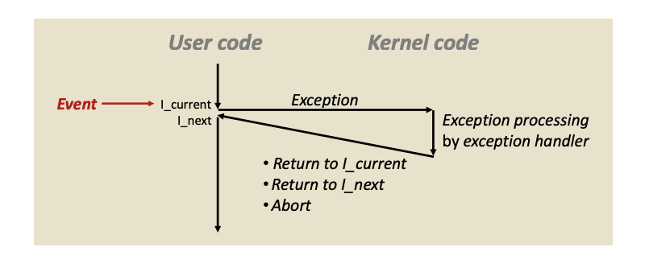
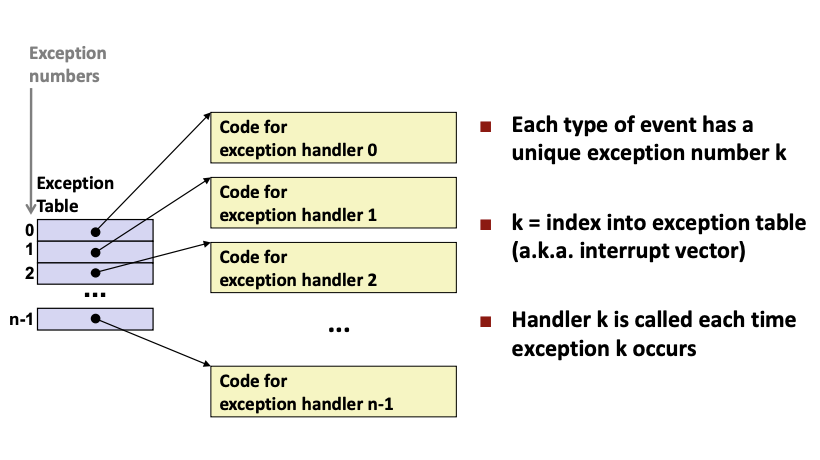
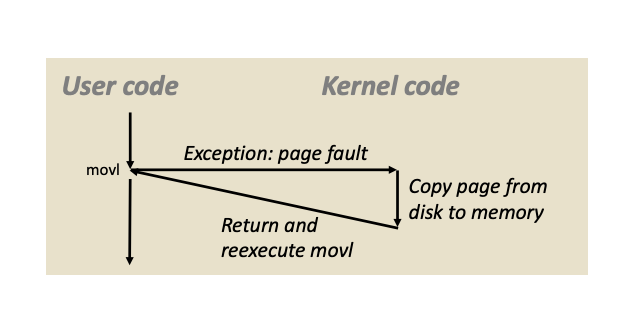
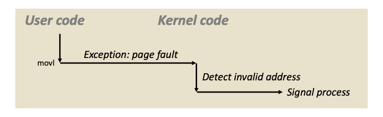
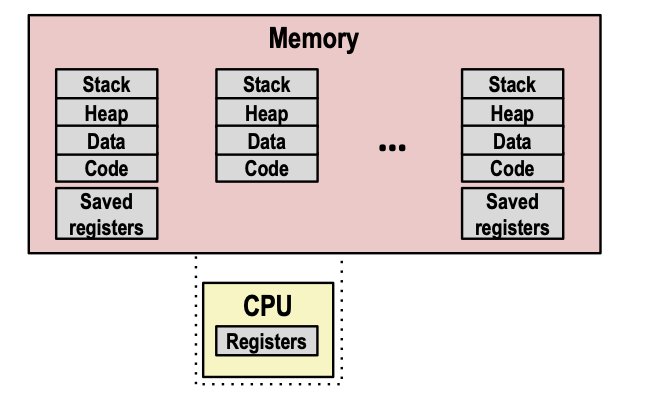

# Lecture 14 - Exceptional Control Flow Exception

### Control Flow
Processors do only one thing:
- From startup to shutdown, a CPU simply reads and executes a sequence of instructions, one at a time
- This sequence is the CPU's *control flow*

##### Altering control flow
Up to now: two mechanisms for changing control flow:
React to changes in **program state**
- Jumps and branches
- Procedure call and return

Insufficient for a useful system:
Difficult to react to changes in **system state**
- Data arrives from a disk or a network adapter
- Instruction divides by zero
- User hits Ctrl+C at the keyboard
- System timer expires

System needs mechanisms for "exceptional control flow"

##### Exceptional Control Flow
 A program reacting to changes in the system state that are not captured in the internal variables.
- Exists at all levels of a computer system

##### Exceptions
An **exception** is a transfer of control to the OS *kernel* in response to some event
- Kernel is the memory-resident part of the OS.
    - Controls all hardware resources and arbitrates conflicts between processes concerning such resources
    - Optimizes the utilization of common resources (e.g. CPU & cache usage, file systems, and network sockets)
- E.g. of events: Divide by 0, arithmetic overflow, page fault, I/O request completes, typing Ctrl+C


##### Exception Tables
Every type of event has a unique exception number, which serves as an index into a jump table called an **exception table**

Exception number: A number that indexes into the exception table. They can be assigned by processor designers (Example: Page faults, Divide-by-zero) or by kernel developers (Example: System calls, I/O signals).

Difference from procedure call:
1. The return address pushed onto the stack can be the current instruction or the next.
2. Processor states such as condition codes may also be pushed onto the stack.
3. The items are pushed onto the kernel's stack not the user's stack.

##### Types of exceptions

**Asynchronous Exceptions (Interrupts):**
Caused by events external to the processor.
- I/O devices trigger interrupts by setting the processor's interrupt pin
- After an interrupt, handler returns to the "next" instruction
- Examples
    - Timer interrupt
        - Every few ms, an external timer chip triggers an interrupt (exception to allow kernel to decide what to do => schedule a new process/ let current process run)
        - Used by the kernel to take back control from user programs (otherwise user program can run forever in an infinite loop)
    - I/O interrupt from external device
        - Hitting Ctrl+C at the keyboard
        - Arrival of a packet from a network
        - Arrival of data from a disk

**Synchronous Exceptions**
Caused by events that occur as a result of executing an instruction.

Traps: Intentional exceptions. For example, `syscall` instruction causes a trap and the exception handler calls the appropriate kernel routine. Always returns to the next instruction.

Faults: Unintentional but possibly recoverable. For example, page fault handler loads the page from disk and returns control to the instruction. May re-execute faulting (current) instruction or `abort`.

Aborts: Unintentional and unrecoverable. The handler returns control to an `abort` routine.

##### System Calls
Each x86-64 system call has a unique ID number. It looks like a function call but it is actually transferring control to the kernel.

System-level function: C wrapper functions for system calls. For example, when the user calls `open(filename, options)`, the unique ID is placed in %rax before the `syscall` instruction is executed.
```
<__open>:
...
mov  $0x2, %eax  # open is syscall #2
syscall          # Kernel returns value in %rax. -ve means error
cmp  $0xfffffffffffff001, %rax
...
retq
```

##### Fault Example: Page Fault
```
int a[1000]
main() {
    a[500] = 13
}

# 80483b7: c7 05 10 9d 04 08 0d movl   $0xd, 0x8049d10
```
- User writes to memory location but it's not actually in the memory; needs to be loaded from disk into memory => page fault
- Creates an exception which transfer control to the page fault handler in the kernel => copies the page from disk to memory => returns to current instructions; re-executes `movl` instruction
- No longer have page fault as the memory has been loaded from disk into memory by the kernel => `movl` instruction completes



##### Fault Example: Invalid Memory Reference
```
int a[1000]
main() {
    a[5000] = 13
}

# 80483b7: c7 05 60 e3 04 08 0d movl   $0xd, 0x804e360
```
- Sends `SIGSEGV` signal to user process
- User process exits with "segmentation fault"



### Processes
A **process** is an instance of a running program
- One of the most profound ideas in computer science
- Not the same as "program" or "processor"

Process provides each program with two key abstractions
- Logical control flow: Each program seems to have exclusive use of CPU.
- Private address space: Each program seems to have exclusive use of main memory. Provided by kernel mechanism called virtual memory

Each program runs within the context of some process. The context consists of states such as program counter, stack, registers, open file descriptors and code/data in memory.

##### Multiprocessing
Computer executes multiple processes concurrently.

Single Core Processors (Traditional):

When OS decides to execute another process:
- Saves current registers in memory => Schedule next process for execution => Restores the context (saved registers and switch address space) of the next process (Context Switch) => Pass control to the next process

This is how the OS creates the illusion that each process has exclusive use of main memory

Multicore Processors (Modern):
Schedule processes on each of the cores available. If there is not enough cores available for the number of processes => resort to context switching

##### Concurrent Processes
Two processes run concurrently if their logical flows overlap in time.

##### System call error handling
On error, Linux system-level functions return -1 and set global variable `errno` to indicate cause. Must always check return status of every system-level function.
```
if ((pid = fork()) < 0) {
    fprintf(stderr, "fork error: %s\n", strerror(errno));
	exit(0);
}
```

Error-handling Wrappers: Identical interface as the original function with first letter uppercase.
```
pid_t Fork(void) {
	pid_t pid;
	if ((pid = fork()) < 0) {
		fprintf(stderr, "fork error: %s\n", strerror(errno));
		exit(0);
	}
	return pid;
}

pid = Fork();
```

##### Creating and Terminating Processes
From a programmer's perspective, we can think of a process as being in one of three states
- Running: Either executing or waiting to be executed.
- Stopped: Execution is suspended until further notice. Runs again when the process receives a `SIGCONT` signal.
- Terminated: Process is stopped permanently. Three reasons - Receiving a signal whose default action is to terminate, returning from the main routine, calling the `exit` function.

Parent *process* creates a new running *child process* by calling `fork`. 
- Returns 0 to the child process, returns child's PID to parent process. 
- Child gets identical copies of the parent's virtual address space and open file descriptors
- Cannot predict the execution order of parent and child.
```
int main() {
	pid_t pid;
	int x = 1;
	
	pid = Fork();
	if (pid == 0) {
		printf("child: x=%d\n", ++x);
		exit(0);
	}
	
	printf("parent: x=%d\n", --x);
	exit(0);
}

linux> ./fork
parent: x=0
child: x=2
```

**Reaping child processes:**
When a process terminates, it still consumes system resources in case parent wants to read its states. Its called a zombie process.

Parent uses `wait` or `waitpid` to reap the zombie process. If parent does not reap, the orphaned child will be reaped by the `init` process (pid == 1) when the parent terminates.

Reaping is important in long-running processes such as shells and servers for preventing memory leak.

##### Loading and Running Programs using `execve`
`int execve(char *filename, char *argv[], char *envp[])` Filename can be object file or script file. Argument list's first item by convention is the filename. Environment variable list contains "name=value" strings.

Overwrites code, data and stack with the same (1) PID, (2) open files and (3) signal context.