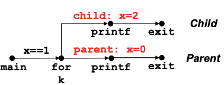
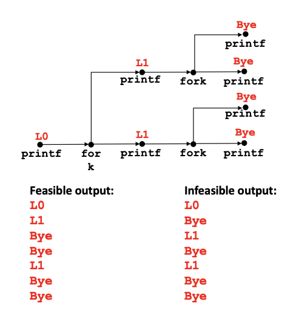
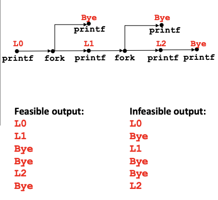
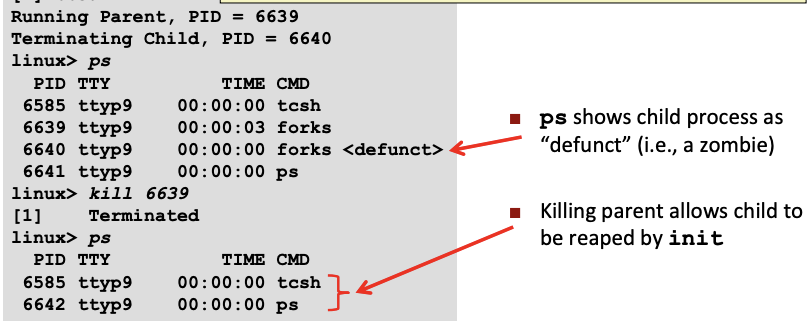
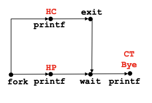
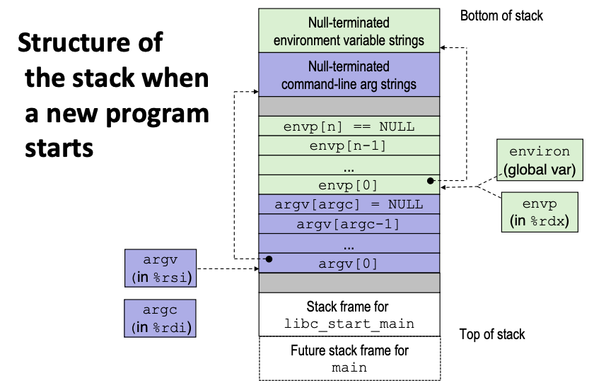
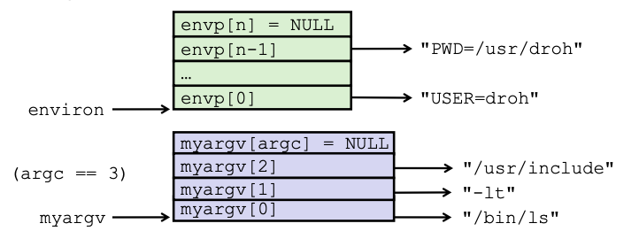

# Lecture 14 - Exceptional Control Flow Exception

### Control Flow
Processors do only one thing:
- From startup to shutdown, a CPU simply reads and executes a sequence of instructions, one at a time
- This sequence is the CPU's *control flow*

##### Altering control flow
Up to now: two mechanisms for changing control flow:
React to changes in **program state**
- Jumps and branches
- Procedure call and return

Insufficient for a useful system:
Difficult to react to changes in **system state**
- Data arrives from a disk or a network adapter
- Instruction divides by zero
- User hits Ctrl+C at the keyboard
- System timer expires

System needs mechanisms for "exceptional control flow"

##### Exceptional Control Flow
 A program reacting to changes in the system state that are not captured in the internal variables.
- Exists at all levels of a computer system

##### Exceptions
An **exception** is a transfer of control to the OS *kernel* in response to some event
- Kernel is the memory-resident part of the OS.
    - Controls all hardware resources and arbitrates conflicts between processes concerning such resources
    - Optimizes the utilization of common resources (e.g. CPU & cache usage, file systems, and network sockets)
- E.g. of events: Divide by 0, arithmetic overflow, page fault, I/O request completes, typing Ctrl+C


##### Exception Tables
Every type of event has a unique exception number, which serves as an index into a jump table called an **exception table**

Exception number: A number that indexes into the exception table. They can be assigned by processor designers (Example: Page faults, Divide-by-zero) or by kernel developers (Example: System calls, I/O signals).

Difference from procedure call:
1. The return address pushed onto the stack can be the current instruction or the next.
2. Processor states such as condition codes may also be pushed onto the stack.
3. The items are pushed onto the kernel's stack not the user's stack.

##### Types of exceptions

**Asynchronous Exceptions (Interrupts):**
Caused by events external to the processor.
- I/O devices trigger interrupts by setting the processor's interrupt pin
- After an interrupt, handler returns to the "next" instruction
- Examples
    - Timer interrupt
        - Every few ms, an external timer chip triggers an interrupt (exception to allow kernel to decide what to do => schedule a new process/ let current process run)
        - Used by the kernel to take back control from user programs (otherwise user program can run forever in an infinite loop)
    - I/O interrupt from external device
        - Hitting Ctrl+C at the keyboard
        - Arrival of a packet from a network
        - Arrival of data from a disk

**Synchronous Exceptions**
Caused by events that occur as a result of executing an instruction.

Traps: Intentional exceptions. For example, `syscall` instruction causes a trap and the exception handler calls the appropriate kernel routine. Always returns to the next instruction.

Faults: Unintentional but possibly recoverable. For example, page fault handler loads the page from disk and returns control to the instruction. May re-execute faulting (current) instruction or `abort`.

Aborts: Unintentional and unrecoverable. The handler returns control to an `abort` routine.

##### System Calls
Each x86-64 system call has a unique ID number. It looks like a function call but it is actually transferring control to the kernel.

System-level function: C wrapper functions for system calls. For example, when the user calls `open(filename, options)`, the unique ID is placed in %rax before the `syscall` instruction is executed.
```
<__open>:
...
mov  $0x2, %eax  # open is syscall #2
syscall          # Kernel returns value in %rax. -ve means error
cmp  $0xfffffffffffff001, %rax
...
retq
```

##### Fault Example: Page Fault
```
int a[1000]
main() {
    a[500] = 13
}

# 80483b7: c7 05 10 9d 04 08 0d movl   $0xd, 0x8049d10
```
- User writes to memory location but it's not actually in the memory; needs to be loaded from disk into memory => page fault
- Creates an exception which transfer control to the page fault handler in the kernel => copies the page from disk to memory => returns to current instructions; re-executes `movl` instruction
- No longer have page fault as the memory has been loaded from disk into memory by the kernel => `movl` instruction completes


##### Fault Example: Invalid Memory Reference
```
int a[1000]
main() {
    a[5000] = 13
}

# 80483b7: c7 05 60 e3 04 08 0d movl   $0xd, 0x804e360
```
- Sends `SIGSEGV` signal to user process
- User process exits with "segmentation fault"


### Processes
A **process** is an instance of a running program
- One of the most profound ideas in computer science
- Not the same as "program" or "processor"

Process provides each program with two key abstractions
- Logical control flow: Each program seems to have exclusive use of CPU.
- Private address space: Each program seems to have exclusive use of main memory. Provided by kernel mechanism called virtual memory

Each program runs within the context of some process. The context consists of states such as program counter, stack, registers, open file descriptors and code/data in memory.

##### Multiprocessing
Computer executes multiple processes concurrently.

Single Core Processors (Traditional):

When OS decides to execute another process:
- Saves current registers in memory => Schedule next process for execution => Restores the context (saved registers and switch address space) of the next process (Context Switch) => Pass control to the next process

This is how the OS creates the illusion that each process has exclusive use of main memory

Multicore Processors (Modern):
Schedule processes on each of the cores available. If there is not enough cores available for the number of processes => resort to context switching

##### Concurrent Processes
Two processes run concurrently if their logical flows overlap in time.

##### System call error handling
On error, Linux system-level functions return -1 and set global variable `errno` to indicate cause. Must always check return status of every system-level function call (only exception is the handful of functions that return `void`).

`fork()`: Fork system call is used for creating a new process, which is called child process, which runs concurrently with the process that makes the fork() call (parent process). After a new child process is created, both processes will execute the next instruction following the fork() system call. A child process uses the same PC (program counter), same CPU registers, same open files which use in the parent process.

It takes no parameters and returns an integer value. Below are different values returned by fork().
- Negative Value: creation of a child process was unsuccessful.
- Zero: Returned to the newly created child process.
- Positive value: Returned to parent or caller. The value contains process ID of newly created child process.
```
if ((pid = fork()) < 0) {
    fprintf(stderr, "fork error: %s\n", strerror(errno));
	exit(0);
}
```
`fprintf(stderr, "")`: used to print the error message within the double quotes to the console. Usually fprintf would redirect the output message to the file indicated (first param). However, since `stderr` is used, the output message cannot be redirected so it prints to the console. `stderr` is used to print the error message to the output console and hence this is used in the program where we want the output to be fetched directly into the other program where it prints the error message directly on the console.

Global Variable `errno`: When a function is called in C, a variable named as errno is automatically assigned a code (value) which can be used to identify the type of error that has been encountered. Its a global variable indicating the error occurred during any function call and defined in the header file `errno.h`.

`strerror(errno)`: strerror() function maps the error number in *errno* to its error message string

Error-reporting functions
```
void unix_error(char *msg) {
    fprintf(stderr, "%s: %s\n", msg, strerror(errno));
    exit(0);
}
// Unix-style errors return -1 and set a number in errno. unix_error() func prints the error message corresponding to the errno before exiting function

// Use the error-reporting function
if ((pid = fork()) < 0)
    unix_error("fork error")
```

**Simplify the code even further by using Stevens-style error-handling wrappers**
Calls the original `fork()` function, checks for unix error. If no error, it will return the process ID. Allows us to make our code compact without violating the rule of always checking return status of the system-level function call.
```
pid_t Fork(void) {
	pid_t pid;
	if ((pid = fork()) < 0) {
		unix_error("Fork error")
	}
	return pid;
}

//Usage
pid = Fork();
```

##### Obtaining Process IDs
`pid_t` data type stands for process identification and it is used to represent process ids.

`pid_t getpid(void)`: returns process ID of current process

`pid_t getppid(void)`: returns process ID of parent process

##### Creating and Terminating Processes
From a programmer's perspective, we can think of a process as being in one of three states
- Running: Either executing or waiting to be executed and will eventually be *scheduled* (i.e. chosen to execute) by the kernel.
- Stopped: Execution is **suspended** until further notice. Runs again when the process receives a `SIGCONT` signal.
- Terminated: Process is stopped permanently. Three reasons - Receiving a signal whose default action is to terminate, returning from the `main` routine, calling the `exit` function.

`void exit(int status)`: terminates program with an exist status
- Exit Success is indicated by `exit(0)` => program has been executed without any error or interrupt
- Exit Failure is indicated by `exit(1)` => abnormal termination of the program

Parent *process* creates a new running *child process* by calling `fork()`. 
- Interesting (and often confusing) because it is called **once** but returns **twice** => Returns 0 to the child process, returns child's PID to parent process.
- Child gets identical copies of the parent's virtual address space and open file descriptors. However, child has a different PID than the parent
- Cannot predict the execution order of parent and child.
```
int main() {
	pid_t pid;
	int x = 1;
	
	pid = Fork(); //creates the child process and returns a value each to both child and parent processes
	if (pid == 0) { // if PID is 0, means we are executing the child process
		printf("child: x=%d\n", ++x);
		exit(0);
	}
	
	// else, we are executing the parent
	printf("parent: x=%d\n", --x);
	exit(0);
}

linux> ./fork
parent: x=0
child: x=2
```
- Call once, return twice
- Concurrent execution
    - Can't predict execution order of parent and child
- Duplicate but separate address space
    - x has a value of 1 when fork returns in parent and child
    - subsequent changes to x are independent
- Shared open files
    - The child process inherits the parent's open files. Since `stdout` file is open in the parent, the child's output is also directed to the screen.

**Modeling `fork` with Process Graphs**
A *process graph* is a useful tool for capturing the partial ordering of statements in a concurrent program. Helps to visualize feasibles orderings of executions of concurrent processes.
Each vertex is the execution of a statement (a -> b means a happens before b). Edges can be labeled with current value of variables.

Previous Example:


Two consecutive forks:
```
void fork2() {
    printf("L0\n");
    fork(); //Now theres 2 concurrent processes
    printf ("L1\n"); //print twice
    fork(); //4 processes
    printf("Bye\n"); //print 4 times
}
```


Nested forks in parent:
```
void fork4() {
	printf("LO\n");
	if (fork() != 0) { //executes only in parent
		printf("l1\n");
		if (fork() != 0) { //executes only in parent
			printf("L2\n");
		}
	}
	printf("Bye\n");
}
```


**Reaping child processes:**
When a process terminates, it still consumes system resources in case parent wants to read its states (e.g. check its exit status). Its called a zombie process.

Parent uses `wait` or `waitpid` to reap the zombie process (Parent is given exit status information). Afterwards, the kernel then deletes zombie child process. If parent does not reap, the orphaned child will be reaped by the `init` process (pid == 1; very first process that exists in system) when the parent terminates.

Reaping is important in long-running processes such as shells and servers for preventing child processes from taking up memory space and causing memory leak.

**Zombie example**
```
void fork7() {
	if (fork() == 0) { //Child
		printf("Terminating child, pid=%d\n", getpid());
		exit(0);
	} else { //Parent
		printf("Running parent, pid=%d\n", getpid());
		while (1)
			; /* Infinite loop */
	}
}
```

`ps` linux command prints the current processes.
Killing process 6639 (parent process) results in process 6640 (child process) to disappear as it is repaed by the `init` process

**`wait`: Synchronizing with Children**
Parent reaps a child by calling the `wait` function

`int wait(int *child_status)`
- Suspends current process until one of its children terminates
- Return value is the `pid` of the child process that terminated
- If `child_status != NULL`, then the integer that it points to (&child_status) will be set to a value that indicates reason the child terminated and the exit status
    - Check using macros defined in wait.h
        - WIFEXITED, WEXITSTATIS, WIFSIGNALED, WTERMSIG, WIFSTOPPED, WSTOPSIG, WIFCONTINUED
```
void fork9() {
	int child_status;
	
	if (fork() == 0) {
		printf("HC: hello from child\n");
		exit(0);
	} else {
		printf("HP: hello from parent\n");
		wait(&child_status);
		printf("CT: child has terminated\n");
	}
	printf("Bye\n");
}
```


**`waitpid`: Waiting for a Specific Process**
`pid_t waitpid(pid_t pid, int &status, int options)`
- Suspends current process until the process with the specified pid terminates
```
void fork11() {
	pid_t pid[N];
	int i, child_status;
	
	for (i=0; i<N; i++)
		if ((pid[i] = fork()) == 0) {
			exit(100+i); /* Child exit with status int indicating which child it is */
		}
	for (i=0; i<N; i--) /* Parent waits for child to terminate N times */
		pid_t wpid = waitpid(pid[i], &child_status, 0); //Suspends current process and check if child process N has terminated
		if (WIFEXITED(child_status)) //Check if child terminated normally by calling exit()
			printf("Child %d terminated with exit status %d\n",
				wpid, WEXITSTATUS(child_status)); //Check exit status of child
		else
			printf("Child %d terminate abnormally\n", wpid);

	/* The only normal termination is if there are no more children */
	if (errno != ECHILD)
		unix_error("waitpid error");
	exit(0);
}
```

##### Loading and Running Programs
To load and run a different program inside of a child process, we can use:
`int execve(char *filename, char *argv[], char *envp[])` Filename can be object file or script file beginning with `#!intepreter` (e.g. #!/bin/bash). Argument list's first item (`argv[0]`) by convention is the filename. Each argument are strings separated by spaces. Environment variable list contains "name=value" strings (e.g. `USER=droh`).

Overwrites code, data and stack with the same (1) PID, (2) open files and (3) signal context.

Called **once** and **never** returns (except if there is an error then returns -1)

After the file is loaded, the `execve` calls the start-up code which sets up the stack and passes the control to the main routine.

**Example**
Run `/bin/ls -lt /usr/include` in a child process with the current environment.
- Execute `ls` command to list files in current `/usr/include` directory
- `-lt`: sort by, and show, ctime (time of last modification of file status information)
- myargv[0]: "/bin/ls"; name of function
- myargv[1]: "-lt"
- myargv[2]: "usr/include"
- environ (env variables): just use the environment variables of the current working directory
    - envp[0]: "USER=droh"
    - envp[n-1]: "PWD=/usr/droh"


```
/* After creating myargv[] */

if ((pid = Fork()) == 0) { /*Child runs program*/
	if (execve(myargv[0], myargv, environ) < 0) { //if execve returns negative int means program does not exist
		printf("%s: Command not found.\n", myargv[0]);
		exit(1);
	}
}
```
If we just called `execve` in the parent process, it will blow away the program. In order to continue to do work after calling `ls`, we fork a child and have the child run the `ls` command instead