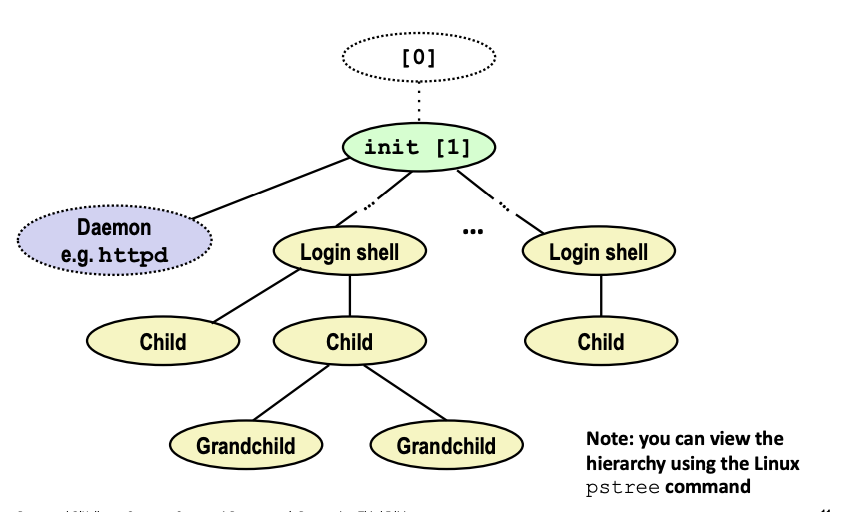
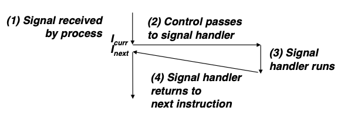
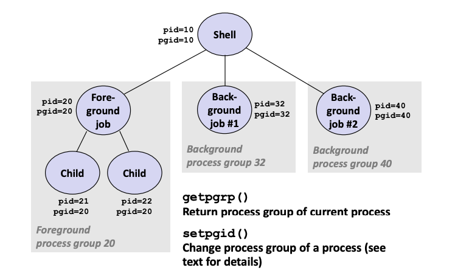
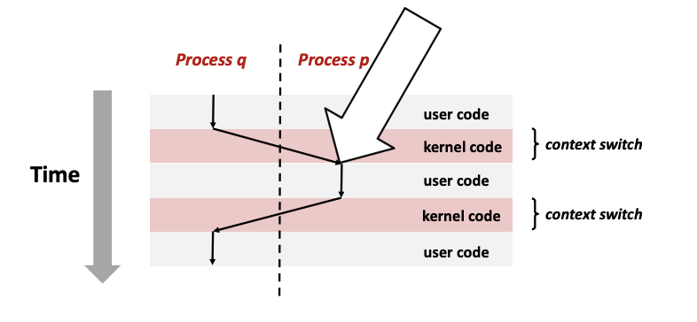
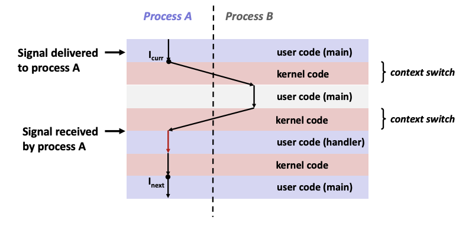
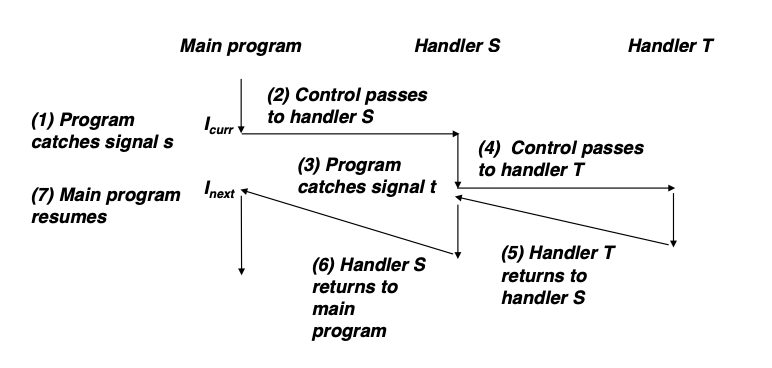

# Lecture 15 - Exceptional Control Flow Signals and Nonlocal Jumps

### Linux Process Hierarchy

The very first process (pid = 1) is the `init` process which is created when the system is booted. All other processes are descendants of the `init` process.

### Shell Programs
A **shell** is an application program that runs program on behalf of the user
- sh         - Original Unix shell
- csh/tcsh   - BSD Unix C shell
- bash       - "Bourne-Again" Shell (default Linux shell)
```
int main() {
    char cmdline[MAXLINE]; /* command line */
    while (1) {
        /* read */
        printf("> ");
        Fgets(cmdline, MAXLINE, stdin)
        if (feof(stdin))
            exit(0);
        
        /* evaluate */
        eval(cmdline)
    }
}
```
`fgets(char *str, int n, FILE *stream)`:
- `str`: the variable in which the input string is going to be stored
- `n`: the maximum length of the string that should be read
- `stream`: it is the filehandle (temporary file name assigned to an open file that is being utilized by the OS), from where the string is to be read. In this case, read from standard input (stdin)

`feof(FILE *stream)`: indicates whether the end-of-file flag is get for the given *stream*. If user types `Ctrl+D`, it will send an EOF flag to the standard input and closes the terminal.

**Simple Shell Example**
```
void eval (char *cmdline) {
    char *argv[MAXARGS]; /* Argument list execve() */
    char buf[MAXLINE]; /* Holds modified command line */
    int bg; /* Should the job run in background or foreground */
    pid_t pid; /* Process id */
    
    strcpy(buf, cmdline); /* Copy cmdline input into buf */
    bg = parseline(buf, argv); /* parseline() is a function written in CSAPP to check if cmdline input ends with "&" */
    if (argv[0] == NULL)
        return; /* Ignore empty lines */
    
    /* builtin_command() is a CSAPP function written to check if the argv[0] is 'quit' or '&' => if so, return 1 or exit, else, returns 0 by default */
    if (!builtin_command(argv)) {
        if ((pid = Fork()) == 0) { /* Child runs user job */
            if (execve(argv[0], argv, environ) < 0) { /* execve never returns unless there's an error; return -1 */
                printf("%s: Command not found.\n", argv[0]);
                exit(0);
            }
        }
        
        /* Parent waits for foreground job to terminate */
        if (!bg) {
            int status;
            if (waitpid(pid, &status, 0) < 0)
                unix_error("waitfg: waitpid error");
        }
        else
            printf("%d %s", pid, cmdline);
    }
    return;
}
```
For more info on how `parseline()` and `builtin_command` is written: http://csapp.cs.cmu.edu/2e/ics2/code/ecf/shellex.c

Shell `eval` function takes in an input string and parse into arguments for `execve` in a child process. If it is a foreground job, a `waitpid` is run to reap the child process.

**Problem with Simple Shell Example**
Example shell does not reap background jobs
- Will become zombies and create a memory leak

Solution: Exceptional control flow
- The kernel will interrupt regular processing to alert us when a background process completes
- In Unix, the alert mechanism is called a **signal**

### Signals
A **signal** is a small message that notifies a process that an event of some type has occurred in the system. Akin to exceptions and interrupts. Only information in a signal is its ID and the fact that it arrived.
ID | Name | Action | Event
------ | ------ | ------ | ------
2 | SIGINT | Terminate | User typed ctrl-C
9 | SIGKILL | Terminate | Kill program (Can't override/ignore)
11 | SIGSEGV | Terminate | Segmentation violation (i.e. access a region of memory that is protected or not legal)
14 | SIGALRM | Terminate | Timer signal (set a timeout)
17 | SIGCHLD | Ignore | Kernel sends signal to Parent every time a Child has terminated, stopped or resumed

##### Sending a signal
- Kernel **sends** (delivers) a signal to a **destination process** by updating some state in the context of the destination process

##### Receiving a signal
- A destination process **receives** a signal when it is forced by the kernel to react in some way to the delivery of the signal
- Ways to react:
    - **Ignore** the signal
    - **Terminate** the process
    - **Catch** the signal by executing a user-level function called **signal handler**
        - Akin to a hardware exception handler being called in response to an asynchronous interrupt
        - Difference is that exception handlers are in the kernel and signal handler is just in the C code (execute in process)
    

##### Pending and Blocked Signals
A signal is **pending** if sent but not yet received.
Only one pending signal of each type is allowed (e.g. at any point of time, there can only be one SIGCHLD signal). The subsequent signals of the same type sent to the process are discarded.

A process can **block** the receipt of certain signals. Blocked signals can be delivered, but will not be received until the signal is unblocked.

Kernel maintains **pending** and **blocked** bit vectors (32-bit ints) in the context of each process
- **pending**: represents the set of pending signals
    - Kernel sets bit k in **pending** when a signal of type k is delivered (that's why sending subsequent signals of the same type has no effect as the bit k is already set)
    - Kernel clears bit k in **pending** when a signal of type k is received
- **blocked**: represents the set of blocked signals
    - Can be set and cleared by using the `sigprocmask` function
    - Also referred to as the *signal mask*

##### Process Groups
Each process belongs to exactly one process group


##### Sending Signals with `/bin/kill` Program
Can use `/bin/kill` program to send arbitrary signal to a process or a process group
```
# Send SIGKILL (-9) to process 24818
/bin/kill -9 24818

# Send SIGKILL (-9) to every process in process group 24817
/bin/kill -9 -24817
```

##### Sending Signals from the Keyboard
Ctrl-C: Sends SIGINT (terminate) to every job in foreground process group.

Ctrl-Z: Sends SIGTSTP (suspend) to every job in the foreground process group. Use `fs` shell command to restore suspended jobs back to foreground

##### Sending Signals with `kill` Function
If PID is zero, the signal is sent to every process in the process group. If PID is less than zero, the signal is sent to the process group |PID|.
```
void fork12() {
	pid_t pid[N];
	int i;
	int child_status;
	
	/* Create N number of Child processes */
	for (i=0; i<N; i++) 
		if ((pid[i] = fork()) == 0) {
			/* Child Infinite loop */
			while (1)
				;
		}
	
	/* Kill every Child process */
	for (i=0; i<N; i++) {
		printf("Killing process %d\n", pid[i]);
		kill(pid[i], SIGINT);
	}
}
```

##### Receiving Signals
Suppose kernel is returning from an exceptional handler and is ready to pass control back to user code in process *p*. 

Kernel checks for any pending nonblocked signals for process *p* before passing control
- `pnb = pending & ~blocked`

If `pnb == 0` (no pending nonblocked signals), can successfully pass control to instruction in user code for *p*
Else
- Choose least nonzero bit *k* in pnb and force process p to **receive** signal *k*
- The receipt of the signal triggers some **action** by p
- Repeat for all nonzero k in pnb
- After going through all the bits in pnb, then pass control to next instruction in logical flow for *p*

##### Installing Signal Handlers
Each signal type has a predefined **default action**, which is one of:
- The process terminates
- The process stops until restarted by a `SIGCONT` signal
- The process ignores the signal

We can modify the **default action** by using a system call function called `signal`
- `handler_t *signal(int signum, handler_t *handler)`

Different values for `handler`:
- SIG_IGN: ignore signals of type **signum**
- SIG_DFL: revert to the default action on receipt of signals of type **signum**
- Otherwise, use the address of an user-level **signal handler**
    - Called when process receives signal of type **signum**
    - Referred to as **"installing"** the handler
    - Executing handler is called **"catching"** or **"handling"** the signal
    - When the handler executes it return statement, control is passed back to instruction in the control flow of the process that was interrupted by receipt of the signal
```
// Example
#include <signal.h>

void sigint_handler(int sig) {
	printf("Signal received is %d\n", sig);
}

int main() {
	/* Install the SIGINT handler */
	if (signal(SIGINT, sigint_handler) == SIG_ERR)
		unix_error("signal error");
	
	/* pause() suspends the current process and until receipt of a signal and the signal handler executes */
	pause();
	
	return 0;
}
```

##### Signal Handlers as Concurrent Flows
A signal handler is a separate logical flow (not process) that runs concurrently with the main program

One of the reasons why signals are so tricky is because of this overlapping concurrent flow. The signal handler runs in the same process as the main program so it has access to all the global state in the program and this can cause problems.

##### Nested Signal Handlers
Handler for a signal can be interrupted by a signal of another type. The same type of signal is implicitly blocked.


##### Blocking and Unblocking Signals
Implicity blocking mechanism
- Kernel blocks any pending signals of same type as the signal currently being handled

Explicit blocking and unblocking mechanism 
- `sigprocmask` function allows process to block and unblock a set of signals

Supporting functions
- `sigemptyset` - Create empty set
- `sigfillset` - Add every signal number to set
- `sigaddset` - Add signal number to set
- `sigdelset` - Delete signal number from set

```
//Example: Temporarily Blocking Signals

sigset_t mask, prev_mask;
Sigemptyset(&mask) /* Create empty set; all 0s */
Sigaddset(&mask, SIGINT) /* Add SIGINT to set */

/* Block SIGINT and save previous blocked set */
Sigprocmask(SIG_BLOCK, &mask, &prev_mask)
... /* Code region that will not be interrupted by SIGINT */
/* Restore previous blocked set, unblocking SIGINT */
Sigprocmask(SIG_SETMASK, &prev_mask, NULL)

```

##### Safe Signal Handling
Tricky issues about Signals
1. Shared global state with main program can cause corruption of shared data structures => inconsistent state
2. Signals are not queued => Do not make the mistake of using signals to count the occurence of events
3. They are not portable across different versions of Linux

Writing safe handlers
1. Keep handlers as simple as possible.
    - e.g. Set a global flag and return
2. Call only async-signal-safe functions in the handlers.
    - `printf`, `sprintf`, `malloc`, and `exit` are not safe!
3. Save and restore `errno` on entry and exit.
    - So that other handlers don't overwrite your value of `errno`
4. Protect accesses to shared data structures by blocking all signals temporarily.
5. Declare global variables as `volatile` to prevent unexpected optimizations.
    - Prevent compiler from storing variables in a register (Read/write from memory directly)
6. Declare global flags as `volatile sig_atomic_t`. 
    - *flag*: variable is only read or written (e.g. flag = 1, not flag++)
    - Flag declared this way does not need to be protected like other globals
    - Read/write to the variable will always happen in one uninterruptible step

###### Async-Signal-Safety
Function is **async-signal-safe** (safe to be used inside a signal handler) if either reentrant (e.g. all variables stored on stack frame; can call multiple instances of the function as they have separate copies of the variables they are using, CS:APP3e 12.7.2) or non-interruptible by signals

Portable Operating System Interface (POSIX) guarantees 117 functions to be async-signal-safe
- Popular functions on the list: `_exit`,`write`,`wait`,`waitpid`,`sleep`,`kill`
- Popular functions that are **NOT** on the list: `printf`,`sprintf`,`malloc`,`exit`

For example, suppose a program is in the middle of a call to `printf` (`printf` acquires a lock on the terminal) and a signal occurs whose handler itself also calls `printf`. In this case, the output of the two `printf` statements would be intertwined (both waiting for the lock on the terminal to be released which will never occur).

This problem cannot be solved by using synchronization primitives because any attempt would produce immediate deadlock.

Use the reentrant SIO (Safe I/O library) from `csapp.c` in your signal handlers

##### Signals are not queued Example
Pending	signals	are	not	queued
- For each signal type, one	bit indicates whether or not signal	is pending…
- …thus	at most one	pending	signal of any particular type.	

You	can’t use signals to count events, such	as children	terminating.

Must wait for all terminated child processes
- Put `wait` in a loop to reap all terminated children
```
// SIGCHLD means at least one children has terminated

int ccount = 0
/**
 * SIGCHLD handler reaps background child processes
 */
void child_handler(int sig) {
	int olderrno = errno;
	pid_t pid;
	/* wait() blocks the calling process until current child process terminates, then parent can continue its execution and other signals can be sent and received */
	while ((pid = wait(NULL)) > 0) {
		ccount--;
		Sio_puts("Handler reaped a child\n");
	}
	if (errno != ECHILD) // no more terminated children
		Sio_error("wait error");
	errno = olderrno;
}

void fork14() {
	pid_t pid[N];
	int i;
	ccount = N;
	Signal(SIGCHLD, child_handler);
	
	/* Create N child processes */
	for (i=0; i<N; i++) {
		if ((pid[i] = Fork()) == 0) {
			Sleep(1);
			exit(0); /* Child exists */
		}
	}
	
	while (ccount > 0) /* Parent spins until ccount becomes 0 */
		;
}
```

##### Portable Signal Handler
Different versions of Unix can have different signal handling semantics
- Some older systems restore action to default after catching signal
- Some interrupted system calls can return with `errno == EINTR` (slow syscalls like `read` will be interrupted by signals; aborted => have to put `read` in a loop and calls until succeed which is troublesome)
- Some systems don't block signals of the type being handled

Solution: `sigaction`
This wrapper function can be used to unify the behaviour among different Unix versions.
```
/* Provided in csapp.c */
sighandler_t *Signal(int signum, sighandler_t handler) {
	struct sigaction action, old_action;
	
	action.sa_handler = handler;
	sigemptyset(&action.sa_mask); /* Block sigs of type being handled */
	action.sa_flags = SA_RESTART; /* Restart syscalls if possible */
	
	if (sigaction(signum, &action, &old_action) < 0)
		unix_error("Signal error");
		
	return (old_action.sa_handler);
}
```

##### Synchronizing Flows to Avoid Races
Child process could terminate before Parent has a chance to add that job to the queue. We cannot make any assumptions about the execution ordering of the child in the process or how long it will run.
If SIGCHLD is not blocked before forking, deletejob() in the child process may run before addjob() in the parent process.
```
void handler(int sig) {
	int olderrno = errno;
	sigset_t mask_all, prev_all;
	pid_t pid;
	
	Sigfillset(&mask_all);
	while((pid = waitpid(-1, NULL, 0)) > 0) { /* Reap child */
		Sigprocmask(SIG_BLOCK, &mask_all, &prev_all);
		deletejob(pid); /* Delete child from job list */
		Sigprocmask(SIG_SETMASK, &prev_all, NULL);
	}
	if (errno != ECHILD)
		Sio_error("waitpid error");
	errno = olderrno;
}

int main(int argc, char **argv) {
	int pid;
	sigset_t mask_all, mask_one, prev_one;
	
	Sigfillset(&mask_all);
	Sigemptyset(&mask_one);
	Sigaddset(&mask_one, SIGCHLD);
	Signal(SIGCHLD, handler);
	initjobs(); /* Initialize job list */
	
	while(1) {
		Sigprocmask(SIG_BLOCK, &mask_one, &prev_one);  // Block SIGCHLD signals before we create new Child
		if ((pid = Fork()) == 0) {                     // Child process
			Sigprocmask(SIG_SETMASK, &prev_one, NULL); // Unblock SIGCHLD in child process to allow them to reap their own Child processes from execve
			Execve("/bin/date", argv, NULL);
		}
		Sigprocmask(SIG_BLOCK, &mask_all, NULL); // Parent process
		addjob(pid);                            // Add child to job list
		Sigprocmask(SIG_SETMASK, &prev_one, NULL);     // Unblock SIGCHLD in parent process
	}
	exit(0);
}
```

##### Explicitly Waiting for Signals
`int sigsuspend(const sigset_t *mask)` is the uninterruptible version of the commands below. Atomicity (`sigprocmask` and `pause` are executed together in `sigsuspend`) eliminates the possibility that the signal is received after the call to `sigprocmask` and before `pause`.
```
sigprocmask(SIG_BLOCK, &mask, &prev); /* Block set of signals */
pause();
sigprocmask(SIG_SETMASK, &prev, NULL); /* Revert back to previous set */
```
While condition is needed to ensure that the execution is suspended if other signals, such as SIGINT, are handled by `pause`.
```
volatile sig_atomic_t pid;

/* Handler explicitly waits for SIGCHLD to arrive */
void sigchld_handler(int s) {
	int olderrno = errno;
	pid = Waitpid(-1, NULL, 0); /* Main is waiting for nonzero pid; wait for foreground job to complete */
	errno = olderrno;
}
void sigint_handler(int s){}

int main() {
	sigset_t mask, prev;
	Signal(SIGCHLD, sigchld_handler);
	Signal(SIGINT, sigint_handler);
	Sigemptyset(&mask);
	Sigaddset(&mask, SIGCHLD);
	
	while (1) {
		Sigprocmask(SIG_BLOCK, &mask, &prev); // Block SIGCHLD to prevent race condition between parent and child
		if (Fork() == 0) /* Child */
			exit(0);
		
		/* Wait for SIGCHLD to be received */
		pid = 0;
		while (!pid) 
			Sigsuspend(&prev); // Pause for any signal but only SIGCHLD receipt can set pid to nonzero as it is using &prev mask where only SIGCHLD is unblocked; SIGINT signal won't affect pid
		
		/* Optionally unblock SIGCHLD */
		Sigprocmask(SIG_SETMASK, &prev, NULL);
		
		/* Do more work */
	}
	exit(0);
}
```

### Nonlocal Jumps
Refer to CSAPP