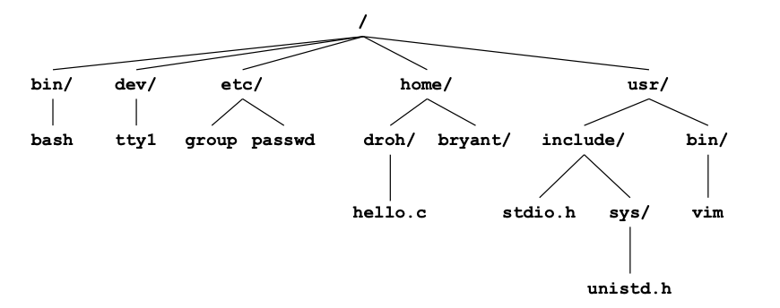
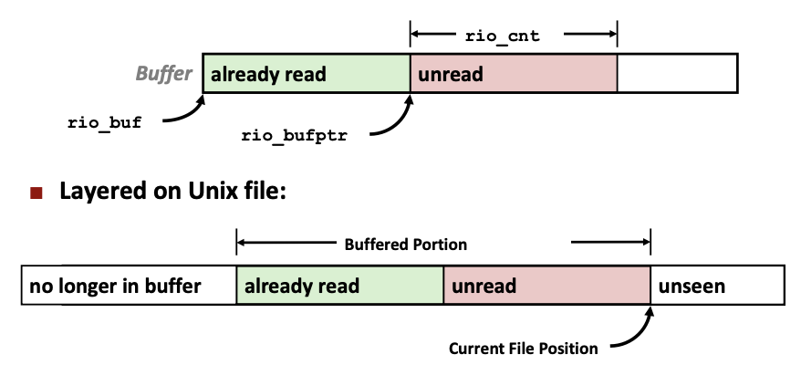
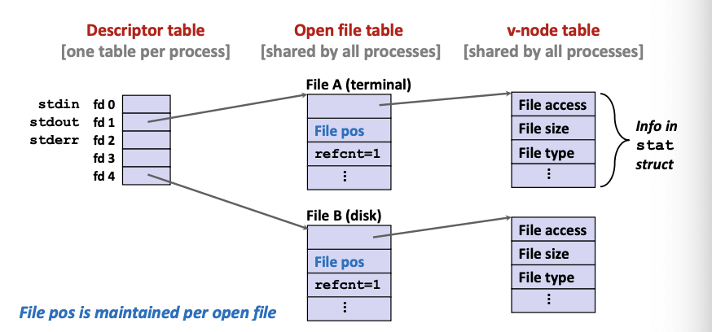
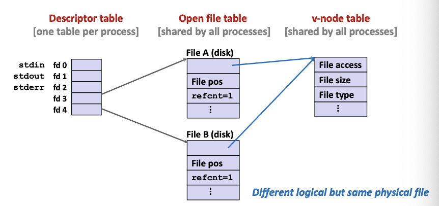
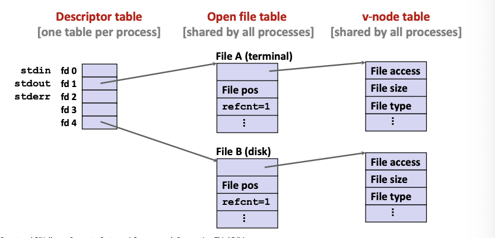
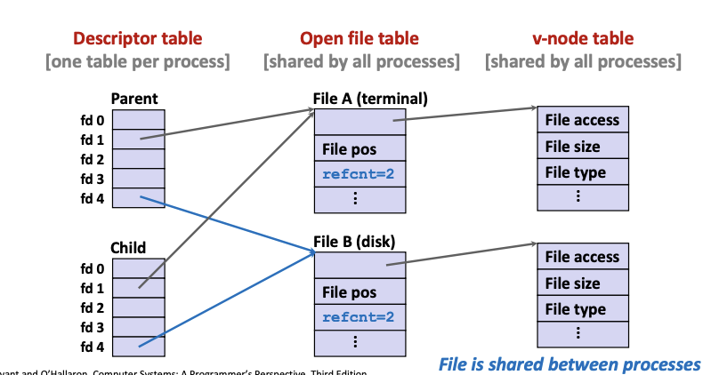
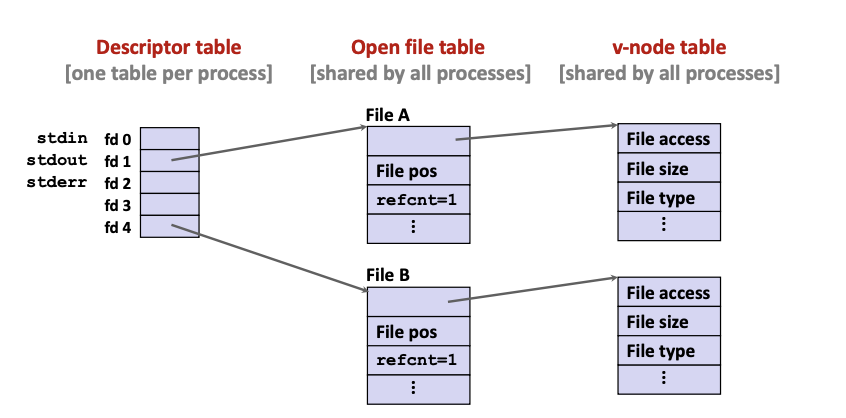
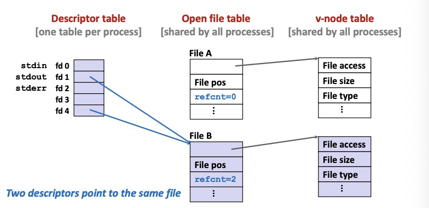
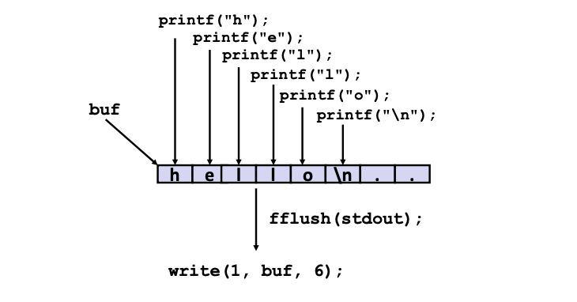

# Lecture 16 - System Level I/O

### Unix I/O (low-level)
##### Unix I/O Overview
A Linux **file** is a sequence of bytes. All I/O devices are represented as files:
- `/dev/sda2` (/usr disk partition)
- `/dev/tty2` (terminal)

Even the kernel is represented as a file:
- `/boot/vmlinuz-3.13.0-55-generic` (kernel image)
- `/proc` (kernel data structures)

Elegant mapping of files to devices allows kernel to export simple interface called Unix I/O:
- Opening and closing files
    - `open()` and `close()`
- Reading and writing a file
    - `read()` and `write()`
- Changing the **current file position** (seek)
    - indicates the next offset into file to read or write
    - `lseek()`: system call that is used to change the location of the read/write pointer of a file descriptor

##### File Types
Each file has a type indicating its role in the system
- *Regular file*: Files on the disk drive containing arbitrary data
- *Directory*: Index for a related group of files
- *Socket*: For communicating with a process on another machine

##### Regular Files
A regular file contains arbitrary data.
Applications often distinguish between text files and binary files
- Text files are regular files with only ASCII or Unicode characters
- Binary files are everything else
    - e.g. object files, JPEG images, audio files
- Kernel doesn't know the difference

Text file is a sequence of text lines
- Text line is a sequence of chars terminated by newline char `/n`
    - Newline is `0xa`, same as ASCII line feed character (LF)

End of line (EOL) indicators in other systems
- Linux and Mac OS: `/n`(0xa)
    - line feed (LF)
- Windows and Internet protocols: `\r\n` (0xd 0xa)
    - Carriage return (CR) and line feed (LF)

##### Directories
Directory consists of an array of lines
- Each link maps a *filename* to a file

Each directory contains at least two entries
- . (dot) is a link to itself
- .. (dot dot) is a link to the *parent* directory in the *directory hierarchy*

Commands for manipulating directories
- `mkdir`: create empty directory
- `ls`: view directory contents
- `rmdir`: delete empty directory

**Directory Hierarchy**

- All files are organized as a hierarchy anchored by root directory name `/` (slash)
- Kernel maintains *current working directory* (cwd) for each process
    - Modified using the `cd` command

**Pathnames**
Locations of files in the hierarchy denoted by **pathnames**
- Absolute **pathname** starts with '/' and denotes path from root
 - `/home/droh/hello.c`
- Relative **pathname** denotes path from current working directory
    - `../home/droh/hello.c`

##### Opening Files
Opening a file informs the kernel that you are getting ready to access that file. Takes in a single one bit flag or a combination of flags (using bitwise OR).
```
int fd; /* file descriptor */

if ((fd = open("/etc/hosts", O_RDONLY)) < 0){
    perror("open");
    exit(1);
}
```
Returns a small identifying integer **file descriptor**
- `fd == -1` indicates that an error occurred

Each process created by a Linux shell begins life with three open files associated with a terminal:
- 0: standard input (stdin)
- 1: standard output (stdout)
- 2: standard error (stderr)

##### Closing Files
Closing a file informs the kernel that you are finished accessing that file
```
int fd;     /* file descriptor */
int retval; /* return value */

if ((retval = close(fd)) < 0){
    perror("close");
    exit(1);
}
```
Closing an already closed file is a recipe for disaster in threaded programs
Always check return codes, even for seemingly benign functions such as `close()`

##### Reading Files
Reading a files copies bytes from the current file position to memory, and then updates file position
```
char buf[512];
int fd;  /* file descriptor */
int nbytes; /* number of bytes read */

/* Open file fd... */
/* Then read up to 512 bytes from file fd */
if ((nbytes = read(fd, buf, sizeof(buf))) < 0){
    perror("read");
    exit(1);
}
```
Buffer sets maximum number of bytes to read.
Returns number of bytes read from file `fd` into `buf`
- Return type `ssize_t`is signed integer
- `nbytes < 0` indicates that an error occured
- Short counts (`nbytes < sizeof(buf)`) are possible and are not errors

##### Writing Files
Writing a file copies bytes from memory to the current file position, and then updates current file position
```
char buf[512];
int fd; /* file descriptor */
int nbytes; /* number of bytes read */

/* Open file fd... */
/* Then write up to 512 bytes from buf to file fd */
if ((nbytes = write(fd, buf, sizeof(buf))) < 0){
    perror("write");
    exit(1);
}
```
Returns number of bytes written from `buf` to file `fd`
- `nbytes < 0` indicates that an error occurred
- As with reads, short counts are possible and are not errors

##### Short Counts
Short counts can occur in these situations:
- Encountering (end-of-file) EOF on reads
- Reading text lines from a terminal (text lines are separated by newline char)
- Reading and writing network sockets (packets of large sizes are sent in small chunks of bytes)

Short counts never occur in these situatons:
- Reading from disk files (except for EOF)
- Writing to disk files

Best practice is to always allow for short counts

### Robust I/O (RIO) Package
RIO is a set of wrappers that provide efficient and robust I/O in apps, such as network programs that are subject to short counts

RIO provides two different kinds of functions
- Unbuffered input and output of binary data
    - `rio_readn` and `rio_written`
- Buffered input of text lines and binary data
    - `rio_readlineb` and `rio_readnb`
    - Buffered RIO routines are thread-safe and can be interleaved arbitrarily on the same descriptor

Download from http://csapp.cs.cmu.edu/3e/code.html
- src/csapp.c and include/csapp.h

##### Unbuffered RIO Input and Output
Same interface as Unix `read` and `write`.
Especially useful for transferring data on network sockets.
```
#include "csapp.h"

ssize_t rio_readn(int fd, void *usrbuf, size_t n);
ssize_t rio_writen(int fd, void *usrbuf, size_t n);

//Return: num. of bytes transferred if OK, 0 on EOF(rio_readn only), -1 on error
```
- `rio_readn` returns short count only if it encounters EOF
    - Only use it when you know how many bytes to read
- `rio_writen` never returns a short count
- Calls to `rio_readn` and `rio_writen` can be interleaved arbitrarily on the same descriptor
```
/* Robustly read n bytes (unbuffered) */
/* Params are the file descriptor, the destination buffer and the umber of bytes to read */
ssize_t rio_readn(int fd, void *userbuf, size_t n) {
	size_t nleft = n;
	ssize_t nread;
	char *bufp = userbuf;
	/* Reads until n is 0 */
	while (nleft > 0) {
		if ((nread = read(fd, bufp, nleft)) < 0) {
			if (errno = EINTR) /* Interrupted by sig handler return */
				nread = 0;     /* and call read() again */
			else
				return -1;     /* errno is set by read() */
		} else if (nread == 0)
			break;             /* EOF */
		nleft -= nread;
		bufp += nread;         /* Move the pointer forward */
	}
	return (n - nleft);
}
```

##### Buffered RIO Input Functions
Efficiently read text lines and binary data from a file partially cached in an internal memory buffer
```
typedef struct {
	int rio_fd;
	int rio_cnt;      /* Unread bytes in internal buffer */
	char *rio_bufptr; /* pointer to next unread byte */
	char rio_buf[RIO_BUFSIZE]; /* internal buffer */
} rio_t;

/* Associates a file descriptor with a read buffer */
void rio_readinitb(rio_t *rp, int fd);

ssize_t rio_readlineb(rio_t *rp, void *usrbuf, size_t maxlen);

ssize_t rio_readnb(rio_t *rp, void *usrbuf, size_t n);
```
- `rio_readlineb` reads a text line of up to `maxlen` bytes from file `fd` and stores the line in `usrbuf`
    - Especially useful for reading text lines from network sockets
- Stopping conditions
    - `maxlen` bytes read
    - EOF encountered
    - Newline (`/n`) encountered
- `rio_readnb` reads up to **n** bytes from file `fd`
- Stopping conditions
    - `maxlen` bytes read
    - EOF encountered
- Calls to `rio_readlineb` and `rio_readnb` can be interleaved arbitrarily on the same descriptor
    - Warning: Don't interleave with calls to `rio_readnb`

File has associated buffer to hold bytes that have been read from file but not yet read by user code. I/O buffering allows caching of data read from file in memory and provide them when user code reads the file. This reduces the number of reads which are costly.

```
/* Robustly read n bytes (Buffered) */
/* The code for rio_readnb is similar to rio_readn */
/* Instead of read(), it uses rio_read() internally */

/* Uses rp->rio_buf as internal buffer before copying to usrbuf */
static ssize_t rio_read(rio_t *rp, char *usrbuf, size_t n) {
	int cnt;
	while (rp->rio_cnt <= 0) { /* Refill if buf empty */
		rp->rio_cnt = read(rp->rio_fd, rp->rio_buf, sizeof(rp->rio_buf));
		
		if (rp->rio_cnt < 0) {
			if (errno != EINTR) /* Allow sig handler interrupt */
				return -1;
		} else if (rp->rio_cnt == 0)
			return 0;
		else
			rp->rio_bufptr = rp->rio_buf; /* Reset buf ptr */
	}
	
	/* Copy min(n, rp->rio_cnt) bytes from internal buf to user buf */
	cnt = n;
	if (rp->rio_cnt < n)
		cnt = rp->rio_cnt;
	memcpy(usrbuf, rp->rioptr, cnt);
	rp->rio_bufptr += cnt;
	rp->rio_cnt -= cnt;
	return cnt;
}
```

### Metadata, Sharing, and Redirection
**Metadata** is data about data, in this case file data
Per-file metadata maintained by kernel
- accessed by users with the `stat` and `fstat` functions

Accessing File Metadata
```
int main(int argc, char **argv) {
	struct stat stat;
	char *type, *readok;
	Stat(argv[1], &stat);         /* Filename and pointer to stat*/
	if (S_ISREG(stat.st_mode))    /* Determine file type */
		type = "regular";
	else if (S_ISDIR(stat.st_mode))
		type = "directory";
	else
		type = "other";
	if ((stat.st_mode & S_IRUSR)) /* Check read access */
		readok = "yes";
	else
		readok = "no";
	printf("type: %s, read: %s\n", type, readok);
	exit(0);
}
```

##### How the Unix Kernel represents Open Files
**File descriptor table**: For every Open File, a record is allocated in the Open File table. The file descriptor table contains pointers to the global file records in the Open File table.
**Open file table**: Table of file records shared globally. Each record contains the last read/write position and the reference count used by the operating system to check if it is still needed . 
**v-node (virtual node) table**: Every file has an associated v-node entry which contains information on the file (e.g. file access, file size, file type, etc.).

Example: Two descriptors referencing two distinct open files. Descriptor 1 (stdout) points to terminal, and descriptor 4 points to open disk file


**File Sharing**
Two distinct file descriptors sharing the same disk file through two distinct entries in the Open File table.
- e.g. calling `open` twice with the same `filename` argument but from different positions in the file


**How Processes Share Files: `fork`**
A child process inherits its parent's open files (has a copy of the parent's descriptor table)
- Note: situation unchanged by `execve` functions (use `fcnt1` to change)

**Before** fork call:

**After** fork call:


##### I/O Redirection
`dup2(oldfd, newfd)`: Copies descriptor table entry `oldfd` to entry `newfd`. Decrements the `refcnt` of the file initially pointed by `newfd`

Example:
Step #1: open file to which stdout should be redirected
- Happens in child executing shell code, before `exec`


Step #2: call `dup2(4,1)`
- Cause fd = 1 (stdout) to refer to disk file pointed at by fd = 4



### Standard I/O Functions
The	C standard library (libc.so) contains a collection of higher-level standard I/O functions.
Standard I/O funcstions use buffering as Unix I/O calls are expensive (around 10,000 clock cycles).

- `hello` program reads from stdin one char at at time using `printf`
- However, it shows that the `write` function is only called once when traced. That's because the standard I/O function uses buffering to prevent repeated reads.

##### Pros and Cons of Standard I/O
Pros
- Buffering increases efficiency by decreasinf the number of `read` and `write` system calls
- Short counts are handled automatically

Cons
- Provides no function for accessing file metadata
- Not async-signal-safe, and not appropriate for signal handlers
- Not appropriate for input and output on network sockets
    - CS:APP3e, Sec 10.11
    - Use RIO I/O

### Choosing I/O Functions
General rule: use the highest-level I/O functions you can

When to use standard I/O
- When working with disk or terminal files

When to use raw Unix I/O
- Inside signal handlers, because Unix I/O is async-signal-safe
- In rare cases when you need absolute highest performance

When to use RIO
- When you are reading and writing network sockets
- Avoid using standard I/O on sockets