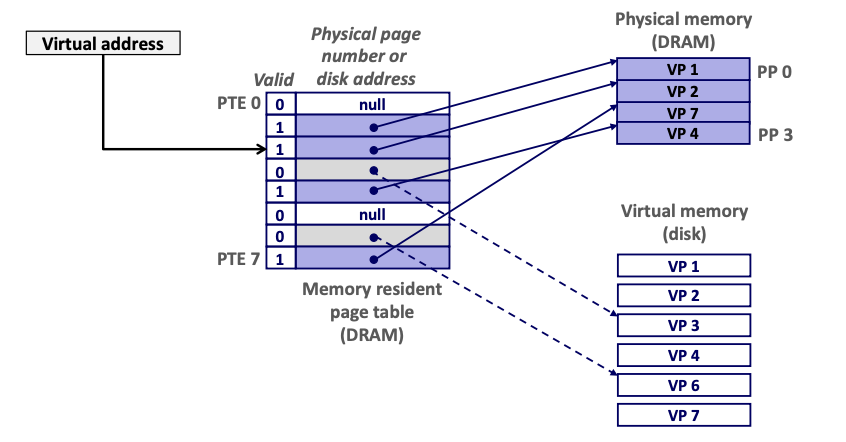
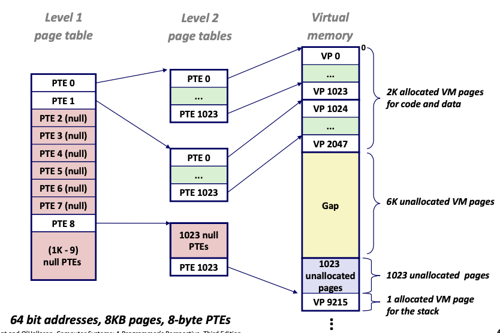

# Lecture 17 - Virtual Memory Concepts

### Virtual Addressing
Physical Addressing (byte offset in main memory) is used in 'simple' systems like embedded microcontrollers in devices like cars, elevators, and digital picture frames.

Virtual Addressing (virtualization of main memory resource) is used in all modern serves, laptops, and smart phones. Requests to access main memory are intercepted by a piece of hardware called the Memory Management Unit (MMU). CPU generates a virtual address which is translated by the MMU to a physical address pointing to the main memory.

##### Address Spaces
Linear address space: Ordered set of contiguous non-negative integer addresses
- {0, 1, 2, 3...}

Virtual address space: Set of N = 2^n^ virtual addresses
- {0, 1, 2, 3, ..., N-1}

Physical address space: Set of M = 2^m^ physical addresses
- {0, 1, 2, 3, ..., M-1}

Virtual address space is usually much larger than the physical address space. The physical address space corresponds to the size of DRAM in the system. Virtual address space is the same for all processes running in the system.

##### Why Virtual Memory (VM)?
Uses main memory efficiently
- Use DRAM as a cache for parts of a virtual address space

Simplifies memory management
- Each process gets the same uniform linear address space vs main memory which is scattered

Isolates address spaces
- Allows us to create separate protected private address spaces such that one process can't interfere with another's memory
- User program cannot access privileged kernel information and code

### VM as a tool for caching
Conceptually, **virtual memory** is an array of N contiguous bytes stored on disk
The contents of the array on disk are cached in **physical memory (DRAM cache)**
The cache are broken into blocks are called virtual pages.

There are 3 subsets of virtual pages. *Unallocated* means that the pages have not been created by the VM system. *Cached* and *Uncached* refers to the virtual pages in and not in the physical memory.

##### DRAM Cache Organization
DRAM cache organization is driven by enormous cache miss penalty. DRAM 10x slower than SRAM. Disk 10,000x slower than DRAM.

Consequences
- Large page (cache block) size: typically 4KB, sometimes 4MB
- Fully associative
    - Single cache set with multiple cache lines (1 x *m* row matrix)
    - Each virtual page can be occupy any of the cache lines in physical memory (Flexibility in allocating memory block and full utilization of cache)
    - Therefore requires a complicated mapping algorithm to keep track of where the virtual pages are stored in DRAM
- Highly sophiscated replacement algorithms
- Write-back rather than write-though
    - Defer write to memory until the replacement of line in cache vs writing immediately to memory on cache hit

##### Page Table
A **page table** is an array of page table entries (PTEs) that maps virtual pages to physical pages. 
- Per-process kernel data structure in DRAM.

Page hit: reference to VP that is cached in DRAM (DRAM cache hit)

Page fault: The address translation hardware infers that virtual page is not in physical memory and triggers page fault (exception).
1. Transfer of control to the kernel's page fault handler
2. Handler evicts a victim and loads the requested virtual page from disk into memory
3. Handler updates the page table with physical address of loaded VP
4. The faulting instruction is re-executed => Now the MMU will checks the PTE corresponding to the requested VP will be cached and can be fetched.

Demand paging: Strategy of waiting until the cache miss to copy the page into physical memory.

Allocating page: `malloc` implements `sbrk` which allocates a PTE to a location in disk. Accessing the page will now trigger a page fault instead of a segmentation fault.

Working set: Set of active virtual pages that are accessed at any point in time. If `Working set < main memory set` -> no disk traffic after compulsory misses.

Thrashing: `SUM(working sets) > main memory` -> performance meltdown when pages are swapped in and out continuously.

### VM as a tool for memory management
Each process has its own virtual address space (per-process page table)
- It can view memory as a simple linear array
- Mapping function scatters addresses through physical memory
    - Well-chosen mappings can improve locality

##### Simplifying memory allocation
- Each VP can be mapped to any PP
- A VP can be stored in different PPs at different times (fully associative)

##### Sharing code and data among processes
- Map VPs to the same PP
- This is how shared libraries are implemented (e.g. lib.c is loaded once in physical memory and the processes that wants to access lib.c will just map the pages in their virtual address space to the physical pages where lib.c was loaded)

##### Simplifying Linking and Loading
Linking
- Each program has similar virtual address space
- Code, data, and heap always start at the same addresses

Loading
- `execve` allocates virtual pages for **.text** and **.data** sections & creates PTEs marked as invalid (set the valid bit to 0)
- On demand by the virtual memory system, a page fault is triggered which passes control to the kernel. The **.text** and **.data** sections are then copied, page by page, by the kernel to physical memory.

### VM as a tool for memory protection
Virtual memory extends PTEs with permission bits.
For each virtual memory address in one process, it records `SUP`, `READ`, `WRITE`, `EXEC`.
MMU checks these bits on each access. If there is unauthorized access, the MMU throws an exception to the kernel.

##### Address translation
`MAP(a) = a'` if data at virtual address `a` is in physical address `a'`. `MAP(a) = ∅ `if data at virtual address `a` is not in physical memory.

##### Symbols
| Symbol            | Meaning                                    |
| ----------------- | ------------------------------------------ |
| N = 2^n^ | No. of addresses in virtual address space  |
| M = 2^m^ | No. of addresses in physical address space |
| P = 2^p^ | Page size (bytes)                          |
| TLBI              | TLB index                                  |
| TLBT              | TLB tag                                    |
| VPO               | Virtual page offset                        |
| VPN               | Virtual page number                        |
| PPO               | Physical page offset                       |
| PPN               | Physical page number                       |

##### Address Translation with a Page Table
Page table base register contains the beginning physical address of page table for current process. When CPU presents a virtual address to the MMU, the virtual page number is used as an index of the page table to retrieve physical page number. The virtual page offset is concatenated afterwards to produce the actual physical address (the virtual page offset has the same bits as the physical page offset).

##### Page hit

Processor sends virtual address to MMU.
MMU fetches PTE from page table in memory.
MMU sends physical address to cache/memory
Cache/memory sends data word to processor.

##### Page Fault

Processor sends virtual address to MMU
MMU fetches PTE from page table in memory.
Valid bit of PTE is zero, so MMU triggers page fault exception (transfers control to page fault handler).
Handler identifies victim to evict
Handler pages in new page and updates PTE in memory
Handler returns to original process, rexecuting faulting instruction.

##### Translation Lookaside Buffer (TLB)
Problem: PTEs are cached in L1 like any other memory word
- PTEs may be evicted by other data references
- PTE hit still requires a small L1 delay

Solution: **Translation Lookaside Buffer**
- Small set-associative hardware cache in MMU.
- Maps virtual page numbers to physical page numbers.
- Contains complete page table entries for small number of pages.

Translation Lookaside Buffer (TLB) is nothing but a special cache used to keep track of recently used transactions. TLB contains page table entries that have been most recently used.
**Accessing the TLB:**

- MMU uses the VPN portion of the virtual address to access the TLB (VPN is made up of TLB tag and TLB index)

**TLB Hit:**

CPU generates virtual address and sends it to MMU.
Instead of directly looking in the memory for the PTE, MMU first looks in the TLB (by sending the VPN).
If the TLB contains the PTE (TLB hit), it returns the PTE to MMU and MMU can then use it to construct the physical address.

**TLB Miss:**

MMU checks with TLB for the PTE but cannot be found (TLB miss).
MMU has to search in memory just like before.
Memory returns the PTE to MMU which stores it in the TLB

### Multi-Level Page Tables
Suppose:
- 4KB (2^12^) page size, 48-bit address space, 8-byte PTE

Problem:
- Would need a 512 GB page table
    - 2^48^ * 2^-12^ * 2^3^ = 2^39^ bytes

Common solution: **Multi-level page table**

Example: 2-level page table
- Level 1 table: each PTE points to the starting address of a level 2 page table (always memory resident)
- Level 2 table: each PTE points to a page (paged in and out like any other data)
- Benefits in memory reduction: Only need to generate enough L2 page tables to cover the portion of the virtual address space that system is using. Portion of VM that is not used will be unallocated (see Gap in image)

Memory requirements reduction: Level 2 page tables do not exist if a PTE in level 1 is null. Since only level 1 page table has to be in the memory all the time, there is less pressure on main memory.

Translating with a k-level Page Table

- When a virtual address is presented by CPU to the MMu, the MMU uses each subset of bits in the VPN to access each page table entry in every level (1-k)
- VPN1 is an offset of a page table in level 1, which is used as page table entry to the starting address of a level 2 page table. VPN2 will be used as the offset for the level 2 page table and so on...
- This process is called *page walk*

This sounds pretty slow: N page table lookups for every memory access. But is it necessarily slow? TLB caches the PTEs from recent lookups, and so if a page’s PTE is in the TLB cache, this improves the multi-level page table access time down to the access time for a single-level page table.
PTEs should almost always be in TLB. If the program has reasonable locality, most of the TLB lookups will generally hit in the TLB. This avoids the tremendous overhead of a TLB miss (page walk => have to fetch PTEs from multiple page tables across the different levels from memory).
When a scheduler switches processes, it invalidates all the TLB entries. The new process then starts with a “cold cache” for its TLB, and takes a while for the TLB to “warm up”. The scheduler therefore should not switch too frequently between processes, since a “warm” TLB is critical to making memory accesses fast.

Number of page tables depends on the architecture. Level 1 and 2 tables cover a huge swath of address space.