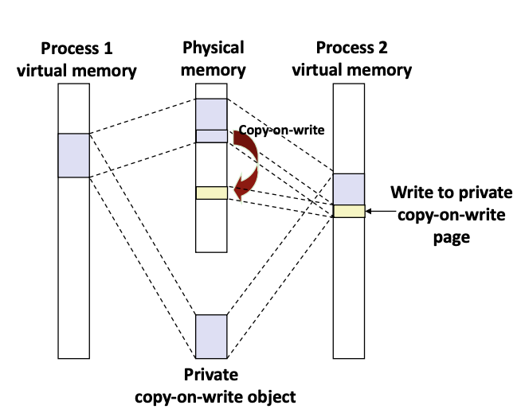

# Lecture 18 - Virtual Memory Systems

### Simple Memory System Example
**Addressing**
- 64-bytes page size - 2^6^ addresses (used for calculating VPO which is 6-bit)
- 14-bit virtual address
- 12-bit physical address


**TLB**
- 16 entries
- 4-way associative (4 sets)


**Page Table**
Page table with 256 entries (28 virtual page numbers)


**Memory System Cache**
Direct-mapped, 16 sets (1 line each), 4-byte blocks size


##### Address Translation Examples
TLB hit and cache hit with virtual address: `0x03D4`
```
13 <--------------------- 0

<- TLBT --> <->
0 0 0 0 1 1 1 1 0 1 0 1 0 0
<---- VPN ----> <-- VPO -->

Check TLB: TLB hit
PPN: 0x0D

<-- CT ---> <- CI > <->
0 0 1 1 0 1 0 1 0 1 0 0
<-- PPN --> <-- PPO -->

Check cache: Cache hit
Byte: 0x36
```

TLB miss and cache miss with virtual address: 0x0020
```
13 <--------------------- 0

<- TLBT --> <->
0 0 0 0 0 0 0 0 1 0 0 0 0 0
<---- VPN ----> <-- VPO -->

Check TLB: TLB miss
Check page table (Valid-bit 1 -> No page fault)
PPN: 0x28

<-- CT ---> <- CI > <->
1 0 1 0 0 0 1 0 0 0 0 0
<-- PPN --> <-- PPO -->

Check cache: Cache miss
Byte: Access memory
```

### Core i7/ Linux Memory System
##### Intel Core i7 Memory System
The unified L2 cache ensures that for programs which utilizes more data than instructions or vice versa, the miss penalty for L1 does not grow too large. The time taken to access L3 is much larger since it is located off the CPU chip.

MMU is also supported by L1 and L2 TLBs. L1 i-TLB's 128 entries > L1 d-TLB's 64 entries. One possible reason that the penalty for missing instructions may be much larger.


##### End-to-end core i7 address translation
VPO = PPO = (L1 cache) CI + CO = 12 bits. While address translation is taking place, L1 can be indexed at the same time. Generally TLB is hit, so PPN bits can be used to check against CT bits in the set afterwards. Once cache address (CT + CI + CO) has been generated, look in the L1 cache for the resulting word. If cache miss in L1, then look in L2, L3 then main memory.


##### Core i7 Level 1-3 Page Table Entries


Each entry references a 4KB child page table. Significant fields:
- P: Child page table present in physical memory (1) or not (0)
- R/W: Read-only or read-write access permission for all reachable pages (all portion of address space covered by this PTE)
- U/S: User or supervisor (kernel) mode access permission for all reachable pages
- WT: Write-through or write-back cache policy for the child page table
- A: Reference bit (set by MMU on reads and writes, cleared by software)
- PS: Page size either 4KB or 4MB (defined for level 1 PTEs only)
- Page table physical base address: Contains the physical address of the child page table. Only 40 most significant bits of the physical addresses are necessary to be stored as 12 zero-bits can be appended.
- XD: Disable or enable executions from all pages reachable from this PTE (Protect from code-injection attacks)

Intel supports 48-bit virtual address space and 52-bit physical address space. Linux uses 4KB pages and the page tables are 4KB aligned (212 addresses). So each page table takes up one virtual page.

##### Core i7 Level 4 Page Table Entries


Each entry references a 4KB child page. Significant fields:
- P: Child page table present in physical memory (1) or not (0)
- R/W: Read-only or read-write access permission for child page
- U/S: User or supervisor (kernel) mode access permission for child page
- WT: Write-through or write-back cache policy for the child page
- A: Reference bit (set by MMU on reads and writes, cleared by software)
- D: Dirty bit (set by MMU on writes, cleared by software)
- Page table physical base address: Contains the physical address of the child page. Only 40 most significant bits of the physical addresses are necessary to be stored as 12 zero-bits can be appended.
- XD: Disable or enable executions from child page

##### Core i7 Page Table Translation


VPN is divided by 4 into 9 bits that gives offset into each page table => 2^9^ possible page table entries in each level of page table. Most programs require only one L1 page table entry as it covers a huge swath of entries (512GB). Kernel maintains the address of the L1 page table in CR3 register.

- L1 page table - 512GB region per entry.
- L2 page table - 1GB region per entry.
- L3 page table - 2MB region per entry.
- L4 page table - 4KB region per entry.

##### Trick for Speeding Up L1 Access


There is parallelism occurring in L1 access
- Bits that determine CI is identical in virtual and physical address
- While address translation is taking place, the CI bits can be sent to cache to extract the cache index bits
- Once CT bits have been generated through address translation, the cache index bits are already prepared for tag check

##### Virtual Address Space of a Linux Process


User address space starts with 0 (bottom), kernel address space starts at 1 (top). Kernel exists in virtual address space of each process.

The "physical memory" region can be used by kernel to access physical memory directly. For example, an offset of 0x1 in the region can access physical memory 0x1.

##### Linux Organizes VM as Collection of "Areas"


An area is a contiguous chunk of allocated virtual memory whose pages are related in some way (Code, heap, data etc). The notion allows the virtual address space to have gaps.

Each process has a data structure called `task_struct` which contains a pointer to `mm_struct`.

`mm_struct` contains `pgd` field, the address of the level 1 page table. When the process is scheduled, the kernel copies `pgd` entry into CR3 register. Just by changing the address stored in the CR3 register, the kernel changes the address space for the current process.

`mm_struct` also contains a pointer to a linked list of `vm_area_struct` which identifies the start/end of each area, their read/write permissions and other flags.

##### Linux Page Fault Handling


Types of Page Faults:
1. Segmentation Fault
    - Accessing a non-existing page that is not contained within the areas of addresess pointed by the `vm_area_structs`
2. Protection exception
    - Violating permission by writing to a read-only page
3. Normal Page Fault
    - Data has not been allocated in the process VM yet => evict a victim and swap in the requested page.

### Memory Mapping
VM areas are initialized by associating them with disk objects
- Process is known as **memory mapping**

Areas can be *backed by* (i.e. get its initial values from):
- **Regular file** on disk (e.g. an executable object file)
    - Initial page bytes come from a section of a file
- **Anonymous file** (e.g. nothing)
    - First fault will allocate a physical page full of 0's (**demand-zero page**)
    - Once the page is written to (**dirtied**), it becomes like any other page

Dirty pages are copied back and forth between memory and a special **swap file**

##### Shared Object


- Process 1 maps to the shared object (on disk; physical memory)
- Process 2 maps to the same shared object
- Both process 1 and 2 maps to the same object from different virtual addresses on separate virtual spaces

##### Private Copy-on-write (COW) Objects


Similarly, two different virtual address spaces map to the same region on physical memory. However, the area struct is flagged as **private copy-on-write**
1. If an instruction (from Process 2) writes to one of the pages, instead of reflecting that change in the shared object, a protection fault is triggered
2. Fault handler creates a new copy in an unused portion of physical memory and update the page table entry
3. The instruction re-executes upon kernel returning control

##### `fork` Function Virtual Address Space
VM and memory mapping explains how `fork` provides private address space for each process

To create virtual address for new child process:
- Create exact copies of current `mm_struct`, `vm_area_struct` and page tables (mapped to shared memory instead of duplicating memory which is expensive)
- Flag each page in both parent and child processes as read-only
- Flag each `vm_area_struct` in both processes as private COW

On return, each process has exact copy of virtual memory (sharing the same physical pages).
Only when process writes to the shared physical space then a protection fault is triggered and the kernel creates new pages using COW mechanism.

This mechanism using VM and memory mapping defers copying the physical address until absolutely necessary (during writes) => most efficient manner to represent different virtual address spaces created by `fork`

##### `execve` Function Virtual Address Space
The `execve` function loads and run a new program (`a.out`) in the current process

This frees all the `vm_area_structs` and page tables for the current process and creates new `vm_area_structs` and page tables for new areas that are backed by the executable object file of the new program.
- `.bss` and stack backed by anomymous file (demand-zero pages)
- Create memory-mapped region for shared objects such as `libc.so` during dynamic linking

Set the PC (`%rip`) to point to the entry point (first instruction) in `.text` => Linux will fault in code and data pages as needed from memory

##### User-Level Memory Mapping


System-level call that allows user to request the kernel to map a region of VM on user's behalf
```
void *mmap (void *start, int len, int prot, int flags, int fd, int offset)
```
Takes a pointer into the virtual address space (`start`), and tries to map `len` bytes starting at `start` (may be 0; 'pick an address'). It maps this portion of the virtual address space to the bytes starting at `offset` from file denoted by the file descriptor `fd` (from opening a file).

User may specify flags for the type of protection needed for the virtual address space and also the type of object.

Function returns a pointer to start of mapped area (may not be `start` if the virtual address space at `start` is already occupied)

If a virtual address is read after running mmap, the kernel will trigger page fault and the swapped pages will be the contents of the file from physical memory.

##### Example: Using `mmap` to Copy Files
Copying a file to `stdout` without transferring data to userr space. The write call reads the bytes which are faulted in by the kernel and writes them to `stdout`. Avoids a step of buffering before the write command (normal way is read from `stdin` and write to `stdout`).

```
#include "csapp.h"

void mmapcopy(int fd, int size) {

    /* Pointer to memory mapped area */
	char *bufp;
	bufp = Mmap(NULL, size, PROT_READ, MAP_PRIVATE, fd, 0); // Pass the bytes from stdin to a buffer
	Write(1, bufp, size); // write buffer to STDOUT file
	return;
}

int main(int argc, char **argv) {
	struct stat stat;
	int fd;
	
	/* Check for required cmd line arg */
	if (argc != 2) {
		printf("usage: %s <filename>\n", argv[0]);
		exit(0);
	}

	/* Get file-descriptor */
	fd = Open(argv[1], O_RDONLY, 0); // open file passed in from cmd line
	Fstat(fd, &stat); // Get the size of file
	mmapcopy(fd, stat.st_size); // Call mmap to copy the bytes in the stdin file to stdout
	exit(0);
}
```