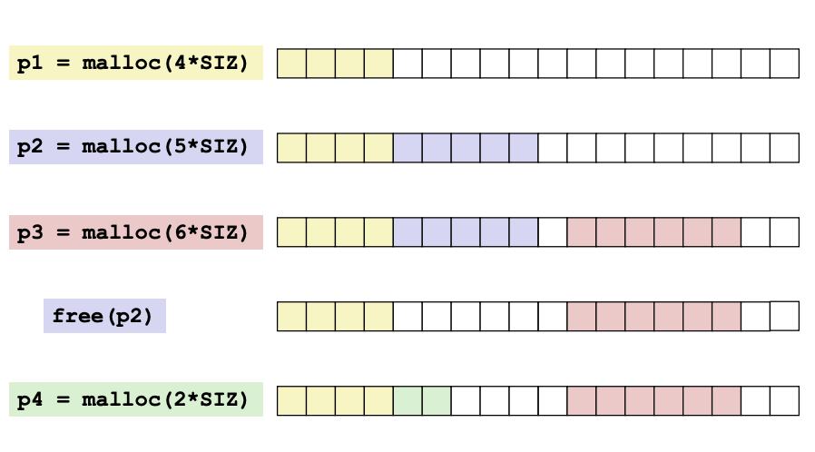
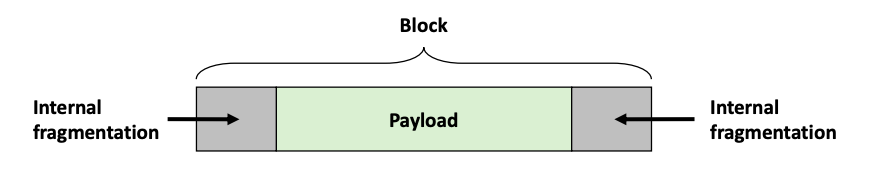
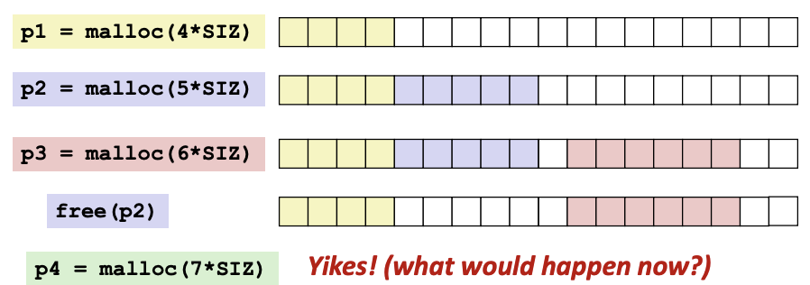
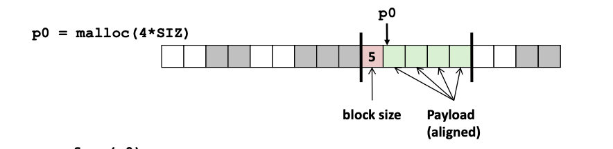
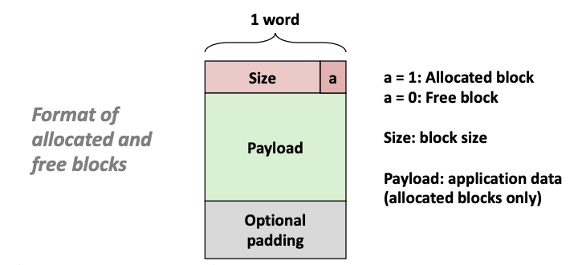
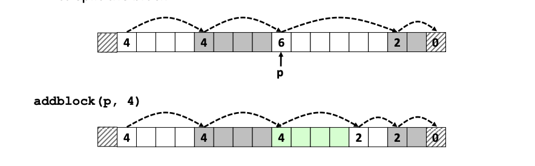
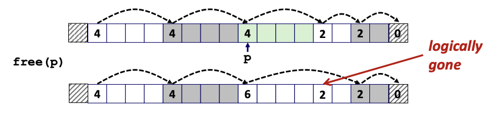
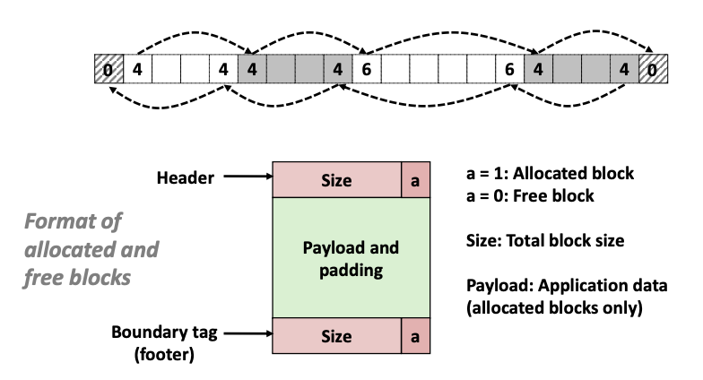
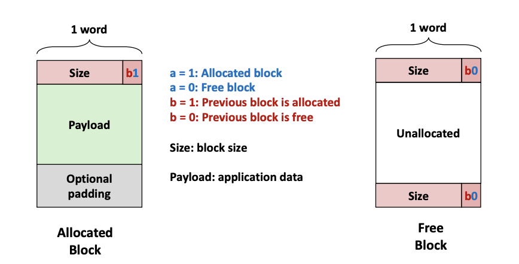

# Lecture 19 - Dynamic Memory Allocation: Basic Concepts

### Dynamic Memory Allocation
Programmers use **dynamic memory allocators** (such as `malloc`) to acquire VM at run time

Dynamic memory allocators manage an area of a process' virtual memory known as the **heap**

Allocator maintains heap as collection of variable sized **blocks**, which are either **allocated** or **free**
- Explicit allocator: application allocates and frees space (e.g. `malloc` and `free` in C)
- Implicit allocator: application allocates, but does not free space => burden of freeing the memory is shifted from application to system (e.g. garbage collection)

##### The `malloc` Package
`void *malloc(size_t size)`
- Successful: If successful, returns a pointer to a memory block of `size` bytes. Boundary aligned 8-byte for x86 and 16-byte for x86-64. If `size == 0`, return NULL
- Unsuccessful: returns NULL (0) and sets `errno`

`void free(void *p)`
- Returns the block pointer at by **p** to pool of available memory
- **p** must come from a previous call to **malloc** or **realloc**

##### `malloc` Example
```
#include <stdio.h>
#include <stdlib.h>

void foo(int n) {
	int i, *p;
	
	/* Allocate a block of n ints */
	p = (int *) malloc(n * sizeof(int));
	if (p == NULL) {
		perror("malloc");
		exit(0);
	}
	
	/* Initialize allocated block */
	for (i=0; i<n; i++)
		p[i] = i;
	
	/* Return allocated block to the heap */
	free(p);
}
```


##### Constraints
Applications
- Can issue arbitrary sequence of `malloc` and `free` requests
- `free` request must be to a `malloc`'d block

Allocators
- Cannot control the size of allocated blocks
- Must respond immediately to malloc requests => cannot reorder or buffer requests
- Must allocate blocks from free memory
- Must align blocks to alignment requirements (8-byte for x86 and 16-byte for x86-64 alignment on Linux boxes)
- Can manipulate and modify only in free memory
- Cannot move the allocated blocks once they are `malloc`'d

##### Performance Goals
**Thoughput**
Number of completed requests per unit time (e.g. 5000 `malloc` calls and 5000 `free` calls in 10 seconds => 1000 operations/second)

**Peak Memory Utilization**
How efficiently the allocator uses the heap. 
`malloc(p)` results in a block with a **payload** of p bytes. Peak memory utilization is the sum of all the payloads divided by the total size of the heap.

##### Fragmentation
Poor memory utilization caused by **fragmentation**

**Internal Fragmentation**
For a given block, internal fragmentation occurs if payload is smaller than block size


Caused by:
- Overhead of maintaining heap data structures
- Padding for alignment purposes
- Explicit policy decisions (e.g. to return a big block to satisfy a small request)

Depends only on the pattern of previous requests => easy to measure

**External Fragmentation**


Occurs when there is enough aggregate heap memory, but no single free block is large enough

Depends on the pattern of future requests => difficult to measure

##### Tracking Allocated Block Size


Standard method to know how much memory to free
- Keep the length of a block in the word preceding the block (known as the **header field** or **header**)
- Requires additional space for every allocated block. These headers decrease the memory utilization.

##### Keeping Track of Free Blocks
Method 1: Implicit list using length of each block - allows us to links all blocks and traverse through them => Need to tag each block as allocated/free

Method 2: Explicit list among the free blocks using pointers - point to start of a free block using a pointer in another free block => Can traverse through free blocks but need to allocate space for pointers

Method 3: Segregated free list - Different free lists for different size classes (e.g. different free lists hold addresses of blocks based on their range of block sizes)

Method 4: Use a balanced tree (e.g. Red-Black tree) with pointers within each free block, and the length used as a key

### Implicit Free List


For each block we need both size and allocation status

Since there is 8-byte or 16-byte alignment, some lower-order 3-bit (1000) or 4-bit (0000) are "always zero" for each block address. The lowest bit of the length can be used as an allocated/free flag.

When reading size word, must mask out this flag bit.

Allocation cost: O(n), for looking through the list. 
Free cost: O(1). Memory usage depends on the allocation policy.

##### Finding a Free Block
First fit: Search free list from beginning, choose **first** free block that fits:
```
p = start;
while ((p < end) && /* not passed end */
((*p & 1) ||        /* already allocated */
(*p <= len)))       /* too small */
p = p + (*p & -2)
```
- takes linear (O(n)) time in total number of blocks (allocated and free)
- In practice it can cause "splinters" at beginning of list

Next fit: First free block starting from end of previous search.
- Often faster tahn first fit by avoiding re-scanning unhelpful blocks
- Cause worse fragmewntation => deprove memory utilization

Best fit: Search the list, choose the **best** free block: fits, with fewest bytes leftover
- Keep fragments small - improve memory utilization
- Will run slower than first fit

##### Allocating in Free Block
Splitting
- Since allocated space might be smaller than free space, we might want to split the block


```
addblock(p, 4);

void addblock(ptr p, int len) {
	/* Round up to even blocks: 8-byte align */
	int newsize = ((len + 1) >> 1) << 1;
	int oldsize = *p & -2;
	*p = newsize | 1;
	if (newsize < oldsize)
		*(p+newsize) = oldsize - newsize;
}
```

##### Freeing a block
**Freeing by coalescing:**
- Clear the "allocated" flag to free up a block
- Join the next block if it is free


```
void free_block(ptr p) {
    *p = *p - 2;    // clear allocated flag
    next = p + *p   // find next block
    if ((*next & 1) == 0)
        *p = *p + *next // add to this block if not allocated
}
```

**Bidirectional Coalescing:**


Boundary tags
- Allow to join the previous block if it is free
- Replicate size/allocated word at end of free blocks
- Check the boundary tag ("footer") of the previous block (one word size before the free block) to see if allocated or free
- Allows us to traverse the free list backwards, but require extra allocation space

**Optimization:**


No boundary tag for allocated blocks
- Boundary tag needed only for free blocks

**Deferred coalescing:** try to improce performance of `free` by deferring coalescing until needed (e.g. when scanning list for `malloc` or when amount of external fragmentation reaches some threshold)