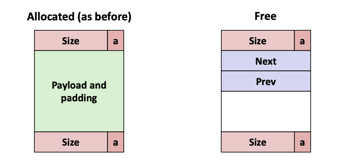
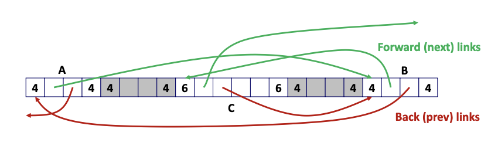
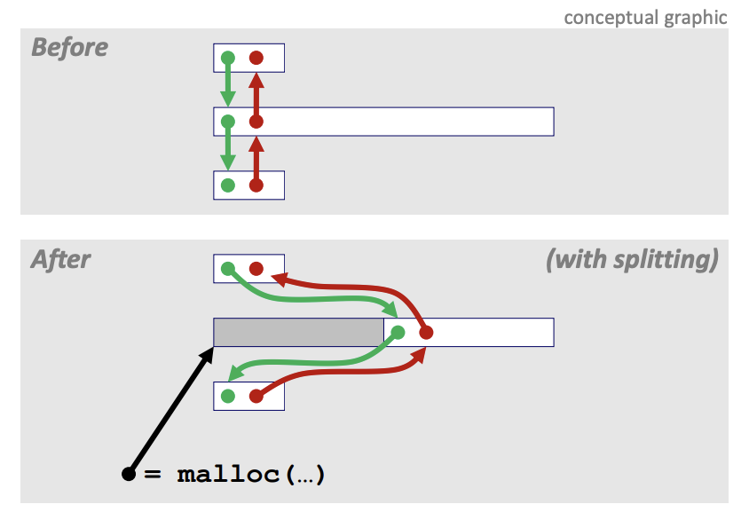
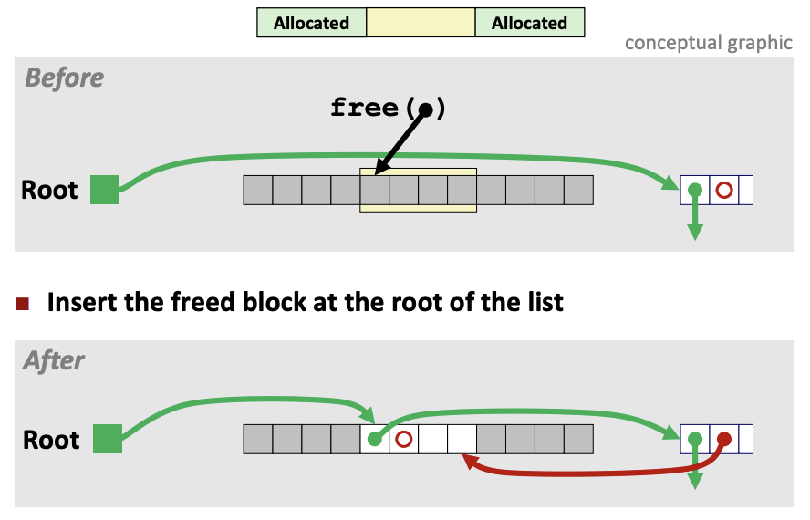
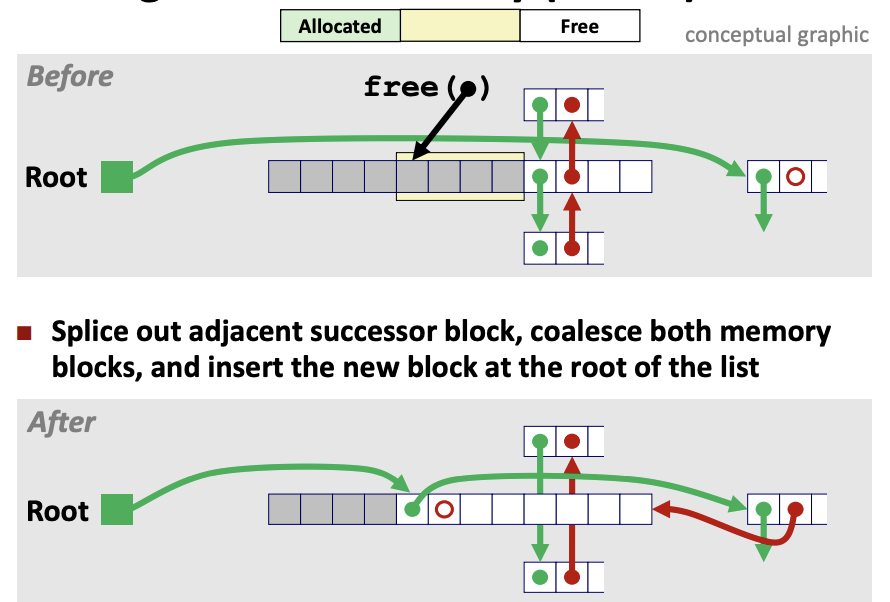
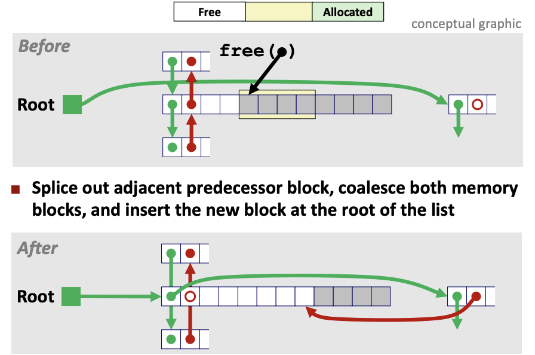
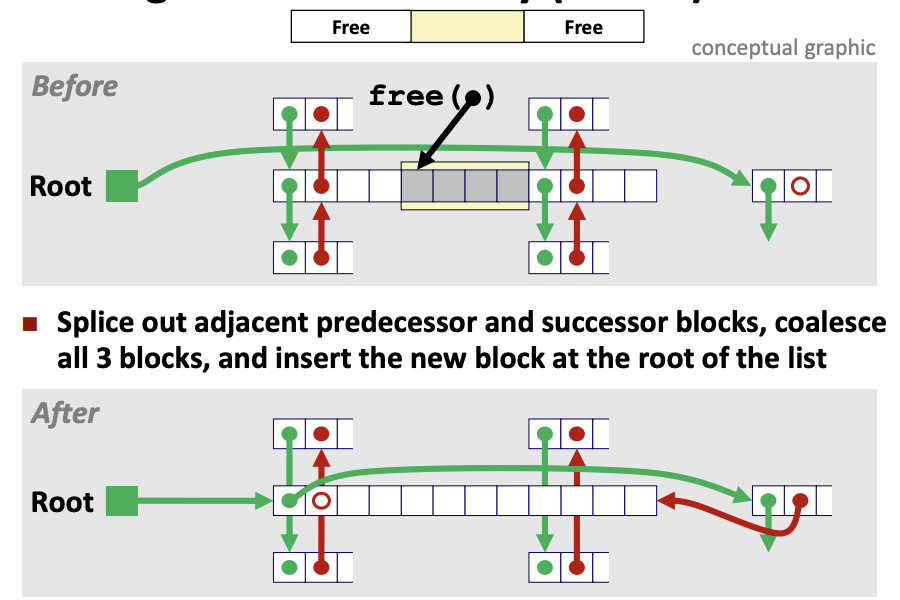
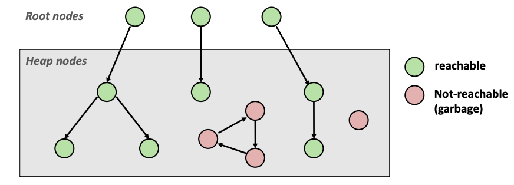
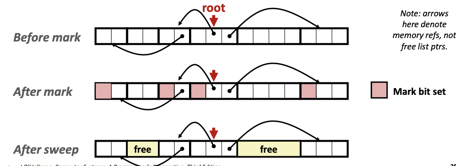

# Lecture 20 - Dynamic Memory Allocation: Advanced Concepts

### Explicit free list


Maintain list(s) of **free** blocks with "next" and "prev" pointers after the block length header. Note that these header, footer and pointers impose a minimum block size.

Compared to implicit list, allocation is faster as allocator only needs to traverse through the free blocks (not all blocks).

Blocks can be linked in any order:


##### Allocating From Explicit Free Lists


- Split free blocks as necessary
- Update 6 pointers every allocation

##### Freeing From Explicit Free Lists
Last-In-First-Out (LIFO) Policy:
- Insert freed block at the beginning of the free list
- Pro: simple and constant time
- Con: studies suggest fragmentation is worse than address ordered

Address-Ordered Policy:
- Insert freed blocks so that free list blocks are always in address order
- Con: requires search to find out where the freed block belongs
- Pro: studies suggest fragmentation is lower than LIFO

##### Freeing with LIFO Policy
Case 1:


Case 2:


- New coalesced free block is now at the root of the list
- Points to the previous block which was at the root
- Prev pointer no longer points to the old previous free block as it is now the first block

Case 3:


- Similar to Case 2

Case 4:


- Need to update pointers correlated with the predecessor and successor blocks

### Secregated Free Lists
Each **size class** of blocks has its own free list

##### Segregated List Allocator
Given an array of free lists, each one for some size class
- Stored at beginning of heap

To allocate a block of size n:
- Search appropriate free list for block of size m > n
- If no block is found, try next larger class
- Repeat until block is found

If no block is found:
- Request additional heap memory from OS (using `sbrk()`)
- Allocate block of n bytes from this new memory
- Place remainder as a single free block in largest-size class

To free a block:
- Coalesce and place on appropriate list

Advantages of seglist allocators:
- Higher throughput
    - log time for power-of-two size classes
- Better memory utilization
    - First-fit search of segregated free list approximates a best-fit search of entire heap

### Garbage Collection (Implicit Memory Management)
Automatic reclamation of heap-allocated storage - application never has to call `free`
```
void foo() {
	int *p = malloc(128);
	return; /* p block is now garbage as it is no longer referenced */
}
```

How does the memory maanger know when memory can be freed?
- Can tell that certain blocks cannot be used if there no pointers to them

Assumptions:
- Memory manager can distinguish pointers from non-pointers
- All pointers point to the start of a block
- Cannot hide pointers (e.g. by coercing them to an int, and then back again)

Classic GC algorithms
1. Mark-and-sweep collection
2. Reference counting
3. Copying collection
4. Generational collections

##### Memory as a Graph
Each block is a node in the graph. Each pointer is an edge in the graph. Locations not in heap that contain pointers into the heap are called **root** nodes (e.g. registers, locations on the stack, global variables)



##### Mark and Sweep Collecting
Built on top of malloc/free package
- Allocate using `malloc` until you "run out of space" (e.g. max heap size or OS unable to provide more VM)

When out of space:
- Use extra **mark bit** in the head of each block
- Mark: Start at roots and set mark bit on each reachable block
- Sweep: Scan all blocks and free blocks that are not marked



Assumptions for simple implementation:
- Application
    - `new(n)`: returns pointer to new block with all locations cleared
    - `read(b, i)`: read location `i` of block `b` into register
    - `write(b, i, v)`: write `v` into location `i` of block `b`
- Each block will have a header word
    - addressed as `b[-1]` for a block `b`
- Instructions used by the Garbage Collector
    - `is_ptr(p)`: determines whether `p` is a pointer
    - `length(b)`: returns length of block `b`, not including the header
    - `get_roots()`: returns all the roots

**Mark Phase:**
Mark using depth-first traversal of the memory graph
```
// Pseudocode
ptr mark(ptr p) {
	if (!is_ptr(p)) return;     // do nothing is not pointer
	if (markBitSet(p)) return;  // check if already marked
	setMarkBit(p);              // set the mark bit
	for (i=0; i<length(p); i++) // for each word in p's block
		mark(p[i]);             // make recursive call
	return;
}

mark(rootPtr);
```

**Sweep Phase:**
Scan all blocks and free blocks that are unmarked
```
// Pseudocode
ptr sweep(ptr p, ptr end) { // takes in pointers to start and end of heap
	while (p < end) {       // for entire heap
		if markBitSet(p)    // was the block reachable?
			clearMarkBit(); // clear mark bit
		else if (allocateBitSet(p)) // never reached: is it allocated?
			free(p);                // free garbage block
		p += length(p);             // goto next block
	}
}
```

The function `is_ptr()` checks if a word is by pointer by checking if it points to an allocated block of memory. However, C pointers can point to the middle of an allocated block. The solution is to use a balanced tree and keep track of the allocated blocks.

### Memory-related perils and pitfalls
##### C Operators
- `->`, `()` and `[]` have higher precedence, with `*` and `&` just below
- Unary `+`, `-`, and `*` have higher precedence than binary forms

```
int *p              // p is a pointer to int
int *p[13]          // p is an array[13] of pointers, each of which point to an int
int *(p[13])        // p is an array[13] of pointers, each of which point to an int
int **p             // p is a pointer to a pointer to an int
int (*p)[13]        // p is a pointer to an array[13] of int
int *f()            // f is a function returning a pointer to int
int (*f)()          // f is a pointer to a function returning int
int (*(*f())[13])() // f is a function which returns a pointer to an array[13] of pointers to functions returning int
int (*(*x[3])())[5] // x is an array[3] of pointers to functions that returns a pointers to an array[5] of ints
```

Reference: The C Programming Language by Brian Kernighan and Dennis Ritchie Section 5.12 for more information