# Lecture 21 - Network Programming: Part I

### Client-Server Transaction
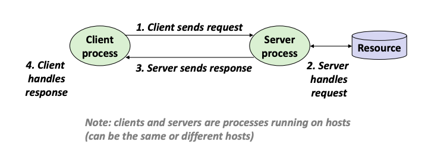

Most network applications are based on the **Client-Server Model**:
- A server process and one or more client processes
- Server manages some resource
- Server provides service by manipulating resource for clients
- Server activated by request from client (vending machine analogy)

### Computer Networks
A **network** is a hierarchical system of boxes and wires organized by geographical proximity
- SAN (System Area Network) spans cluster or machine room
- LAN (Local Area Network) spans a building or companus
- WAN (Wide Area Network) spans country or world

An **internetwork (internet)** is an interconnected set of networks
- The Global IP Internet is the most famous example of an internet

### Construction of an internet

##### Lowest Level: Ethernet Segment
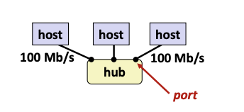

Consists of a collection of **hosts** connected by wires (twisted pairs) to a **hub** (Note: Hubs are obsolete. Bridges became cheap enough to replace them.)
Operation
- Each Ethernet adapter has a unique 48-bit address (MAC address)
- Hosts send bits to any other host in chunks called frames
- Hub slavishly copies each bit from each port to every port => Every host sees every bit

##### Next Level: Bridged Ethernet Segment
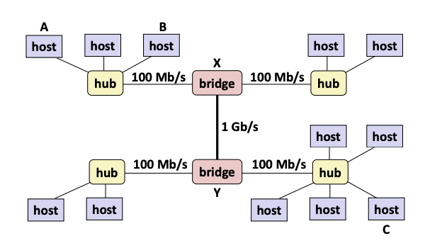

Bridges connects multiple ethernet segments. They cleverly learn which hosts are reachable from which ports and selectively copy frames from port to port.

##### Conceptual View of LANs
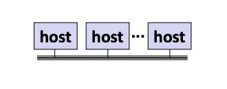

For simplicity, hubs, bridges, and wires are often shown as a collection of hosts attached to a single wire

##### Next Level: internets
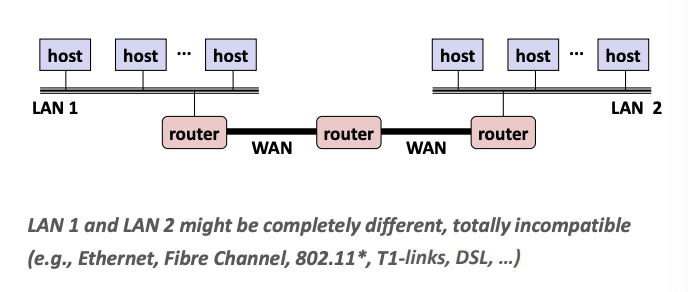

Multiple incompatible LANs can be physically connected by specialized computers called **routers**
The connected networks are called an **internet**

##### Logical Structure of an internet
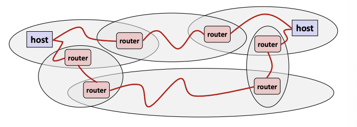

Ad hoc interconnection of networks
- Whole bunch of hosts spread around the world

Send packets from source to destination by hopping through networks
- Router forms bridge from one network to another
- Different packets may take different routes

##### internet Protocol
How is it possible to send bits across incompatible LANs and WANs?
- Solution: **protocol** software running on each host and router
    - Protocol is a set of rules that governs how hosts and routers should cooperate when they transfer data from network to network
    - Smooths out the differences between different networks

Naming Scheme: An internet protocol defines a uniform format for **host addresses**
- Each host (and router) is assigned at least one of these internet addresses that uniquely identifies it

Delivery Mechanism: An internet protocol defines a standard transfer unit (**packet**)
- Packet consists of **header** and **payload**
    - Header: contains info such as packet size, source and destination addresses
    - Payload: contains data bits sent from source host

##### Transferring internet Data via Encapsulation
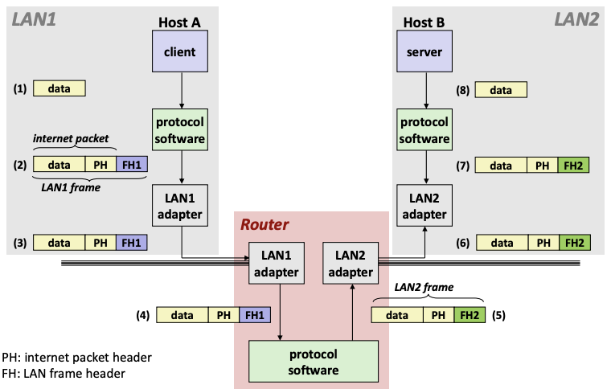

Transferring data from Host A to Host B
1. Host A wants to send some data
2. Protocol software on Host A's machine will put a **packet header** in front of the data to describe the internet routing (*internet packet*) and a **frame header** that indicates the LAN routing that gets used (*LAN1 frame*)
3. The LAN1 adapter (network interface card) sends packet out to network
4. LAN2 adapter receives the packet and modifies the frame header to pass into its  own protocol software
5. Protocol software on Host B's machine strips off the headers from the packet and data bits are sent to Host B

### Global IP Internet
Most famous example of an internet

Based on the TCP/IP protocol family
- Internet Protocol (IP)
    - Provides **basic naming scheme** and unreliable **delivery capability** of packets (datagrams) from **host-to-host**
- Unreliable Datagram Protocol (UDP)
    - Uses IP to provide **unreliable** datagram delivery from **process-to-process**
- Transmission Control Protocol (TCP)
    - Uses IP to provide **reliable** byte streams from **process-to-process** over **connections**

Accessed via a mix of Unix file I/O and functions from the **sockets interface**. Socket interface provides the routines required for interprocess communication between applications.

##### Hardware and Software Organization of an Internet Application
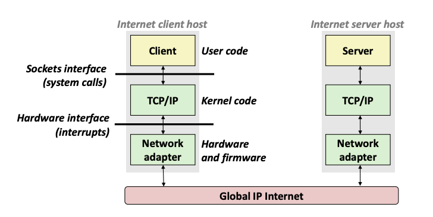

##### A Programmers' View of the Internet
Hosts are mapped to a set of 32-bit **IP addresses**
- e.g. 128.2.203.179

The set of IP addresses is mapped to a set of identifiers called Internet **domain names**
- e.g. 128.2.203.179 is mapped to www.cs.cmu.edu

A process on one Internet host can communicate with a process on another Internet host over a **connection**

##### IP Addresses
32-bit IP addresses are stored in an **IP address struct**
- addresses stored in memory in **network byte order** (big-endian byte order)
```
/* Internet address structure */
struct in_addr {
    uint32_t s_addr; /* network byte order (big-endian) */
}
```
Helper functions:
```
// Returns value in network-byte-order
uint32_t htonl(uint32_t hostlong);
uint16_t htons(uint16_t hostshort);

// Returns value in host-byte-order
uint32_t ntohl(uint32_t netlong);
uint16_t ntohs(unit16_t netshort);

// (IP address) "84.52.184.224"
// --> (NBO) 0x 54 34 B8 E0
// --> (HBO) 0x E0 B8 34 54

// Convert dotted-decimal string to binary IP address (NBO)
int inet_pton(AF_INET, const char *src, void *dst);
```

##### Internet Domain Names
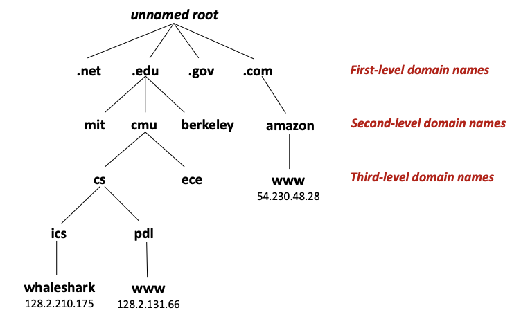

Domain Naming System: The Internet maintains a mapping between IP addresses and domain names in a huge worldwide distributed database called **DNS**.

The DNS database is a collection of millions of host entries
- Each host entry defines the mapping between a set of domain names and IP addresses

##### Internet Connections
Client and servers communicate by sending streams of bytes over **connections**. Each connection is
- Point-to-point: connects a pair of processes
- Full-duplex: data can flow in both directions at the same time
- Reliable: stream of bytes send by the source is eventually received by the destination in the same order it was sent

A **socket** is an endpoint of a connection
- Socket address is an `IPaddress:port` pair

A **port** is a 16-bit integer that identifies a process:
- **Ephemeral port**: Assigned automatically by client kernel when client makes a connection request
- Well-known port: Associated with some **service** provided by a server. Mappings between well-known ports and service names are contained in the file `/etc/services` on each Linux machine.

##### Anatomy of a Connection
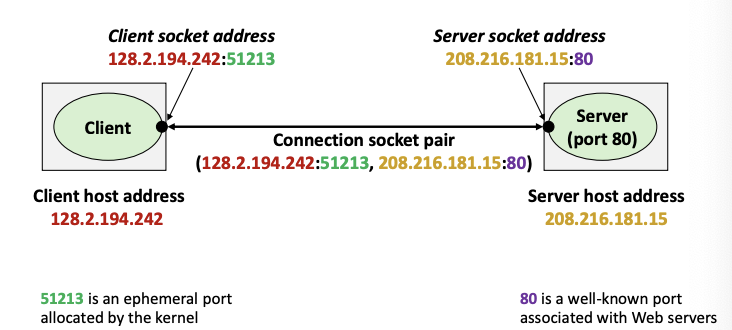

A connection is uniquely identified by the socket addresses of its endpoints (socket pair)
- `(cliaddr:cliport, servaddr:servport)`

Using Ports to Identify Services
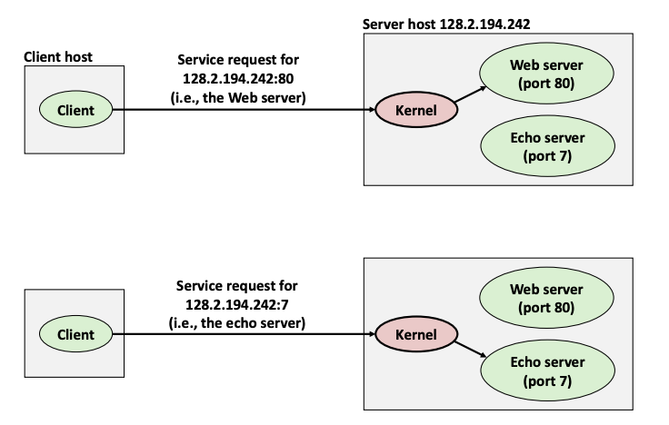

- Kernel's job to differentiate the connections coming into the machine and identify which process to execute when some data arrives from the other machine and which program will be making use of that data
- This is done by associating each of the port numbers with a particular process executing program that is going to handle those requests.

##### Sockets
To the kernel, a socket is an endpoint of communication
To an application, a socket is a file descriptor that lets the application read/write from/to the network (all Unix I/O devices are modeled as files)

The main distinction between regular file I/O and socket I/O is how the application "opens" the socket descriptors

**Socket Address Structures**
Generic socket address:
- For address arguments to **connect**, **bind** and **accept**
- Necessary only because C did not have generic (`void *`) pointers when the sockets interface was designed
```
struct sockaddr {
	uint16_t sa_family; /* Protocol */
	char sa_data[14];   /* Address data */
};
typedef struct sockaddr SA;
```

There is a more specific socket address version for the Internet called `sockaddr_in` (Must cast appropriately as somne functions only take in the generic version `sockaddr`)
```
struct sockaddr_in {
	uint16_t sin_family;         /* Protocol, always AF_INET */
	uint16_t sin_port;           /* Port num in network byte order */
	struct in_addr sin_addr;     /* IP addr in network byte order */
	unsighed char sin_zero[8];   /* Pad to sizeof(struct sockaddr) */
};
```

**Sockets interface overview**
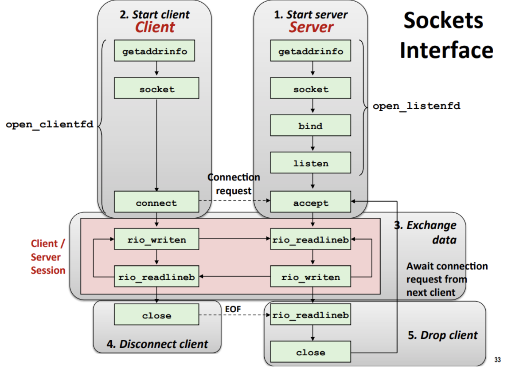

1. Server runs a program that is ready to receive connections from clients to perform various services 
2. Start up a client that will make use of server
3. Maintain a session, which is back and forth communication between client and server
4. Client disconnects
5. Server shuts down.

**Sockets Interface: `socket`**
Client and servers use the `socket` function (system call) to create a *socket* descriptor
```
int socket(int domain, int type, int protocol)

// IPv4, stream of bytes (connection endpoint)
int sockfd = socket(AF_INET, SOCK_STREAM, 0);
// AF_INET indicates that we are using 32-bit IPV4 addresses
// SOCK_STREAM indicates that the socket will be the end point of a connection
```

**Sockets Interface: `bind`**
A server uses `bind` to ask the kernel to associate the server's socket address (`addr`) with a socket descriptor (`sockfd`)
```
int bind(int sockfd, SA *addr, socklen_t addrlen);
```
The process can read bytes that arrive on the connection whose endpoint is `addr` by reading from the descriptor `sockfd`. Writes to the socket descriptor are transferred along the same connection.

**Sockets Interface: `listen`**
By default, kernel assumes that descriptor from socket function is an **active socket** that will be on the client end of a connection.
Server calls the `listen` function to tell the kernel that a descriptor will be used by a server rather than a client
```
/* sockfd becomes listenfd */
int listen(int sockfd, int backlog); 
```
Converts `sockfd` from an active socket to a **listening socket** that can accept connection requests from clients
`backlog` is a hint abou the number of outstanding connection requests that the kernel should queue up before starting to refuse requests

Active socket means the client is responsible for the active opening of TCP connection (SYN). Passive (listening) socket means the server waits for requests (SYN) and creates active sockets for each connection accepted.

**Sockets Interface: `accept`**
Server waits for connection requests from clients by calling `accept`:
```
int accept(int listenfd, SA *addr, int *addrlen); /* Returns connfd */
```
Waits for connection request to arrive on the connection bound to `listenfd`, then fills in client's socket address in `addr` and size of the socket address in `addrlen`
Returns a **connected descriptor** (`connfd`) that can used to communicate with the client via Unix I/O routines. This allows the program to fork a child whenever a new request is received

**Sockets Interface: `connect`**
A client establishes a connection with a server by calling connect:
```
int connect(int clientfd, SA *addr, socklen_t addrlen);
```
Attempts to establish a connection with server at socket address `addr`
- If successful, then `clientfd` is now ready for reading/writing
- Resulting connection is characterized by socket pair `x:y`
    - `x` is client address
    - `y` is ephemeral port that uniquely identiifies client process on client host

**`connect`/`accept` Illustrated**
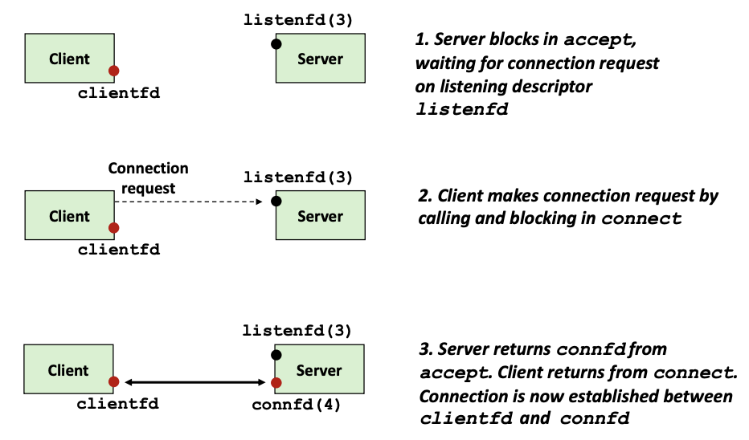

Listening descriptor
- End point for client connection requests
- Created once and exists for lifetime of the server

Connected descriptor
- End point of the connection between client and server
- A new descriptor is created each time the server accepts a connection request from a client
- Exists only as long as it takes to service client (until client disconnects)

Why the distinction?
- Allows for concurrent servers that can communicate over many client communcations simultaneously
    - e.g. each time we receive a new request, we fork a child to handle the request

##### Host and Service Conversion: `getaddrinfo`
`getaddrinfo` is the modern way to convert string representations of hostnames, host addresses, ports, and service names to socket address structures

Advantages:
- Reentrant (can be safely used by threaded programs)
- Allows us to write portable protocol-independent code (works with both IPv4 and IPv6)

```
int getaddrinfo(const chat *host,              /* Hostname or address */
                const char *service,           /* Port or service */
			    const struct addrinfo *hints,  /* Input parameters */
				struct addrinfo **result);     /* Output linkedlist */
				
void freeaddrinfo(struct addrinfo *result);    /* May ret errcode */

const char *gai_strerror(int errcode);         /* Error message */
```

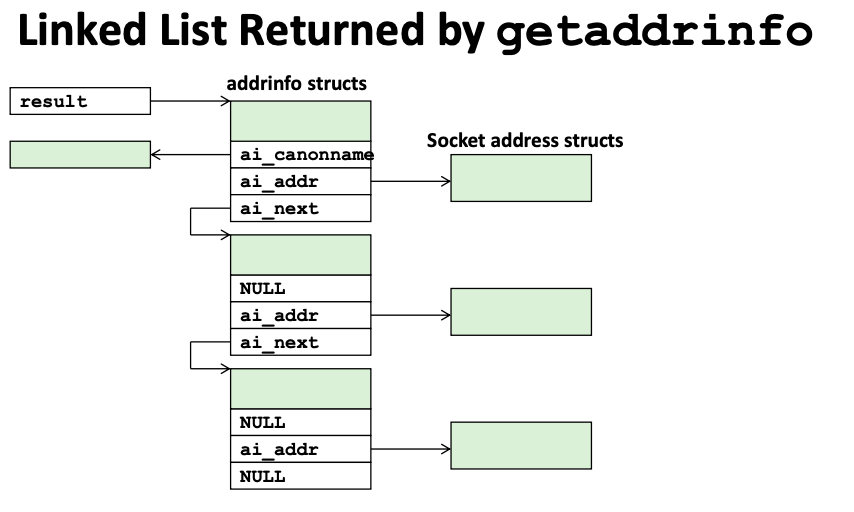

Given `host` and `service`, `getaddrinfo` returns `result` that points to a linked list of `addrinfo` structs (a hostname can map to multiple IP addresses), each to which points to a corresponding socket address struct, and which contains arguments for the socket interface functions

Clients: walk this linked list, trying each socket addres in turn, until the calls to `socket` and `connect` succeed
Servers: walk the list until calls to `socket` and `bind` succeed

**`addrinfo` Struct**
```
struct addrinfo {
	int ai_flags;             /* Hints argument flags */
	int ai_family;            /* First arg to socket function */
	int ai_socktype;          /* Second arg to socket function */
	int ai_protocol;          /* Third arg to socket function */
	char *ai_canonname;       /* Canonical host name */
	size_t ai_addrlen;        /* Size of ai_addr struct */
	struct sockaddr *ai_addr; /* Ptr to socket address struct */
	struct addrinfo *ai_next; /* Ptr to next addrinfo */
}

// ai_flags
// AI_ADDRCONFIG - Recommended for connections
// AI_NUMERICSERV - Service argument is port number instead of name
// AI_PASSIVE - Returns potential passive sockets, host = NULL
```
- Each `addrinfo` struct contains arguments that can be passed directly to `socket` function
- Also points to a socket address struct that can be passed directly to `connect` and `bind` functions

**Example of linked list usage**
```
#include "csapp.h"

int main(int argc, char **argv) {
	struct addrinfo *p, *listp, hints;
	char buf[MAXLINE];
	int rc, flags;

	memset(&hints, 0, sizeof(struct addrinfo));
	hints.ai_family = AF_INET;        /* IPv4 only */
	hints.ai_socktype = SOCK_STREAM;  /* TCP connections only */
	if ((rc = getaddrinfo(argv[1], NULL, &hints, &listp)) != 0) {
		fprintf(stderr, "getaddrinfo error: %s\n", gai_strerror(rc));
		exit(1);
	}
	
	/* Walk the list and display each IP address */
	flags = NI_NUMERICHOST; /* Display address instead of name */
	for (p=listp, p; p= p->ai_next) {
		Getnameinfo(p->ai_addr, p->ai_addrlen,
					buf, MAXLINE, NULL, 0, flags);
		printf("%s\n", buf);
	}
	
	/* Clean up */
	Freeaddrinfo(listp);
	exit(0);
}
```